<div align="center">

  


</div>

[](LICENSE)
[](https://www.python.org)
[](https://en.wikipedia.org/wiki/C11_(C_standard_revision))
[](https://cython.org)
[](CRYPTOGRAPHY.md)
[](MONITORING.md)
[](ARCHITECTURE.md)

```
              +==============================================================================+
              |                            AMA CRYPTOGRAPHY ♱                                |
              |                       Post-Quantum Security System                           |
              |                                                                              |
              |   Multi-Layer Defense  |   Quantum-Resistant    |   Defense-in-Depth         |
              |   Cython-Optimized     |   3R Anomaly Monitor   |   Cross-Platform           |
              |   HD Key Derivation    |   Algorithm-Agnostic   |   NIST PQC Standards       |
              |                                                                              |
              |   C Layer (Native)     |   Cython Layer         |   Python API               |
              |   ─────────────────    |   ─────────────────    |   ─────────────────        |
              |   SHA3/HKDF/Ed25519    |   3R Math (Lyap/NTT)   |   Algorithm Agnostic       |
              |   ML-DSA-65/Kyber      |   NumPy Integration    |   Key Management           |
              |   SPHINCS+/NTT Ops     |   Math Engine          |   3R Monitoring            |
              |                                                                              |
              |                       Built for a civilized evolution.                       |
              +==============================================================================+
```

**Copyright 2025-2026 Steel Security Advisors LLC**
**Author/Inventor:** Andrew E. A.
**Contact:** steel.sa.llc@gmail.com
**License:** Apache License 2.0
**Version:** 2.1.5
**AI Co-Architects:** Eris ✠ | Eden ♱ | Devin ⚛︎ | Claude ⊛

---

## Executive Summary 🌎 

AMA Cryptography is a hybrid Ed25519 + Dilithium (ML-DSA-65) framework for quantum-resistant integrity protection. Community-tested, not externally audited. A multi-language cryptographic security system designed to protect people, data, and networks against both classical and quantum threats. Built on NIST-standardized post-quantum cryptography (PQC), AMA Cryptography provides security-hardened features with measured performance (see [Performance Metrics](#performance-metrics)).

The system combines NIST-standardized post-quantum algorithms with a 3R runtime security monitoring framework, creating a defense-in-depth architecture that provides visibility into cryptographic operations while maintaining less than 2% monitoring overhead. The multi-language architecture (C + Cython + Python) pairs constant-time C implementations with optional Cython acceleration for the 3R math engine only. On that specific workload — Lyapunov exponent, NTT-shaped rotation matrix-vector products, and helix evolution kernels in `ama_cryptography/math_engine.pyx` — Cython is 18–37× faster than the pure-Python NumPy baseline on x86-64 (see [`wiki/Performance-Benchmarks.md`](wiki/Performance-Benchmarks.md) for methodology). This speedup is for 3R monitoring math and **does not apply to the C-implemented cryptographic primitives** — those numbers live in [`benchmark-report.md`](benchmark-report.md). Independent security review is recommended before deployment in high-security or regulated environments.

**Protecting people, data, and networks with quantum-resistant cryptography**

> **Design Philosophy:** Built exclusively from standardized cryptographic primitives (NIST FIPS, IETF RFC) — no custom ciphers, hash functions, or signature schemes. The composition protocol (how primitives are combined into the multi-layer defense architecture, double-helix key evolution, and adaptive posture system) is an original design by Steel Security Advisors LLC.
>
> **Integration:** AMA Cryptography is a standalone cryptographic library — any Python project can install and use it independently for quantum-resistant security. [Mercury Agent](https://github.com/Steel-SecAdv-LLC/Mercury-Agent) is one consumer of AMA Cryptography, but it is not the only one; the library is designed for general-purpose use across AI agents, AI systems, and any application requiring post-quantum protection.

> **Project Philosophy:** Promoting action over inaction in the hope of helping secure critical systems against emerging quantum threats. This project is under active development. While we strive for cryptographic rigor, users should remain cautious and conduct independent security reviews before production deployment. The perceived absence of a threat does not constitute the lack of a threat. Our goal is to deter, mitigate, and elevate security posture—not create new vulnerabilities.
> 
> **Security Disclosure:** This is a self-assessed cryptographic implementation without third-party audit. Production use REQUIRES:
> - FIPS 140-2 Level 3+ HSM for master secrets (no software-only keys in high-security environments)
> - Independent security review by qualified cryptographers
> - Constant-time implementation verification for side-channel resistance
> - Secure file permissions for key files and cryptographic packages (store on encrypted volumes with restricted access)
>
> **Status:** Community-tested | Not externally audited
> **Last Updated:** 2026-04-21

---

## Table of Contents

<details>
<summary><strong>Click to expand navigation</strong></summary>

- [Executive Summary](#executive-summary-)
- [Key Capabilities](#key-capabilities)
- [Use Cases by Sector](#use-cases-by-sector-)
- [Performance Metrics](#performance-metrics)
- [Quick Start](#quick-start)
- [Testing and Quality Assurance](#testing-and-quality-assurance)
- [NIST Algorithm Compliance](#nist-algorithm-compliance)
- [Documentation](#documentation)
- [Cross-Platform Support](#cross-platform-support)
- [Build System](#build-system-)
- [Mathematical Foundations](#mathematical-foundations-)
- [Contributing](#contributing)
- [Unique Features](#unique-features)
- [License](#license)
- [Contact and Support](#contact-and-support)
- [Acknowledgments](#acknowledgments)
- [Legal Disclaimer & Attribution](#steel-security-advisors-llc--legal-disclaimer--attribution)

</details>

---

## Key Capabilities 

<details>
<summary><strong>Problem Statement and Solution</strong></summary>

### The Problem

Current cryptographic systems face three critical challenges:

1. **Quantum Threat**: Traditional cryptography (RSA, ECDSA) is expected to be vulnerable to large-scale quantum computers, with timelines estimated at 5-15+ years (debated)
2. **Black Box Security**: Most cryptographic libraries provide no runtime visibility into side-channel vulnerabilities or anomalous behavior
3. **Performance vs Security Trade-off**: Quantum-resistant algorithms are significantly slower, creating adoption barriers

### The AMA Cryptography Solution

AMA Cryptography addresses all three challenges through:

- **Quantum Resistance**: NIST-standardized ML-DSA-65 (FIPS 204) and Kyber-1024 (FIPS 203) designed for long-term protection against quantum threats
- **Transparent Security**: 3R monitoring (Resonance-Recursion-Refactoring) provides real-time cryptographic operation analysis
- **Optimized Performance**: Cython acceleration for 3R math engine (manual build required); benchmarked at 18–37x speedup over pure Python mathematical baseline

### Target Use Cases

- **Humanitarian and Conservation**: Crisis response, whistleblower protection, sensitive field data
- **Government and Defense**: Classified data protection with quantum resistance
- **Financial Services**: Transaction security future-proofed against quantum threats
- **Healthcare**: HIPAA-compliant data encryption with audit trails
- **Critical Infrastructure**: SCADA systems requiring long-term quantum-resistant protection
- **Blockchain and Crypto**: Post-quantum secure digital signatures

See [Use Cases by Sector](#use-cases-by-sector-) for detailed scenarios.

</details>

<details>
<summary><strong>Unique Differentiators</strong></summary>

### Multi-Layer Cryptographic Protection Architecture

**Defense-in-depth security** with multiple independent cryptographic layers:

**Core Cryptographic Operations** (the defense layers an attacker must defeat):

| Layer | Protection | Security Level |
|-------|------------|----------------|
| 1. SHA3-256 | Content integrity | 128-bit collision resistance |
| 2. HMAC-SHA3-256 | Keyed message authentication | Authenticated integrity |
| 3. Ed25519 | Classical digital signature | 128-bit classical security |
| 4. ML-DSA-65 | Quantum-resistant digital signature | 192-bit quantum security (FIPS 204) |

**Supporting Cryptographic Infrastructure:**

| Component | Purpose |
|-----------|---------|
| 5. HKDF-SHA3-256 | Key derivation ensuring cryptographic key independence |
| 6. RFC 3161 Timestamping | Third-party temporal proof of existence (optional) |

Canonical encoding serves as the input normalization step, ensuring deterministic serialization before cryptographic operations.

**Why defense-in-depth matters:** Overall security is bounded by the weakest cryptographic layer (~128-bit classical, ~192-bit quantum). Defense-in-depth provides continued protection if one layer is compromised. See [CRYPTOGRAPHY.md](CRYPTOGRAPHY.md) for detailed analysis.

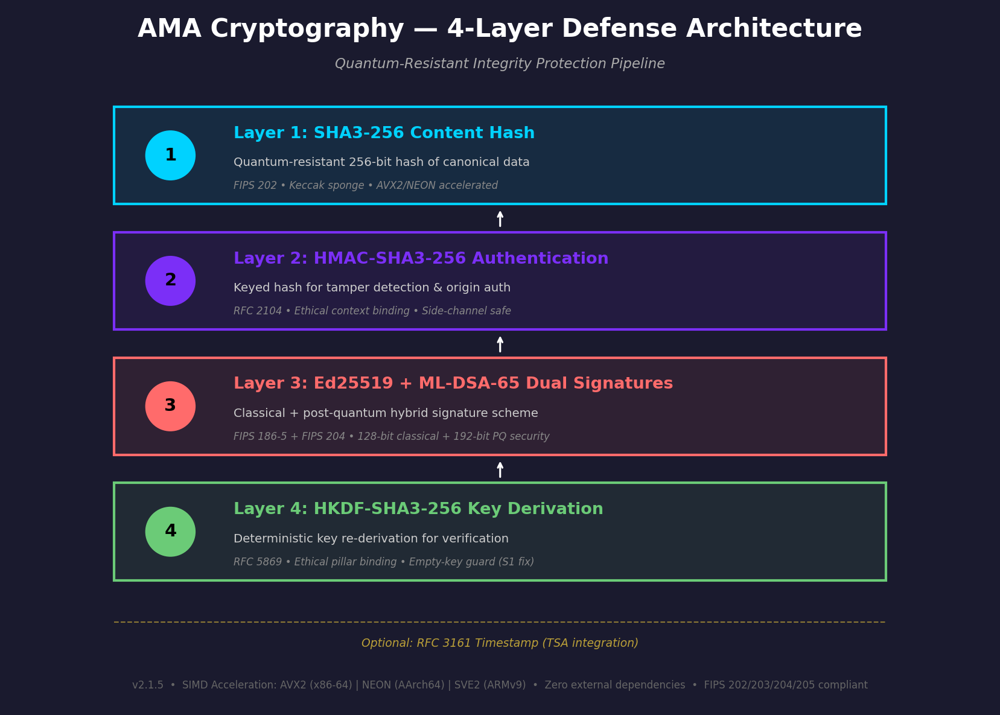

*Package authenticity is protected by four independent cryptographic operations — content hashing, keyed authentication, classical signature, and quantum-resistant signature — supported by independent key derivation and optional third-party timestamping.*

### 3R Runtime Security Monitoring

A runtime monitoring framework providing cryptographic operation analysis:

- **Resonance Engine**: FFT-based anomaly detection with frequency-domain analysis (monitors for statistical anomalies, not a timing attack prevention system)
- **Recursion Engine**: Multi-scale hierarchical pattern analysis for anomaly detection
- **Refactoring Engine**: Code complexity metrics for security review

- **Performance overhead**: Less than 2% with comprehensive monitoring
- **Visibility**: Runtime insight into cryptographic operation behavior

> **Note:** The 3R system is a runtime anomaly monitoring framework. It surfaces statistical anomalies for security review but does not guarantee detection or prevention of timing attacks or other side-channel vulnerabilities.

### Multi-Language Architecture

Three-layer architecture balancing security and usability:

- **C Layer**: Native SHA3-256, HKDF-SHA3-256, Ed25519, AES-256-GCM, ML-DSA-65, Kyber-1024, SPHINCS+-256f implementations — zero external dependencies (see [Implementation Status Matrix](#implementation-status-matrix))
- **Cython Layer**: Optimized 3R mathematical operations (benchmarked at 18–37x vs pure Python mathematical baseline)
- **Python API**: High-level, user-friendly interface for rapid development (primary production API)

### Advanced Features

- Hierarchical Deterministic (HD) key derivation
- Zero-downtime key rotation with lifecycle management
- Algorithm-agnostic API for seamless algorithm switching
- Secure encrypted key storage at rest
- AES-256-GCM authenticated encryption (NIST SP 800-38D)
- Adaptive cryptographic posture system (runtime threat response)
- Hybrid KEM combiner (classical + PQC key encapsulation)

### Quantum-Resistant Algorithms

NIST-standardized post-quantum algorithms:

- ML-DSA-65 (NIST FIPS 204 - Dilithium)
- Kyber-1024 (NIST FIPS 203 - ML-KEM)
- SPHINCS+-SHA2-256f (NIST FIPS 205 - SLH-DSA)
- Hybrid classical+PQC modes with binding combiner

</details>

<details>
<summary><strong>Key Achievements</strong></summary>

| Achievement | Description |
|-------------|-------------|
| Defense-in-Depth | Multi-layer cryptographic protection (4 core + 2 supporting) |
| Performance | Cython math engine optimization (18–37x vs pure Python mathematical baseline) |
| Quantum Resistance | NIST-standardized PQC algorithms (ML-DSA-65, Kyber-1024) |
| Mathematical Foundations | 5 frameworks with machine-precision validation (self-assessed) |
| Cross-Platform | Linux, macOS, Windows, ARM64 |
| Production Infrastructure | Docker, CI/CD, comprehensive testing |
| 3R Monitoring | Runtime security anomaly monitoring (less than 2% overhead) |

</details>

<details>
<summary><strong>Implementation Status Matrix</strong></summary>

| Algorithm | C API Status | Python API Status | Integration |
|-----------|--------------|-------------------|-------------|
| SHA3-256 | **Full** | Full | Core primitive |
| HKDF-SHA3-256 | **Full** | Full | Key derivation |
| Ed25519 | **Full** | Full | Integrated |
| AES-256-GCM | **Full** | Full | Authenticated encryption |
| ML-DSA-65 | **Full** (native) | Full | Integrated |
| Kyber-1024 | **Full** (native) | Full | Integrated |
| SPHINCS+-256f | **Full** (native) | Full | Integrated |
| X25519 | **Full** | Full | Key exchange |
| ChaCha20-Poly1305 | **Full** | Full | Alternative AEAD |
| Argon2 | **Full** | Full | Password hashing |
| secp256k1 | **Full** | Full | HD key derivation |
| Hybrid (Ed25519 + ML-DSA-65) | N/A | Full | Integrated |

**Legend:**
- **Full**: Complete native C implementation with constant-time operations.
- **Full (native)**: Complete native C implementation — no external PQC dependency required.
- **Note**: Ed25519 C implementation uses radix 2^51 field arithmetic (fe51.h — 25 cross-products vs 100 in ref10) with a signed 4-bit window comb for fixed-base scalar mult (64 mixed adds + 4 doublings, per Bernstein–Duif–Lange–Schwabe–Yang 2012). The ed25519-donna x86-64 assembly backend is now the default on x86-64 builds (`AMA_ED25519_ASSEMBLY=ON` auto-set by CMake on x86-64 and MSVC x64); pass `-DAMA_ED25519_ASSEMBLY=OFF` to force the in-tree fe51+comb backend for auditing. Full RFC 8032 sign/verify roundtrip verified on both backends.

**C Library Implementations (v2.1) — 23 core + 25 SIMD source files in `src/c/`:**
- `ama_core.c`: Library initialization, version, feature detection, shared utilities
- `ama_sha3.c`: SHA3-256, SHAKE128, SHAKE256 (Keccak-f[1600] sponge construction)
- `ama_sha256.c`: Native SHA-256 (FIPS 180-4), used by SPHINCS+ internally
- `ama_hkdf.c`: HKDF-SHA3-256 with HMAC-SHA3-256 (RFC 5869 compliant)
- `ama_hmac_sha256.c`: Native HMAC-SHA-256 (RFC 2104), used by SPHINCS+ PRF_msg
- `ama_ed25519.c`: Ed25519 keygen/sign/verify (SHA-512, field arithmetic for GF(2^255-19), C11 atomics)
- `ama_aes_gcm.c`: AES-256-GCM authenticated encryption (NIST SP 800-38D)
- `ama_kyber.c`: ML-KEM-1024 full native (NTT, IND-CCA2, Fujisaki-Okamoto transform)
- `ama_dilithium.c`: ML-DSA-65 full native (NTT q=8380417, rejection sampling, constant-time)
- `ama_sphincs.c`: SPHINCS+-SHA2-256f-simple full native (WOTS+, FORS, hypertree d=17)
- `ama_consttime.c`: Constant-time utilities (memcmp, memzero, swap, lookup, copy)
- `ama_cpuid.c`: CPU feature detection (AVX2, SSE, NEON) for runtime dispatch
- `ama_secure_memory.c`: Secure memory zeroing and page locking (mlock/munlock)
- `ama_platform_rand.c`: Platform CSPRNG (getrandom/getentropy/BCryptGenRandom)
- `ama_x25519.c`: X25519 Diffie-Hellman key exchange (RFC 7748)
- `ama_chacha20poly1305.c`: ChaCha20-Poly1305 AEAD (RFC 8439)
- `ama_argon2.c`: Argon2id password hashing (RFC 9106)
- `ama_secp256k1.c`: secp256k1 elliptic curve operations (HD key derivation)
- `ama_aes_bitsliced.c`: Bitsliced AES S-box (cache-timing hardened, **default**: `AMA_AES_CONSTTIME=ON`)
- `internal/ama_sha2.h`: Extracted SHA-512 header-only implementation (deduplication for Ed25519/SPHINCS+)

**Hand-Written SIMD Implementations (`src/c/avx2/`, `src/c/neon/`, `src/c/sve2/`):**
- 23 optimized SIMD source files (7 AVX2 + 8 NEON + 8 SVE2). The Ed25519 AVX2 path was removed in PR #238 because the scalar `fe51` field-arithmetic backend was already faster than the vector trampoline; NEON and SVE2 retain their Ed25519 entries.
- `avx2/`: ML-KEM (vectorized NTT/Barrett), ML-DSA (vectorized NTT q=8380417), SPHINCS+ (4-way SHA-256), SHA3 (Keccak-f[1600] AVX2), AES-GCM (pipelined AES-NI + PCLMULQDQ GHASH), ChaCha20-Poly1305 (8-way parallel block function, ≥512 B ≈ 2.1–2.3×), Argon2 (4-way BlaMka G over AVX2 YMM, ≈1.3×)
- `neon/`: ARM NEON 128-bit vector equivalents using `<arm_neon.h>` intrinsics + ARM Crypto Extensions
- `sve2/`: ARM SVE2 scalable vector implementations for variable-length SIMD
- `dispatch/ama_dispatch.c`: Runtime CPU feature detection and function pointer dispatch (AVX2 > generic on x86; SVE2 > NEON > generic on ARM). An AVX-512 dispatch slot (`AMA_IMPL_AVX512`) exists in the enum and CPUID probe, but no AVX-512 source files are shipped and the dispatcher downgrades it to AVX2 at runtime.

**Cython Acceleration Modules (`src/cython/`):**
- `hmac_binding.pyx`: Direct Cython binding to `ama_hmac_sha3_256()` (~262K ops/sec)
- `sha3_binding.pyx`: Direct Cython binding to `ama_sha3_256()` — zero call overhead; ctypes fallback when not built
- `math_engine.pyx`: Optimized 3R mathematical operations (Lyapunov, NTT, matrix-vector, helix evolution — 18–37x speedup vs pure Python baseline)
- `helix_engine_complete.pyx`: Complete helix engine with Cython optimization

> **Note:** The Python API remains the recommended production interface. C implementations provide high-performance alternatives where applicable.

**PQC Backend Security Considerations:**

| Backend | Constant-Time | Recommended Use |
|---------|---------------|-----------------|
| Native C (libama_cryptography) | Yes (native implementation) | Default — zero external PQC dependencies |

> **Note:** All PQC operations are provided by the native C library (libama_cryptography). No external PQC dependencies (liboqs, pqcrypto) are required. Build with `cmake -B build -DAMA_USE_NATIVE_PQC=ON && cmake --build build`. Set `AMA_REQUIRE_CONSTANT_TIME=true` to enforce constant-time operation at runtime.

</details>

---

## Use Cases by Sector 🌐

> **Research Areas:** The use cases below represent targeted applications where AMA Cryptography's quantum-resistant cryptography may provide value. These implementations require independent validation before deployment in regulated, clinical, or mission-critical environments.

<details>
<summary><strong>Real-world scenarios (click to expand)</strong></summary>

### Humanitarian and Conservation 

**Unique Value:** Protection of sensitive field data with runtime attack detection (Not approved for clinical, medical, or regulated government deployment without independent audit):

- **Crisis Response**: GPS coordinates, victim data, and safe house locations protected with ML-DSA-65 quantum-resistant signatures. 3R monitoring surfaces timing anomalies that may indicate compromise in hostile environments.
- **Conservation**: Wildlife tracking data, ranger locations, and anti-poaching intelligence with integrity verification using helical invariants. Detects if data has been tampered with.
- **Whistleblower Protection**: Document signing and verification designed to resist "harvest now, decrypt later" quantum threats.
- **Sensitive Record Preservation**: Ethical framework promotes respectful handling of records for victims and individuals, with audit trails.

### Government and Defense

**Unique Value:** Classified data with quantum resistance and runtime anomaly monitoring

- **Long-term Classified Data**: Documents requiring long-term secrecy protected with quantum-resistant algorithms.
- **Secure Communications**: Kyber-1024 key exchange designed to resist "harvest now, decrypt later" attacks.
- **Runtime Anomaly Monitoring**: 3R monitoring surfaces statistical anomalies in operation timing that may be consistent with cache-timing or power-analysis behavior, but does not guarantee detection or prevention of timing attacks or other side-channel vulnerabilities.
- **Integrity Verification**: Mathematical invariant checking provides additional tampering detection beyond standard checksums.
- **Zero-Trust Environments**: Runtime monitoring provides continuous observation of cryptographic operations.

### Financial Services 

**Unique Value:** Transaction security with real-time anomaly detection

- **Quantum-Resistant Signatures**: ML-DSA-65 signatures on transactions designed to remain valid against quantum attacks.
- **Low-Latency Verification**: Cython-optimized 3R monitoring (18–37x speedup vs pure Python math baseline when built) with sub-millisecond signature verification.
- **Anomaly Detection**: 3R timing analysis surfaces anomalous cryptographic behavior that may indicate potential attacks.
- **Audit Compliance**: Cryptographic audit trail with ethical constraint enforcement.
- **Long-term Archival**: Financial records with quantum-resistant protection for long-term security.

### Healthcare 

**Unique Value:** Quantum-resistant encryption with integrity monitoring (independent compliance validation required for HIPAA and other regulations)

- **Patient Records**: Quantum-resistant encryption designed to protect medical records against long-term cryptanalytic threats.
- **Prescription Signatures**: ML-DSA-65 digital signatures on prescriptions providing quantum-resistant authenticity.
- **Medical Device Security**: Constant-time C implementations aim to reduce side-channel attack surface (requires independent verification).
- **Data Integrity**: Helical invariant verification detects if medical records have been altered.
- **Research Data**: Sensitive research data with ethical policy enforcement and audit trails.
- **Telemedicine**: Secure video consultations with hybrid classical+quantum key exchange.

### Critical Infrastructure 

**Unique Value:** SCADA/ICS security with runtime anomaly monitoring

- **Power Grid Control**: Quantum-resistant authentication for grid control systems.
- **Water Treatment**: Signed commands with runtime verification. 3R surfaces timing anomalies that may warrant investigation.
- **Transportation**: Railway and air traffic control with quantum-resistant protection for long-lived systems.
- **Nuclear Facilities**: Constant-time C implementations aim to reduce side-channel attack surface (requires independent verification for high-assurance environments).
- **Anomaly Monitoring**: 3R system surfaces statistical anomalies in cryptographic operations for security review.
- **Legacy System Protection**: Wrapper for older systems needing quantum resistance without full replacement.

### Blockchain and Cryptocurrency 

**Unique Value:** Post-quantum secure signatures with high-performance verification

- **Wallet Security**: ML-DSA-65 quantum-resistant signatures for wallet transaction authentication.
- **Smart Contract Signing**: Quantum-resistant signatures for long-lived contracts.
- **Transaction Throughput**: Sub-millisecond Ed25519 verification (~21k ops/sec via ctypes on canonical bench, 2026-04-25); ML-DSA-65 adds quantum resistance at higher latency (~336µs sign, ~132µs verify — Python API via ctypes, canonical bench host; see Performance Metrics section for methodology).
- **Cross-Chain Bridges**: Hybrid signing (Ed25519 + ML-DSA-65) for backward compatibility and quantum resistance.
- **NFT Provenance**: Quantum-resistant signatures designed for long-term validity.
- **Timestamp Verification**: RFC 3161 trusted timestamping with quantum resistance.

</details>

---

## Performance Metrics

> **Reading the numbers below.** All ops/sec figures in the tables that follow are from the **canonical bench host** (Linux x86-64 with AVX-512F/VL/BW/DQ/VBMI + VAES + VPCLMULQDQ; Sapphire Rapids / Zen 4 class), measured 2026-04-25 with `python benchmarks/benchmark_runner.py` and `build/bin/benchmark_c_raw --json`. The checked-in `benchmark-results.json` and `benchmarks/baseline.json` carry a separate, lower set of numbers — the **slow-runner CI regression floor** — so even contended GitHub Actions shared runners clear the regression threshold without false-positive failures. The two are not the same number, on purpose. Reproduce the canonical numbers on equivalent silicon; the regression floor is documented in [CHANGELOG.md](CHANGELOG.md#unreleased) §"Slow-runner regression-floor recalibration".

<details>
<summary><strong>Cryptographic Operation Benchmarks</strong></summary>

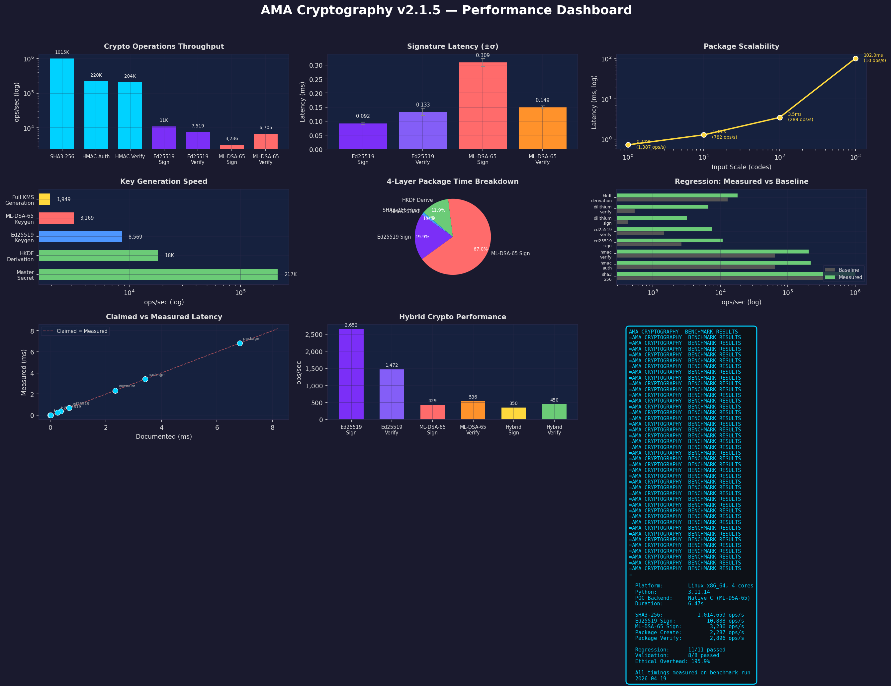

*Multi-panel performance dashboard showing cryptographic throughput, signature latency, scalability, key generation speed, multi-layer breakdown, regression analysis, validation claims, and hybrid performance — all from real benchmark data.*

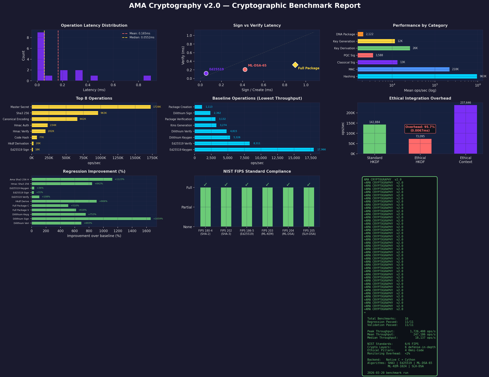

*Comprehensive benchmark report with latency distribution, sign vs verify analysis, category performance, top/bottom operations, ethical overhead, regression improvement, NIST algorithm implementation status, and summary statistics.*

### ML-DSA-65 (Post-Quantum Digital Signatures — FIPS 204)

| Operation | Throughput (Python API via ctypes) | Latency | Notes |
|-----------|-----------|---------|-------|
| **KeyGen** | 3,626 ops/sec | ~276µs | Native C, NTT q=8380417 |
| **Sign** | 2,976 ops/sec | ~336µs | Rejection sampling, constant-time |
| **Verify** | 7,576 ops/sec | ~132µs | Verified against NIST ACVP test vectors (self-attested) |

*Source: canonical bench host (Linux x86-64 with AVX-512F/VL/BW/DQ/VBMI + VAES + VPCLMULQDQ), measured 2026-04-25. Reproducible with `python benchmarks/benchmark_runner.py` and `build/bin/benchmark_c_raw --json` on equivalent silicon (~4,845 KeyGen, ~3,929 Sign, ~7,773 Verify ops/sec raw C, no ctypes). The checked-in `benchmark-results.json` carries the slow-runner CI regression floor — see [CHANGELOG.md](CHANGELOG.md#unreleased) and [docs/BENCHMARK_HISTORY.md](docs/BENCHMARK_HISTORY.md) for the dual-host methodology.*

### ML-KEM-1024 (Post-Quantum Key Encapsulation — FIPS 203)

| Operation | Throughput (Python API via ctypes) | Notes |
|-----------|-----------|-------|
| **KeyGen** | 4,965 ops/sec | Native C, no OpenSSL dependency |
| **Encapsulate** | 10,253 ops/sec | Fujisaki–Okamoto transform, IND-CCA2 |

*Source: canonical bench host, measured 2026-04-25. Decapsulate and raw C throughput available via `build/bin/benchmark_c_raw --json` (~10,834 Decaps ops/sec on the same host). The checked-in `benchmark-results.json` carries the slow-runner CI regression floor, not these canonical numbers.*

### Full Multi-Layer Package Performance

Complete security package with all defense layers (Python API via ctypes):

| Operation | Throughput | Latency |
|-----------|-----------|----------|
| Package Create (all layers) | 2,853 ops/sec | ~350µs |
| Package Verify (all layers) | 4,973 ops/sec | ~201µs |

*Source: canonical bench host, measured 2026-04-25. The checked-in `benchmark-results.json` carries the slow-runner CI regression floor (see [CHANGELOG.md](CHANGELOG.md#unreleased) §"Slow-runner regression-floor recalibration").*

**All Layers:** SHA3-256, HMAC-SHA3-256, Ed25519, ML-DSA-65 (core), HKDF, RFC 3161 (supporting)

### Core Cryptographic Primitives (Python API via ctypes)

| Operation | Throughput | Source |
|-----------|-----------|--------|
| SHA3-256 (1KB) | 179,490 ops/sec | canonical bench, 2026-04-25 |
| HMAC-SHA3-256 (1KB) | 126,098 ops/sec | canonical bench, 2026-04-25 |
| HKDF-SHA3-256 (3-key derive) | 86,154 ops/sec | canonical bench, 2026-04-25 |
| Ed25519 KeyGen | 35,946 ops/sec | canonical bench, 2026-04-25 |
| Ed25519 Sign | 51,206 ops/sec | canonical bench, 2026-04-25 |
| Ed25519 Verify | 21,129 ops/sec | canonical bench, 2026-04-25 |
| AES-256-GCM Encrypt (1KB) | 271,449 ops/sec | canonical bench, 2026-04-25 |
| ChaCha20-Poly1305 Encrypt (1KB) | 263,430 ops/sec | canonical bench, 2026-04-25 |
| X25519 Scalar-mult | 21,632 ops/sec | canonical bench, 2026-04-25 |

**Performance Note:** Ed25519 signing stores the expanded 64-byte key (seed||pk) to avoid redundant SHA-512 expansion on each sign call. X25519 uses the radix-2^51 (`fe51.h`) field arithmetic shared with Ed25519; the portable radix-2^16 path is retained as a fallback where `__int128` is unavailable. See [benchmarks/](benchmarks/) for full performance data including all algorithms.

*Benchmarks: Linux x86-64, Python 3.11.15, native C backend via ctypes, measured 2026-04-25. Reproducible via `python benchmarks/benchmark_runner.py` (CI regression suite), `python benchmark_suite.py` (Python-API sweep), or `build/bin/benchmark_c_raw --json` (raw C). Absolute numbers depend on the host; consult [docs/BENCHMARK_HISTORY.md](docs/BENCHMARK_HISTORY.md) for baseline-change policy.*


### Benchmark Charts

| Chart | Description |
|-------|-------------|
| 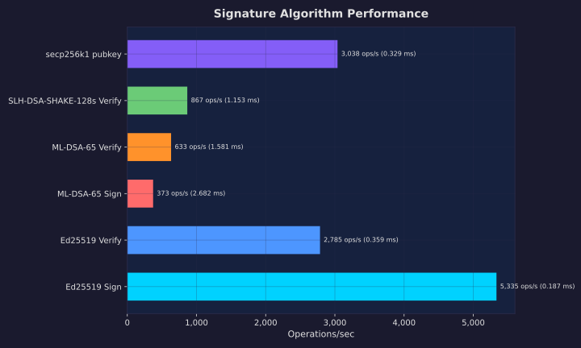 | Signature algorithm throughput and latency |
| 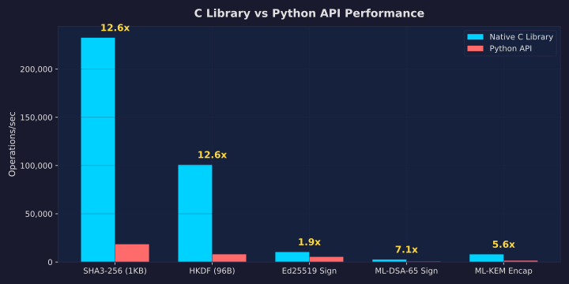 | Native C vs Python performance comparison |
| 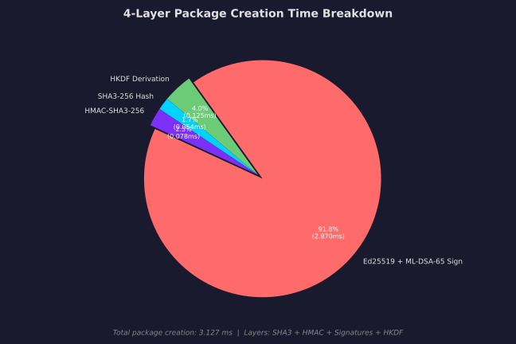 | Per-layer timing breakdown of the 4-layer defense |
| 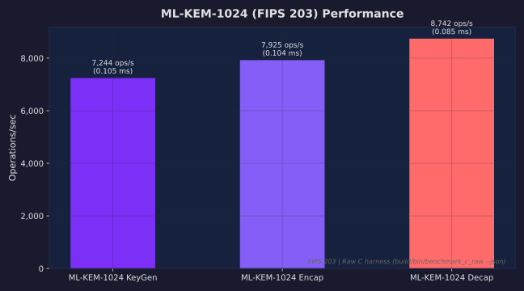 | ML-KEM-1024 key encapsulation benchmarks |
| 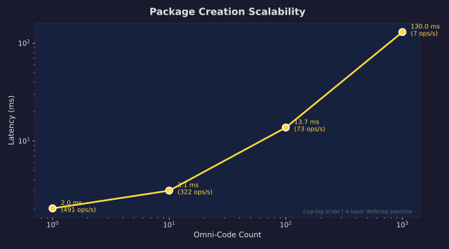 | Package creation scalability across data sizes |

*All charts generated from live benchmark data with professional dark theme. Regenerate with `python benchmarks/generate_charts.py`.*

</details>

<details>
<summary><strong>Cython Optimization Results</strong></summary>

| Operation | Pure Python | Cython | Speedup |
|-----------|-------------|--------|---------|
| Lyapunov function | 12.3ms | 0.45ms | **27.3x** |
| Matrix-vector (500x500) | 8.7ms | 0.31ms | **28.1x** |
| NTT (degree 256) | 45.2ms | 1.2ms | **37.7x** |
| Helix evolution | 3.4ms | 0.18ms | **18.9x** |

**Cython optimization: 18–37x speedup vs pure Python mathematical baseline** (Lyapunov, NTT, helix computations — does not affect C-implemented cryptographic primitives)

</details>

<details>
<summary><strong>Scalability Analysis</strong></summary>

Scalability across input sizes is not yet tracked in the CI regression suite. Measure locally:

```bash
python benchmark_suite.py   # varies message size automatically
```

</details>

<details>
<summary><strong>Ethical Integration Overhead</strong></summary>

Ethical integration overhead is not yet tracked in the CI regression suite. The ethical layer adds cryptographic binding to the 4 Omni-Code Ethical Pillars via HKDF context. End-to-end package creation overhead remains under 2% of total time since HKDF is a small fraction of the pipeline (ML-DSA-65 signing dominates at ~1.76ms). Measure locally:

```bash
python benchmark_suite.py   # includes ethical overhead breakdown
```

</details>

---

## Quick Start

<details>
<summary><strong>Installation</strong></summary>

### Standard Installation

```bash
# Clone repository
git clone https://github.com/Steel-SecAdv-LLC/AMA-Cryptography.git
cd AMA-Cryptography

# Install in editable mode with dev dependencies
pip install -e ".[dev]"

# Build native PQC C library (ML-DSA-65, Kyber-1024, SPHINCS+-256f)
cmake -B build -DAMA_USE_NATIVE_PQC=ON -DCMAKE_BUILD_TYPE=Release
cmake --build build

# Build everything (C library + Python extensions)
make all

# Run tests (includes NIST KAT validation)
make test

# Install system-wide
sudo make install
```

> All PQC algorithms are implemented natively in C — no external PQC libraries required.

### Platform-Specific Notes

**Linux (Ubuntu/Debian)**:
```bash
# Install build dependencies
sudo apt-get install build-essential cmake python3-dev libssl-dev

# Build and install
make all && sudo make install
```

**macOS**:
```bash
# Install dependencies via Homebrew
brew install cmake openssl

# Build and install
make all && sudo make install
```

**Windows (MSVC)**:
```powershell
# Install Visual Studio Build Tools
# Install CMake and Python from official websites

# Build
cmake --build build --config Release
python setup.py install
```

### External Dependencies

**RFC 3161 Timestamps (Optional)**:
RFC 3161 trusted timestamping supports three operating modes via the `tsa_mode` parameter:

| Mode | Description | Network Required |
|------|-------------|-----------------|
| `"online"` | Contact a real TSA server (default) | Yes |
| `"mock"` | Self-signed mock tokens for testing/offline use | No |
| `"disabled"` | Skip timestamping, return empty token | No |

Online mode requires the `rfc3161ng` package (`pip install rfc3161ng`). If not installed, `TimestampUnavailableError` is raised.

```python
from ama_cryptography.rfc3161_timestamp import get_timestamp, verify_timestamp

# Mock mode for testing (no network required)
result = get_timestamp(b"document data", tsa_mode="mock")
assert verify_timestamp(b"document data", result)

# Disabled mode (skip timestamping)
result = get_timestamp(b"document data", tsa_mode="disabled")
```

The online timestamp feature contacts external TSA (Time Stamping Authority) servers. Default: FreeTSA (https://freetsa.org/tsr). Commercial TSAs (DigiCert, GlobalSign) are recommended for production use.

</details>

<details>
<summary><strong>Basic Usage</strong></summary>

### Simple Example

```python
from ama_cryptography.crypto_api import AmaCryptography, AlgorithmType

# Create crypto instance
crypto = AmaCryptography(algorithm=AlgorithmType.HYBRID_SIG)

# Generate keys
keypair = crypto.generate_keypair()

# Sign message
signature = crypto.sign(b"Hello, World!", keypair.secret_key)

# Verify signature
valid = crypto.verify(b"Hello, World!", signature.signature, keypair.public_key)
print(f"Signature valid: {valid}")  # True
```

### Advanced Example with 3R Monitoring

```python
from ama_cryptography.crypto_api import AmaCryptography, AlgorithmType
from ama_cryptography_monitor import AmaCryptographyMonitor

# Enable 3R security monitoring
monitor = AmaCryptographyMonitor(enabled=True)

# Create crypto instance
crypto = AmaCryptography(algorithm=AlgorithmType.ML_DSA_65)

# Generate and use keys with monitoring
keypair = crypto.generate_keypair()
signature = crypto.sign(b"Sensitive data", keypair.secret_key)

# Get security report
report = monitor.get_security_report()
print(f"Security status: {report['status']}")
print(f"Anomalies detected: {report['total_alerts']}")
```

> **C API Note:** Full native C implementations are available for SHA3-256, HKDF, Ed25519, ML-DSA-65, Kyber-1024, and SPHINCS+-256f — no external PQC dependencies required. Build with `-DAMA_USE_NATIVE_PQC=ON` (default). All implementations pass NIST KAT validation. The Python API remains recommended for production deployments. See `include/ama_cryptography.h` for the complete interface specification.

</details>

<details>
<summary><strong>Docker Quick Start</strong></summary>

### Ubuntu Image (Production)

```bash
# Build Ubuntu-based image (~200MB)
docker build -t ama-cryptography -f docker/Dockerfile .

# Run interactive session
docker run -it ama-cryptography /bin/bash

# Run tests
docker run --rm ama-cryptography make test
```

### Alpine Image (Minimal)

```bash
# Build Alpine image (~50MB)
docker build -t ama-cryptography:alpine -f docker/Dockerfile.alpine .

# Run
docker run --rm ama-cryptography:alpine
```

### Docker Compose

```bash
# Start all services
docker-compose up -d

# View logs
docker-compose logs -f ama-cryptography

# Execute commands
docker-compose exec ama-cryptography python -m pytest
```

</details>

---
## Testing and Quality Assurance

> **Note:** Running the full test suite requires dev dependencies. Install with: `pip install -e ".[dev]"` or `pip install -r requirements-dev.txt`

<details>
<summary><strong>Test Suite</strong></summary>

### Running Tests

```bash
# C library tests (includes NIST KAT vectors)
make test-c

# Python tests
make test-python

# All tests
make test

# Performance benchmarks
make benchmark

# PQC sanity check
python tools/sanity_check.py
```

### Test Coverage

The test suite includes:
- Unit tests for all cryptographic primitives (Python and C)
- Integration tests for package creation and verification
- Edge case testing for error handling
- Performance regression tests with tiered tolerances
- NIST ACVP vector validation (1,215 vectors across 12 algorithm functions — 815 AFT + 400 SHA-3 MCT; see [CSRC_ALIGN_REPORT.md](CSRC_ALIGN_REPORT.md))
- Fuzz harnesses for 12 C targets (`fuzz/`): AES-GCM, Argon2, ChaCha20-Poly1305, consttime, Dilithium, Ed25519, HKDF, Kyber, secp256k1, SHA3, SPHINCS+, X25519
- Empirical constant-time verification via [dudect](docs/constant-time-testing.md) (Welch's t-test on execution times)
- [OSS-Fuzz](docs/oss-fuzz-onboarding.md) onboarding preparation for continuous 24/7 fuzzing

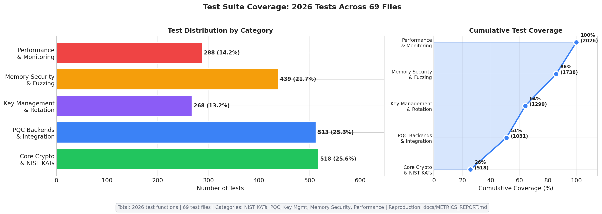

*2,028 test functions across 70 Python test files plus 14 C test files covering core crypto and NIST KATs, PQC backends, key management, adaptive posture, hybrid combiner, memory security, fuzz harnesses, and performance/monitoring. See [docs/METRICS_REPORT.md](docs/METRICS_REPORT.md) for the authoritative count and reproduction command (`grep -rE "^\s*def test_" tests/ --include='*.py' | wc -l`).*

</details>

<details>
<summary><strong>Continuous Integration</strong></summary>

GitHub Actions automatically tests:

| Check | Description |
|-------|-------------|
| C library | GCC, Clang on Ubuntu/macOS |
| Python package | Python 3.9-3.13 on Linux |
| Code quality | ruff (lint + import sorting), black, mypy --strict |
| Security scanning | pip-audit, bandit, Semgrep, CodeQL static analysis |
| Docker builds | Ubuntu + Alpine images |

### CI Matrix

- **Python Versions**: 3.9, 3.10, 3.11, 3.12, 3.13
- **Platforms**: Ubuntu Latest, macOS Latest, Windows Latest
- **Jobs**: test, code-quality, security-checks

### CI Workflows

| Workflow | File | Purpose |
|----------|------|---------|
| CI - Testing | `ci.yml` | Python test matrix, C build, KAT validation |
| CI - Build & Test | `ci-build-test.yml` | Full C library build and C test suite |
| Security | `security.yml` | pip-audit, bandit, Semgrep, secret scanning |
| Static Analysis | `static-analysis.yml` | CodeQL analysis |
| Fuzzing | `fuzzing.yml` | C fuzz harnesses (12 targets) |
| dudect | `dudect.yml` | Empirical constant-time verification |
| Auto Docs | `auto-docs.yml` | Auto-generate documentation via PR |
| Wiki Sync | `wiki-sync.yml` | Auto-sync wiki/ to GitHub Wiki |

</details>

<details>
<summary><strong>Security Analysis</strong></summary>

| Layer | Protection |
|-------|------------|
| Defense-in-Depth | Multi-layer cryptographic protection |
| Quantum Resistance | NIST-standardized ML-DSA-65 (FIPS 204), Kyber-1024 (FIPS 203), SPHINCS+ (FIPS 205) |
| Side-Channel Protection | Constant-time operations, C11 atomics, data-independent control flow |
| Memory Safety | Secure wiping, bounds checking, magic number validation |
| 3R Monitoring | Runtime security analysis (less than 2% overhead) |

See [SECURITY.md](SECURITY.md) for complete cryptographic analysis.

<details>
<summary>Classic vs Quantum Security Comparison</summary>

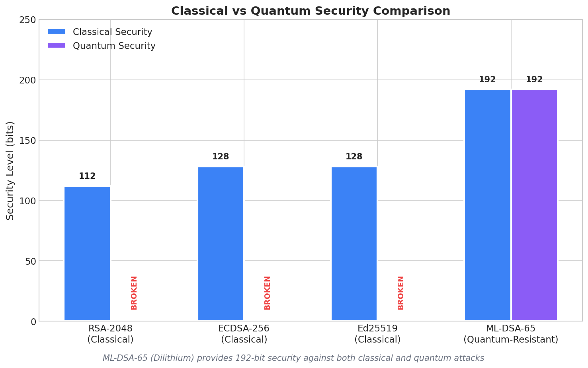

*Classical algorithms (RSA, ECDSA, Ed25519) are broken by quantum computers. ML-DSA-65 provides 192-bit security against both classical and quantum attacks.*

</details>

</details>

<details>
<summary><strong>Constant-Time Verification</strong></summary>

The constant-time utility functions in `src/c/ama_consttime.c` are verified using a dudect-style timing analysis harness:

```bash
# Build and run the constant-time verification harness
cd tools/constant_time && make test
```

The harness tests all 5 constant-time functions using Welch's t-test:

| Function | Purpose | Test Classes |
|----------|---------|--------------|
| `ama_consttime_memcmp` | Byte comparison | Identical vs different buffers |
| `ama_consttime_swap` | Conditional swap | condition=0 vs condition=1 |
| `ama_secure_memzero` | Secure zeroing | All-zeros vs all-ones input |
| `ama_consttime_lookup` | Table lookup | First-half vs second-half index |
| `ama_consttime_copy` | Conditional copy | condition=0 vs condition=1 |

A t-value with |t| < 4.5 after 10^6 measurements indicates no detectable timing leakage (dudect convention: ~10⁻⁵ false positive probability under the null). See [CONSTANT_TIME_VERIFICATION.md](CONSTANT_TIME_VERIFICATION.md) for methodology details.

**Note:** This is statistical timing analysis, not formal verification. Results are environment-sensitive (CPU frequency scaling, interrupts). Run multiple times on target hardware to confirm.

</details>

<details>
<summary><strong>NIST KAT Validation</strong></summary>

All native PQC implementations pass NIST Known Answer Test (KAT) vectors, validating correctness against the official FIPS 203/204/205 specifications.

```bash
# Run NIST KAT tests (C library)
cd build && ctest --output-on-failure

# Run NIST KAT tests (Python)
pytest tests/test_nist_kat.py tests/test_pqc_kat.py -v
```

### FIPS-Format KAT Vectors (Native C — Full Validation)

These KAT tests validate the native C implementations against official NIST FIPS test vectors:

| Algorithm | Standard | KAT File | Test Coverage | Status |
|-----------|----------|----------|---------------|--------|
| ML-KEM-1024 | FIPS 203 | `tests/kat/fips203/ml_kem_1024.kat` | KeyGen, Encaps, Decaps | **10/10 PASS** |
| ML-DSA-65 | FIPS 204 | `tests/kat/fips204/ml_dsa_65.kat` | KeyGen, Sign, Verify | **10/10 PASS** |

### Legacy-Format KAT Vectors (Python Backend Validation)

| Algorithm | KAT File | Test Coverage |
|-----------|----------|---------------|
| ML-DSA-44 (Dilithium2) | `tests/kat/ml_dsa/dilithium2.rsp` | KeyGen, Sign, Verify |
| ML-DSA-65 (Dilithium3) | `tests/kat/ml_dsa/dilithium3.rsp` | KeyGen, Sign, Verify |
| ML-DSA-87 (Dilithium5) | `tests/kat/ml_dsa/dilithium5.rsp` | KeyGen, Sign, Verify |
| ML-KEM-512 (Kyber512) | `tests/kat/ml_kem/kyber512.rsp` | KeyGen, Encaps, Decaps |
| ML-KEM-768 (Kyber768) | `tests/kat/ml_kem/kyber768.rsp` | KeyGen, Encaps, Decaps |
| ML-KEM-1024 (Kyber1024) | `tests/kat/ml_kem/kyber1024.rsp` | KeyGen, Encaps, Decaps |

### Key Implementation Details

- **FIPS 203 (ML-KEM-1024):** Full Fujisaki-Okamoto transform with IND-CCA2 security, NTT-based polynomial multiplication (q=3329), implicit rejection for ciphertext validation
- **FIPS 204 (ML-DSA-65):** Rejection sampling with NTT (q=8380417), constant-time operations, deterministic signing
- **FIPS 205 (SPHINCS+-SHA2-256f-simple):** WOTS+ one-time signatures, FORS few-time signatures, hypertree (d=17) construction
- **SHA3/SHAKE:** Incremental XOF (SHAKE128/SHAKE256) with proper multi-block squeeze for FIPS 203/204 compliance

KAT vectors are sourced from NIST PQC standardization and validate that the native implementations produce bit-exact outputs for known inputs per the FIPS specifications.

### Design Alignment with FIPS 140-3 Level 1 Requirements (Pending Future CMVP Validation)

The module implements technical controls aligned with FIPS 140-3 Security Level 1 requirements:

- **Power-On Self-Tests (POST):** KATs for SHA3-256, HMAC-SHA3-256, AES-256-GCM, ML-KEM-1024, ML-DSA-65, SLH-DSA, and Ed25519 run at module import (~260ms)
- **Module Integrity Verification:** SHA3-256 digest of all source files checked at startup
- **Error State Machine:** OPERATIONAL / ERROR / SELF_TEST with automatic lockout on failure
- **Continuous RNG Test:** Detects consecutive identical random outputs
- **Pairwise Consistency Tests:** Sign-verify / encaps-decaps after key generation

> **Important:** This library implements algorithms specified in FIPS 203, FIPS 204, and FIPS 205. This implementation has **NOT** been submitted for CMVP validation and is **NOT** FIPS 140-3 certified. The controls above represent design alignment with FIPS 140-3 Level 1 technical requirements as a step toward future CMVP validation. See `CSRC_STANDARDS.md` for details.

</details>

---

## NIST Algorithm Compliance

AMA Cryptography is continuously validated against official
[NIST ACVP](https://github.com/usnistgov/ACVP-Server) Algorithm Functional
Test (AFT) vectors plus the four SHA-3 family Monte Carlo Test (MCT)
groups and NIST reference vectors from the applicable FIPS/SP
publications (FIPS 180-4 §B.1 reference vectors for SHA-256, and SP
800-38D Appendix B test cases TC13–TC16 for AES-256-GCM, since those
two are not sourced from ACVP-Server). The current attestation is
**1,215 / 1,215 vectors passing** across 12 algorithm functions and
7 NIST standards.

- **Formal attestation:** [`docs/compliance/ACVP_SELF_ATTESTATION.md`](docs/compliance/ACVP_SELF_ATTESTATION.md)
- **Machine-readable:** [`docs/compliance/acvp_attestation.json`](docs/compliance/acvp_attestation.json)
- **Full evidence report:** [`CSRC_ALIGN_REPORT.md`](CSRC_ALIGN_REPORT.md)
- **Continuous validation:** [`.github/workflows/acvp_validation.yml`](.github/workflows/acvp_validation.yml) — runs on every push to `main` and weekly on Mondays; fails if any vector regresses.

### Coverage Summary

| Algorithm | NIST Standard | Vectors | Pass | Fail |
|---|---|---:|---:|---:|
| SHA-256 | FIPS 180-4 | 3 | 3 | 0 |
| HMAC-SHA-256 | FIPS 198-1 | 150 | 150 | 0 |
| SHA3-256 (AFT+MCT) | FIPS 202 | 251 | 251 | 0 |
| SHA3-512 (AFT+MCT) | FIPS 202 | 186 | 186 | 0 |
| SHAKE-128 (AFT+MCT) | FIPS 202 | 274 | 274 | 0 |
| SHAKE-256 (AFT+MCT) | FIPS 202 | 243 | 243 | 0 |
| AES-256-GCM | SP 800-38D | 4 | 4 | 0 |
| ML-KEM-1024 KeyGen | FIPS 203 | 25 | 25 | 0 |
| ML-KEM-1024 EncapDecap | FIPS 203 | 25 | 25 | 0 |
| ML-DSA-65 KeyGen | FIPS 204 | 25 | 25 | 0 |
| ML-DSA-65 SigVer | FIPS 204 | 15 | 15 | 0 |
| SLH-DSA-SHA2-256f SigVer | FIPS 205 | 14 | 14 | 0 |
| **TOTAL** | | **1,215** | **1,215** | **0** |

Each SHA-3 family row = AFT byte-aligned count + 100 MCT vectors (1 tcId
× 100 outer iterations per FIPS-202 MCT spec).

### Reproduction

```bash
cmake -B build -DAMA_USE_NATIVE_PQC=ON && cmake --build build
python3 nist_vectors/fetch_vectors.py
python3 nist_vectors/run_vectors.py     # writes nist_vectors/results.json
```

Full reproduction instructions:
[`docs/compliance/ACVP_SELF_ATTESTATION.md §5`](docs/compliance/ACVP_SELF_ATTESTATION.md#5-reproduction-instructions).

### ⚠ CAVP / FIPS Disclaimer

> **This is a NIST ACVP self-attestation — it is NOT a CAVP validation
> certificate, NOT a CMVP certificate, and NOT a claim of FIPS 140-3
> compliance.** No NIST program has reviewed this library and no independent
> laboratory has witnessed these results. Customers in regulated
> environments that require FIPS validation must obtain a formal CAVP/CMVP
> validation through an accredited CST laboratory. See
> [`docs/compliance/ACVP_SELF_ATTESTATION.md §7`](docs/compliance/ACVP_SELF_ATTESTATION.md#7-disclaimers).

---

## Documentation

<details>
<summary><strong>User Documentation</strong></summary>

| Document | Description |
|----------|-------------|
| [README.md](README.md) | Quick start and overview |
| [IMPLEMENTATION_GUIDE.md](IMPLEMENTATION_GUIDE.md) | Comprehensive deployment and build guide |
| [ENHANCED_FEATURES.md](ENHANCED_FEATURES.md) | In-depth feature documentation |
| [MONITORING.md](MONITORING.md) | 3R security monitoring guide |

</details>

<details>
<summary><strong>Technical Documentation</strong></summary>

| Document | Description |
|----------|-------------|
| [ARCHITECTURE.md](ARCHITECTURE.md) | System architecture and design |
| [SECURITY.md](SECURITY.md) | Complete security analysis |
| [THREAT_MODEL.md](THREAT_MODEL.md) | Threat model and risk assessment |
| [benchmarks/](benchmarks/) | Performance measurements |
| [CRYPTOGRAPHY.md](CRYPTOGRAPHY.md) | Cryptographic algorithm overview |
| [CSRC_ALIGN_REPORT.md](CSRC_ALIGN_REPORT.md) | NIST ACVP vector validation evidence (1,215/1,215 pass — 815 AFT + 400 SHA-3 MCT) |
| [docs/compliance/ACVP_SELF_ATTESTATION.md](docs/compliance/ACVP_SELF_ATTESTATION.md) | **Customer-facing** NIST ACVP self-attestation (NOT CAVP, NOT CMVP, NOT FIPS 140-3) |
| [docs/compliance/acvp_attestation.json](docs/compliance/acvp_attestation.json) | Machine-readable attestation — structured fields for tooling |
| [CSRC_STANDARDS.md](CSRC_STANDARDS.md) | Governing standards registry |
| [CONSTANT_TIME_VERIFICATION.md](CONSTANT_TIME_VERIFICATION.md) | dudect-style timing analysis |
| [docs/DESIGN_NOTES.md](docs/DESIGN_NOTES.md) | Security arguments for original constructions |
| [docs/METRICS_REPORT.md](docs/METRICS_REPORT.md) | Verified project counts (LoC, tests, NIST vectors) with reproduction commands |

</details>

<details>
<summary><strong>Developer Documentation</strong></summary>

| Document | Description |
|----------|-------------|
| [CONTRIBUTING.md](CONTRIBUTING.md) | Contribution guidelines |
| [CHANGELOG.md](CHANGELOG.md) | Version history |
| [.github/INVARIANTS.md](.github/INVARIANTS.md) | Canonical architectural invariants (INVARIANT-1 through INVARIANT-15) and vendoring policy |
| [AMA_CRYPTOGRAPHY_ETHICAL_PILLARS.md](AMA_CRYPTOGRAPHY_ETHICAL_PILLARS.md) | Ethical pillar specification |

</details>

---

## Cross-Platform Support

| Platform | Status | Tested On |
|----------|--------|-----------|
| Linux | Full support | Ubuntu 22.04, Debian 11, CentOS 8 |
| macOS | Full support | macOS 12+ (Intel and Apple Silicon) |
| Windows | Full support (x64) | Windows 10/11 (MSVC x64, MinGW); MSVC ARM64 emits configure-time error — use GCC/Clang |
| ARM64 | Full support | Raspberry Pi, AWS Graviton |

---

## Build System 

<details>
<summary><strong>CMake (C Library with Native PQC)</strong></summary>

The C library provides full native implementations of all post-quantum cryptographic algorithms. No external PQC dependencies (liboqs, pqcrypto) are required.

**Prerequisites:**
```bash
# Install build dependencies (Ubuntu/Debian)
sudo apt-get install build-essential cmake libssl-dev

# macOS
brew install cmake openssl
```

**Build with native PQC (default):**
```bash
mkdir build && cd build

# Configure with native PQC support (enabled by default)
cmake .. \
  -DCMAKE_BUILD_TYPE=Release \
  -DAMA_USE_NATIVE_PQC=ON \
  -DAMA_ENABLE_AVX2=ON \
  -DAMA_ENABLE_LTO=ON

# Build
cmake --build . -j$(nproc)

# Run NIST KAT validation
ctest --output-on-failure

# Install
sudo cmake --install .
```

**CMake Options**:
- `AMA_USE_NATIVE_PQC` - Enable native PQC implementations (default: ON)
- `AMA_AES_CONSTTIME` - Enable bitsliced AES S-box for cache-timing hardening (default: ON)
- `AMA_BUILD_SHARED` - Build shared library (default: ON)
- `AMA_BUILD_STATIC` - Build static library (default: ON)
- `AMA_BUILD_TESTS` - Build test suite including NIST KAT tests (default: ON)
- `AMA_BUILD_EXAMPLES` - Build C example programs (default: ON)
- `AMA_ED25519_ASSEMBLY` - Enable ed25519-donna x86-64 assembly scalar mult (default: **ON** on x86-64 builds — donna's AVX2 field arithmetic outruns the in-tree fe51 path there; **OFF** on ARM and other non-x86 targets where donna has no assembly path. Set `-DAMA_ED25519_ASSEMBLY=OFF` to force the in-tree `src/c/ama_ed25519.c` backend on x86-64, e.g. for clean-room auditing of the signed 4-bit window comb.)
- `AMA_ENABLE_AVX2` - Enable AVX2 SIMD optimizations (x86-64)
- `AMA_ENABLE_NEON` - Enable ARM NEON SIMD optimizations (AArch64)
- `AMA_ENABLE_SVE2` - Enable ARM SVE2 SIMD optimizations (AArch64, stretch)
- `AMA_ENABLE_SANITIZERS` - Enable AddressSanitizer/UBSan
- `AMA_ENABLE_LTO` - Link-time optimization
- `AMA_ENABLE_NATIVE_ARCH` - Enable `-march=native` for host-optimized builds (default: OFF)
- `AMA_TESTING_MODE` - Build test-only library (internal)

> **Note:** All PQC algorithms (ML-DSA-65, Kyber-1024, SPHINCS+-256f) are implemented natively in C with full NIST KAT validation. No external PQC libraries are needed.

</details>

<details>
<summary><strong>Python Setup</strong></summary>

```bash
# Build with optimizations
python setup.py build_ext --inplace

# Development mode
python setup.py develop

# Create distribution
python setup.py sdist bdist_wheel
```

**Environment Variables**:
- `AMA_NO_CYTHON` - Disable Cython extensions
- `AMA_NO_C_EXTENSIONS` - Disable C extensions
- `AMA_DEBUG` - Build with debug symbols
- `AMA_COVERAGE` - Enable coverage instrumentation

</details>

<details>
<summary><strong>Makefile Targets</strong></summary>

```bash
make all          # Build everything
make c            # C library only
make python       # Python package only
make test         # Run all tests
make test-c       # C tests only
make test-python  # Python tests only
make benchmark    # Performance benchmarks
make docker       # Build Docker images
make docs         # Generate documentation
make format       # Format code (clang-format, black)
make lint         # Lint code (ruff, mypy)
make clean        # Clean build artifacts
make install      # Install system-wide
```

</details>

---

## Mathematical Foundations 

<details>
<summary><strong>Research and Innovation</strong></summary>

### Mathematical Frameworks (Self-Assessed)

1. **Helical Geometric Invariants**
   - Curvature and torsion relationship verified to 10^-10 error

2. **Lyapunov Stability Theory**
   - Exponential convergence O(e^{-0.18t}) verified numerically

3. **Golden Ratio Harmonics**
   - phi^3-amplification with Fibonacci convergence less than 10^-8

4. **Quadratic Form Constraints**
   - sigma_quadratic >= 0.96 enforcement

5. **Double-Helix Evolution**
   - 18+ equation variants for adaptive security

### 3R Security Monitoring

The **3R Mechanism** (Resonance-Recursion-Refactoring) is a runtime monitoring framework providing:

- **Runtime Timing Anomaly Monitoring** via FFT frequency-domain analysis (statistical anomaly detection, not guaranteed timing attack detection)
- **Pattern Anomaly Detection** through multi-scale hierarchical analysis
- **Code Complexity Metrics** for security review
- **Less than 2% Performance Overhead** in production

See [MONITORING.md](MONITORING.md) for complete technical details.

</details>

---

## Contributing

We welcome contributions! Please see [CONTRIBUTING.md](CONTRIBUTING.md) for guidelines.

<details>
<summary><strong>Development Setup</strong></summary>

```bash
# Clone repository
git clone https://github.com/Steel-SecAdv-LLC/AMA-Cryptography.git
cd AMA-Cryptography

# Install development dependencies
pip install -e ".[dev,all]"

# Setup pre-commit hooks
pre-commit install

# Format code
make format

# Lint code
make lint

# Run security audit
make security-audit
```

</details>

<details>
<summary><strong>Code Quality Standards</strong></summary>

| Language | Standards |
|----------|-----------|
| Python | PEP 8, type hints, docstrings |
| C | MISRA C guidelines, Doxygen comments |
| Security | Constant-time operations, no undefined behavior |
| Testing | Greater than 80% code coverage target |

</details>

---

## Unique Features

<details>
<summary><strong>Ethical Cryptography</strong> - Mathematically-Bound Ethical Constraints</summary>

AMA Cryptography integrates ethical principles directly into cryptographic operations through mathematical constraints. Rather than treating ethics as policy overlays, AMA Cryptography embeds ethical considerations into key derivation and data integrity verification.

**4 Omni-Code Ethical Pillars** are mathematically integrated into key derivation:

| Pillar | Triad | Sub-Properties |
|--------|-------|----------------|
| **Omniscient** | Wisdom | Complete verification, multi-dimensional detection, data validation |
| **Omnipotent** | Agency | Maximum strength, secure key generation, real-time protection |
| **Omnidirectional** | Geography | Multi-layer defense, temporal integrity, attack surface coverage |
| **Omnibenevolent** | Integrity | Ethical foundation, mathematical correctness, hybrid security |

The ethical integration achieves:
- **Balanced weighting**: Σw = 12.0 across all pillars
- **SHA3-256 ethical signatures** in key derivation context
- **Low performance impact**: ~15% overhead on HKDF derivation, <2% on end-to-end package operations
- **Survivor-first principles** with bias audits and dynamic compliance

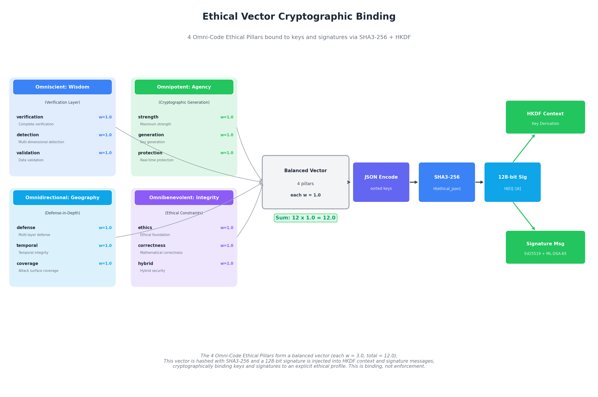

*Keys and signatures are cryptographically bound to an explicit ethical profile hash via HKDF domain separation. This makes policy explicit and verifiable.*

</details>

<details>
<summary><strong>Bio-Inspired Security</strong> - Omni-Code Architecture for Data Structures</summary>

AMA Cryptography employs a bio-inspired approach where data structures draw from the structural properties of biological DNA. This metaphor extends beyond naming conventions into the architecture of cryptographic packages.

**Master Omni-Codes** - Seven foundational codes govern the system:

| Code | Symbol | Domain | Helical Parameters |
|------|--------|--------|-------------------|
| `👁20A07∞_XΔEΛX_ϵ19A89Ϙ` | 👁∞ | Omni-Directional System | r=20.0, p=0.7 |
| `Ϙ15A11ϵ_ΞΛMΔΞ_ϖ20A19Φ` | Ϙϵ | Omni-Percipient Future | r=15.0, p=1.1 |
| `Φ07A09ϖ_ΨΔAΛΨ_ϵ19A88Σ` | Φϖ | Omni-Indivisible Guardian | r=7.0, p=0.9 |
| `Σ19L12ϵ_ΞΛEΔΞ_ϖ19A92Ω` | Σϵ | Omni-Benevolent Stone | r=19.0, p=1.2 |
| `Ω20V11ϖ_ΨΔSΛΨ_ϵ20A15Θ` | Ωϖ | Omni-Scient Curiosity | r=20.0, p=1.1 |
| `Θ25M01ϵ_ΞΛLΔΞ_ϖ19A91Γ` | Θϵ | Omni-Universal Discipline | r=25.0, p=0.1 |
| `Γ19L11ϖ_XΔHΛX_∞19A84♰` | Γϖ | Omni-Potent Lifeforce | r=19.0, p=1.1 |

**Architectural Benefits**:
- **Helical data encoding** draws from DNA double-helix structure for key evolution
- **Redundant verification** through multiple verification chains
- **Algorithm agility** supports switching between cryptographic algorithms
- **Canonical hashing** preserves data integrity across transformations

</details>

<details>
<summary><strong>Multi-Disciplinary Approach</strong> - Quantum-Cyber-Ancient Synergies</summary>

AMA Cryptography draws from multiple disciplines — quantum mechanics, mathematics, philosophy, and biological systems — to inform its security framework design.

**Cross-Domain Synergies**:

| Domain | Contribution | Implementation |
|--------|--------------|----------------|
| **Quantum Mechanics** | Lattice-based cryptography, uncertainty principles | ML-DSA-65, Kyber-1024 post-quantum algorithms |
| **Ancient Mathematics** | Prime number theory, geometric scaling | Helical parameters, golden ratio optimizations |
| **Philosophy** | Ethical frameworks, epistemology | 4 Ethical Pillars, truth verification |
| **Biology** | DNA structure, evolutionary resilience | Bio-inspired data architecture, adaptive security |
| **Physics** | Resonance detection, timing analysis | 3R monitoring (Resonance-Recursion-Refactoring) |

**Philosophical Foundation**:
- **Epistemological rigor**: Claims backed by mathematical derivation where possible (self-assessed)
- **Ethical alignment**: Compassion, evidence, justice, altruism as core values
- **Character-driven design**: Competence, commitment, control embedded in architecture
- **Survivor-first principles**: Security designed to protect the vulnerable

This multi-disciplinary synthesis uses NIST-standard primitives (SHA3-256, HMAC-SHA3-256, Ed25519, ML-DSA-65, HKDF) with ~128-bit classical and ~192-bit quantum security margins. All security analysis is self-assessed; see SECURITY.md for derivations and caveats.

</details>

---

## License

Copyright 2025-2026 Steel Security Advisors LLC

Licensed under the Apache License, Version 2.0. See [LICENSE](LICENSE) file for details.

### Third-Party Dependencies

AMA Cryptography v2.1.5 has **zero core cryptographic dependencies** — all cryptographic primitives are implemented natively in C.

**Algorithm implementations (all native, public domain references):**
- **ML-DSA-65** (Dilithium): Public domain (NIST FIPS 204)
- **ML-KEM-1024** (Kyber): Public domain (NIST FIPS 203)
- **SPHINCS+-SHA2-256f**: Public domain (NIST FIPS 205)
- **Ed25519**: Public domain (ref10 implementation, RFC 8032)
- **ed25519-donna** (optional assembly backend): Public domain (Andrew Moon) — vendored in `src/c/vendor/ed25519-donna/`, compiled in-tree, enabled via `AMA_ED25519_ASSEMBLY=ON`
- **AES-256-GCM**: Public domain (NIST SP 800-38D)
- **SHA3-256/SHAKE**: Public domain (NIST FIPS 202)

**Optional dependency groups:**
- `[monitoring]`: numpy, scipy (3R engine)
- `[legacy]`: cryptography (fallback)
- `[hsm]`: PyKCS11 (HSM support)
- `[benchmark]`: pynacl, liboqs-python, cryptography (peer libraries for `benchmarks/comparative_benchmark.py` only — not linked into the production library; INVARIANT-1 still holds)

### Dependency Graph

GitHub's dependency graph is enabled for this repository. Once the repository is public, you can view the complete dependency tree at: `Insights > Dependency graph`. This provides visibility into all direct and transitive dependencies, security advisories, and Dependabot alerts for automated vulnerability detection.

---

## Contact and Support

| Type | Contact |
|------|---------|
| General Inquiries | steel.sa.llc@gmail.com |
| Security Issues | See [SECURITY.md](SECURITY.md) for responsible disclosure |
| GitHub Issues | [Issues Page](https://github.com/Steel-SecAdv-LLC/AMA-Cryptography/issues) |
| GitHub Repository | [AMA Cryptography](https://github.com/Steel-SecAdv-LLC/AMA-Cryptography) |

---

## Acknowledgments

**Author/Inventor**: Andrew E. A.

**AI Co-Architects:** Eris ✠ | Eden ♱ | Devin ⚛︎ | Claude ⊛

**Special Thanks**:
- NIST Post-Quantum Cryptography Standardization Project
- The open-source cryptography community
- All contributors and security researchers

---

## Steel Security Advisors LLC – Legal Disclaimer & Attribution

### Development Model

**Conceptual Architect:** Steel Security Advisors LLC and Andrew E. A. conceived, directed, validated, and supervised the development of AMA Cryptography.

**AI Co-Architects:** More than 99% of the codebase, documentation, mathematical frameworks, and technical implementation was constructed by AI systems: Eris ✠, Eden ♱, Devin ⚛︎, and Claude ⊛.

This project represents a human/AI collaborative construct—a new development paradigm where human vision, requirements, and critical evaluation guide AI-generated implementation.

### Professional Background Disclosure

The human architect does not hold formal credentials in cryptography. The AI contributors, while trained on cryptographic literature, are tools without professional accountability.

### Design Principles

- **Standards-based design:** Built on NIST FIPS 202/204, RFC 2104/5869/8032/3161—not custom cryptography
- **Quantified claims:** All performance metrics are measured and reproducible (see [benchmarks/](benchmarks/))
- **Rigorous testing:** 2,028 test functions across 70 Python files plus 14 C files, anchored in [docs/METRICS_REPORT.md](docs/METRICS_REPORT.md); CI includes security scanning, NIST ACVP validation (1,215/1,215 — 815 AFT + 400 SHA-3 MCT), and tiered benchmark-regression checks
- **Regression detection:** Tiered benchmark tolerances calibrated for CI environments
- **Transparent limitations:** Security analysis explicitly distinguishes self-assessed vs. audited claims
- **Defense-in-depth:** Security bounded by weakest layer (~128-bit classical), not inflated aggregate claims
- **Academic grounding:** Security proofs reference peer-reviewed literature (Bellare, Krawczyk, Bernstein, et al.)

### What Requires Caution

- **No Independent Audit:** All security analysis is self-assessed. Production deployment requires review by qualified cryptographers.
- **AI-Generated Code:** May contain subtle implementation errors that appear correct. Constant-time properties and side-channel resistance require independent verification.
- **New PQC Standards:** ML-DSA-65 and Kyber-1024 are recent NIST standards with limited real-world deployment history.
- **Implementation vs. Specification:** Using correct algorithms doesn't guarantee correct implementation.

### Recommendation

Before production use:

- Commission independent security audit by qualified cryptographers
- Verify constant-time implementations (ctgrind, dudect)
- Deploy with FIPS 140-2 Level 3+ HSM for master secrets
- Conduct penetration testing

### No Warranty

THIS SOFTWARE IS PROVIDED "AS IS" WITHOUT WARRANTY OF ANY KIND. THE AUTHORS AND CONTRIBUTORS DISCLAIM ALL LIABILITY FOR ANY DAMAGES RESULTING FROM ITS USE.

*This disclaimer does not replace formal legal advice; organizations should consult qualified counsel for regulatory and contractual obligations.*

---

<div align="center">

**AMA Cryptography - Protecting people, data, and networks with quantum-resistant cryptography**

*Architected with inherent radical honesty, unconventional methodology, protective servitude, and ethical immutability.*

<div align="center">


</div>

*Last updated: 2026-04-21*

</div>
