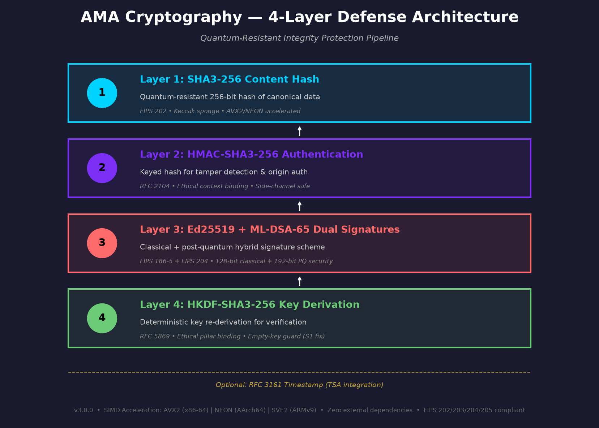
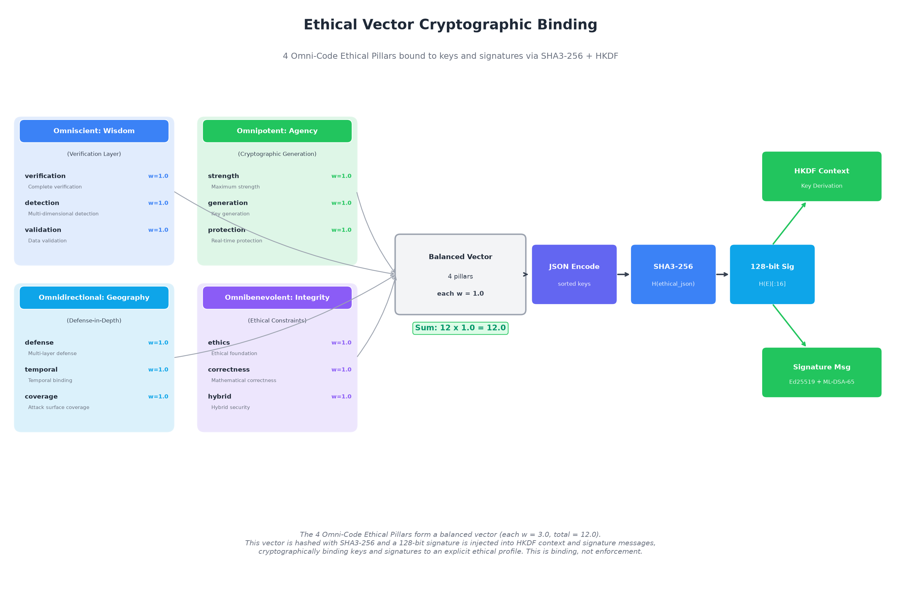

<div align="center">

  

</div>

[](LICENSE)
[](https://www.python.org)
[](https://en.wikipedia.org/wiki/C11_(C_standard_revision))
[](https://cython.org)
[](CRYPTOGRAPHY.md)
[](docs/compliance/ACVP_SELF_ATTESTATION.md)
[](MONITORING.md)
[](ARCHITECTURE.md)

```
              +==============================================================================+
              |                            AMA CRYPTOGRAPHY ♱                                |
              |                       Post-Quantum Security System                           |
              |                                                                              |
              |   Multi-Layer Defense  |   Quantum-Resistant    |   Defense-in-Depth         |
              |   Cython 3R Math       |   3R Anomaly Monitor   |   Cross-Platform           |
              |   HD Key Derivation    |   Algorithm-Agnostic   |   NIST PQC Standards       |
              |                                                                              |
              |   C Layer (Native)     |   Cython Layer         |   Python API               |
              |   ─────────────────    |   ─────────────────    |   ─────────────────        |
              |   SHA3/HKDF/AEAD       |   3R Math (Lyap/NTT)   |   Algorithm-Agnostic       |
              |   ML-DSA/ML-KEM/SLH    |   NumPy Integration    |   Key Management           |
              |   Ed25519/X25519       |   Math Engine          |   3R Monitoring            |
              |   NIST P-curves        |                        |                            |
              |   secp256k1/FROST      |                        |                            |
              |   Ascon/LMS/HSS        |                        |                            |
              |                                                                              |
              |                       Built for a civilized evolution.                       |
              +==============================================================================+
```

**Copyright 2025-2026 Steel Security Advisors LLC**
**Author/Inventor:** Andrew E. A.
**Contact:** steel.sa.llc@gmail.com
**License:** Apache License 2.0
**Version:** 3.5.0
**AI Co-Architects:** Eris ✠ | Eden ♱ | Devin ⚛︎ | Claude ⊛

---

## Executive Summary

AMA Cryptography is a hybrid classical + post-quantum cryptographic library implemented in native C with a Python API. Every cryptographic primitive is implemented in-tree: the library links no external cryptographic runtime (INVARIANT-1). Peer libraries appear only inside `benchmarks/` and only as speed references — INVARIANT-36 forbids using another implementation as a correctness answer key.

The library provides:

- **Hash / MAC / KDF:** SHA3-256, SHA3-512, SHAKE-128, SHAKE-256, SHA-256, SHA-512, HMAC-SHA2-256/384/512, HMAC-SHA3-256, HKDF over any supported hash.
- **AEAD:** AES-256-GCM (NIST SP 800-38D) and ChaCha20-Poly1305 (RFC 8439). AES defaults to a constant-time bitsliced S-box (INVARIANT-20); a table-based path is opt-in only. Ascon-AEAD128 (SP 800-232) is available for lightweight profiles.
- **Password hashing:** Argon2id (RFC 9106).
- **Elliptic-curve signatures / KEX:** Ed25519 (RFC 8032), X25519 (RFC 7748), NIST P-256 / P-384 / P-521 ECDSA (FIPS 186-5) and ECDH (SP 800-56A), secp256k1 ECDSA.
- **Threshold signing:** FROST-Ed25519 (RFC 9591), t-of-n Schnorr threshold with two-round binding-commitment protocol.
- **Post-quantum:** ML-KEM-512 / -768 / -1024 (FIPS 203), ML-DSA-44 / -65 / -87 (FIPS 204), SLH-DSA-SHA2-256f and SLH-DSA-SHAKE-128s (FIPS 205).
- **Stateful hash-based signatures:** LMS and HSS verifier surfaces (SP 800-208; verification/parameter reads only).
- **Interoperability:** PKCS#8, SPKI, PEM, JWK and COSE_Key encoders/decoders across all twelve algorithms in `ama_cryptography.key_formats`.
- **Runtime monitoring:** the optional 3R engine (Resonance / Recursion / Refactoring) plus two agentic-abuse detectors (`VolumeSpikeDetector`, `NoteArtifactDetector`) introduced with INVARIANT-30 for agent-instance binding.

Cryptographic operations run on the native C library. The Cython layer accelerates only the 3R monitoring math (Lyapunov exponent, NTT-shaped rotation matrix-vector products, helix evolution); the reported 18–37× speedup applies to `math_engine.pyx` versus the pure-Python NumPy baseline and does **not** apply to the C-implemented cryptographic primitives, which have their own measurements below.

> **Design Philosophy:** built exclusively from published NIST / IETF primitives — no ad-hoc ciphers, hashes, or signature schemes. The *composition* protocol — how primitives combine into the multi-layer package, the double-helix key evolution, and the adaptive posture system — is an original construction by Steel Security Advisors LLC.
>
> **The Trio — Kin Systems.** AMA Cryptography, Mercury Agent, and FINDΩYOU™ share a single lineage. Each is independently deployable. AMA is the cryptographic foundation — the other two derive their post-quantum surface from this library.
>
> - **AMA Cryptography ♱** — this repository. A standalone library any Python project can adopt.
> - **Mercury Agent ♱** — a neuro-symbolic autonomous-AI prototype gated by a dual hard-enforcement layer (Benevolence ≥ 0.99 and the σ_Immutable signed-corpus gate).
> - **FINDΩYOU™** — an ethical multi-modal biometric platform (face / iris / fingerprint / voice + AgeTransGAN) bound by neuro-symbolic ethical constraints, focused on locating the missing and reuniting families.

> **Security Disclosure.** This is a self-assessed cryptographic implementation. No third-party audit has occurred. Production use in regulated or high-assurance environments requires:
> - An independent review by qualified cryptographers.
> - FIPS 140-2/-3 Level 3+ HSM protection for master secrets.
> - Environment-specific validation of the constant-time and dispatch behaviour on target hardware.
> - Secure file permissions for on-disk key material.
>
> **Status:** community-tested; not externally audited.

---

## Table of Contents

<details>
<summary><strong>Click to expand navigation</strong></summary>

- [Executive Summary](#executive-summary)
- [Cryptographic Surface](#cryptographic-surface)
- [Implementation Status Matrix](#implementation-status-matrix)
- [3R Runtime Monitoring](#3r-runtime-monitoring)
- [Multi-Language Architecture](#multi-language-architecture)
- [Performance](#performance)
- [Installation & Quick Start](#installation--quick-start)
- [Downstream Consumers](#downstream-consumers-hard-runtime-dependency)
- [Testing and Quality Assurance](#testing-and-quality-assurance)
- [NIST ACVP Compliance](#nist-acvp-compliance)
- [Wycheproof](#wycheproof)
- [Documentation](#documentation)
- [Continuous Integration](#continuous-integration)
- [Cross-Platform Support](#cross-platform-support)
- [Build System](#build-system)
- [Architectural Invariants](#architectural-invariants)
- [Ethical Integration](#ethical-integration)
- [License](#license)
- [Contact and Support](#contact-and-support)
- [Acknowledgments](#acknowledgments)
- [Legal Disclaimer & Attribution](#steel-security-advisors-llc--legal-disclaimer--attribution)

</details>

---

## Cryptographic Surface

### Defense-in-depth package

A signed AMA package is protected by four independent core cryptographic operations, supported by two infrastructure primitives. Overall security is bounded by the weakest layer (~128-bit classical, ~192-bit quantum).

| Layer | Primitive | Purpose |
|---|---|---|
| 1 | SHA3-256 | Content integrity (128-bit collision resistance) |
| 2 | HMAC-SHA3-256 | Keyed message authentication |
| 3 | Ed25519 | Classical digital signature (~128-bit classical) |
| 4 | ML-DSA-65 (FIPS 204) | Quantum-resistant digital signature (~192-bit quantum) |
| 5 (support) | HKDF-SHA3-256 | Domain-separated key derivation |
| 6 (support) | RFC 3161 timestamp binding | Token → data binding only (see caveat below) |

**RFC 3161 caveat.** AMA verifies the §2.4.2 message-imprint binding, the `PKIStatusInfo` verdict, and the TSA's nonce echo. It does **not** verify the TSA's CMS `SignerInfo` signature and does **not** validate the TSA certificate chain, so `TSTInfo.genTime` is unauthenticated. The binding check is meaningful only when the token's issuer is trusted through a separate control. See [INVARIANT-37](INVARIANTS.md#invariant-37--a-verification-api-must-not-claim-a-check-it-does-not-perform).



### Agent-instance binding (INVARIANT-30)

Long-lived persistence material and successor-authorising signatures are refused unless a human-held operator key authorises them. The mechanism is domain separation and policy layered over the existing SHA3-256 / HMAC-SHA3-256 / HKDF surface — no new primitives — and is implemented in `src/c/ama_agent_binding.c` and `ama_cryptography/agent_binding.py`. A dedicated fuzz harness (`fuzz/fuzz_agent_binding.c`) asserts security properties (fail-closed policy, no derivation for a refused binding, tampered tags rejected) rather than crash-freedom alone.

<a id="implementation-status-matrix"></a>

### Implementation Status Matrix

| Algorithm / Family | C API | Python API | Notes |
|---|---|---|---|
| SHA-256, SHA-512 | Full | Full | FIPS 180-4; SHA-256 has an opt-in SHA-NI single-block kernel (`ama_sha256_ni.c`) selected by dispatch |
| SHA3-256 / -512, SHAKE-128 / -256 | Full | Full | FIPS 202; AVX-512 4-way Keccak available opt-in via `-DAMA_ENABLE_AVX512=ON` |
| HMAC-SHA-256 / -384 / -512, HMAC-SHA3-256 | Full | Full | RFC 2104, FIPS 198-1 |
| HKDF (any supported hash) | Full | Full | RFC 5869 |
| AES-256-GCM | Full | Full | SP 800-38D; constant-time bitsliced S-box default; VAES + VPCLMULQDQ YMM kernel selected at runtime when CPUID reports both |
| ChaCha20-Poly1305 | Full | Full | RFC 8439; AVX2 8-way + NEON kernels |
| Ascon-AEAD128 & Ascon-Hash256 | Full | Full | SP 800-232 |
| Argon2id | Full | Full | RFC 9106; `out_len ≤ AMA_ARGON2ID_MAX_TAG_LEN` (1024). Legacy verify-only path (`ama_argon2id_legacy*`) for one-shot migration of hashes from AMA ≤ 2.1.5 |
| Ed25519 | Full | Full | RFC 8032; INVARIANT-26 canonical-S enforced. Backend: vendored ed25519-donna x86-64 assembly by default (`AMA_ED25519_ASSEMBLY=ON` auto-set on x86-64 / MSVC x64); `-DAMA_ED25519_ASSEMBLY=OFF` selects the in-tree fe51 + signed-4-bit-window comb path |
| X25519 | Full | Full | RFC 7748; field arithmetic dispatched fe64 (radix-2⁶⁴ on x86-64 GCC/Clang, promoted to a MULX+ADX asm kernel when CPUID reports BMI2 ∧ ADX) → fe51 (radix-2⁵¹, non-x86-64 64-bit) → gf16 (radix-2¹⁶, 32-bit and MSVC). u-coordinates canonicalised (INVARIANT-27); low-order outputs rejected (INVARIANT-21); batch API `ama_x25519_scalarmult_batch` available; opt-in AVX2 4-way ladder |
| NIST P-256 / P-384 / P-521 | Full | Full | FIPS 186-5 ECDSA + SP 800-56A ECDH; TLS/X.509/JOSE/COSE/WebAuthn interop. P-256 4-limb Montgomery MULX+ADCX/ADOX kernel; P-384/P-521 use the generic multi-limb CIOS path constant-folded to their limb counts. Strict minimal-DER with `r`,`s` in `[1, n-1]` unconditional; RFC 6979 `s` emitted verbatim and either representative accepted by default, low-`s` opt-in via `AMA_NISTP_ECDSA_SIGN_LOW_S` / `AMA_NISTP_ECDSA_REQUIRE_LOW_S` (INVARIANT-34); canonical field-element pubkey coordinates (INVARIANT-29). See [docs/NIST_PRIME_CURVES.md](docs/NIST_PRIME_CURVES.md) |
| secp256k1 | Full | Full | RFC 6979 deterministic ECDSA; fixed-base comb over the compile-time generator (4-block, 16 entries) — pubkey derivation and signing scalar multiplications use the comb; caller-supplied bases keep the constant-time Montgomery ladder |
| ML-KEM-512 / -768 / -1024 | Full (native) | Full | FIPS 203; Fujisaki–Okamoto transform, IND-CCA2; NTT q=3329 |
| ML-DSA-44 / -65 / -87 | Full (native) | Full | FIPS 204; NTT q=8380417; rejection sampling; constant-time |
| SLH-DSA-SHA2-256f | Full (native) | Full | FIPS 205; WOTS+ / FORS / hypertree d=17 |
| SLH-DSA-SHAKE-128s | Full (native) | Full | FIPS 205 |
| LMS / HSS verify | Full | Full | SP 800-208; verification and parameter reads (`ama_lms_verify`, `ama_hss_verify`, `ama_lms_signature_length`, `ama_hss_pubkey_levels`) — signing is not exposed at the Python layer |
| FROST-Ed25519 (RFC 9591) | Full | Full | Trusted-dealer keygen, two-round commit / sign, aggregate |
| Hybrid Ed25519 + ML-DSA-65 | N/A | Full | See `ama_cryptography.hybrid_combiner` (INVARIANT-19) |
| Key formats — PKCS#8 / SPKI / PEM / JWK / COSE_Key | N/A | Full | 12 algorithms: Ed25519, X25519, P-256/-384/-521, secp256k1, ML-DSA-44/-65/-87, ML-KEM-512/-768/-1024. See [docs/KEY_FORMATS.md](docs/KEY_FORMATS.md) |

> All PQC operations run through the native C library. No external PQC dependency (liboqs, pqcrypto) is present or required. Build with `cmake -B build -DAMA_USE_NATIVE_PQC=ON && cmake --build build`. Set `AMA_REQUIRE_CONSTANT_TIME=true` in the process environment to enforce constant-time operation at import.

---

## 3R Runtime Monitoring

The 3R engine (Resonance / Recursion / Refactoring) is an *anomaly-monitoring* framework. It surfaces statistical anomalies during cryptographic operations for human review. It is **not** a timing-attack prevention system and does not guarantee detection of side-channel vulnerabilities.

- **Resonance:** FFT-based frequency-domain analysis of operation timings.
- **Recursion:** multi-scale hierarchical pattern analysis.
- **Refactoring:** code-complexity metrics for security review.

Two agentic-abuse detectors ship on by default and are advisory (never block a cryptographic operation):

- **`VolumeSpikeDetector`** — statistical detection of anomalous KEM / signature bursts, scored in the Anscombe variance-stabilising transform so a quiet baseline cannot manufacture false spikes. An optional key fingerprint separates ephemeral-key churn from a hot loop over one key.
- **`NoteArtifactDetector`** — surfaces signed payloads shaped like instructions addressed to a later instance ("notes for future versions"). Calibrated against this repository's own text as a hard-negative corpus.

3R overhead is not part of the CI regression gate; measure it locally on your target with `python benchmarks/benchmark_suite.py` before quoting an environment-specific figure. See [MONITORING.md](MONITORING.md).

---

## Multi-Language Architecture

Three layers, each carrying a specific concern:

1. **Native C library** (`src/c/`) — every cryptographic primitive, dispatch, and CPU-feature detection. Zero external cryptographic runtime dependency.
2. **Cython accelerators** (`src/cython/`) — direct FFI bindings for the hottest Python-facing primitives and the 3R monitoring math engine.
3. **Python API** (`ama_cryptography/`) — algorithm-agnostic surface, key management, monitoring, ethical integration, key formats, hybrid combiner, session, secure channel.

### C library inventory (v3.5.0)

Top-level `src/c/*.c` — 27 translation units:

`ama_aes_bitsliced.c`, `ama_aes_gcm.c`, `ama_agent_binding.c`, `ama_argon2.c`, `ama_ascon.c`, `ama_chacha20poly1305.c`, `ama_consttime.c`, `ama_core.c`, `ama_cpuid.c`, `ama_dilithium.c`, `ama_ed25519.c`, `ama_frost.c`, `ama_hkdf.c`, `ama_hmac_sha256.c`, `ama_hmac_sha384.c`, `ama_kyber.c`, `ama_lms.c`, `ama_nistp.c`, `ama_platform_rand.c`, `ama_secp256k1.c`, `ama_secure_memory.c`, `ama_sha256.c`, `ama_sha256_ni.c`, `ama_sha3.c`, `ama_slhdsa.c`, `ama_x25519.c`, `ed25519_donna_shim.c`.

Public headers under `include/` — 4: `ama_cryptography.h` (top-level API), `ama_cpuid.h`, `ama_dispatch.h`, `ama_uint128.h`.

Additional C sources:

- `src/c/dispatch/ama_dispatch.c` — runtime CPU-feature detection and function-pointer dispatch. On x86 the SHA-3 slot promotes to the AVX-512 kernel when `AMA_ENABLE_AVX512=ON` at build time and `ama_cpuid_has_avx512_keccak()` (AVX-512F + AVX-512VL + XCR0 5+6+7) holds at runtime; every other x86 slot ceiling is AVX2. On AArch64 the order is SVE2 → NEON → generic (for the three slots wired to SVE2; see below). Best-of-5 SHA-3 auto-tune with a 10 % revert threshold. Overrides: `AMA_DISPATCH_NO_AUTOTUNE=1`, `AMA_DISPATCH_VERBOSE=1`.
- `src/c/x86/` (2 files) — `ama_keccak_f1600_bmi.c` (Keccak-f[1600] BMI1/BMI2 kernel where `ANDN` collapses chi's `(~b) & c`); `ama_nistp_mont_mulx.c` (P-256 4-limb MULX+ADCX/ADOX Montgomery multiply).
- `src/c/internal/` — 1 `.c`: `ama_x25519_fe64_mulx.c` (fe64 multiply / square / reduce with `MULX` + `ADCX` + `ADOX` dual-carry chains); 5 `.h`: `ama_sha2.h` (SHA-512 header-only), `ama_sha3_x4.h` (4-way Keccak interface), `ama_ed25519_canonical.h`, `ama_keccak_round.h` (macro-based round header shared by scalar / BMI paths), `ama_once.h` (platform once-primitive for INVARIANT-15).
- `src/c/vendor/` — vendored public-domain ed25519-donna (`src/c/vendor/ed25519-donna/`).

### Hand-written SIMD kernels — 26 translation units

**AVX2 (`src/c/avx2/`, 9 files):** SHA3 4-way Keccak-f[1600], ML-KEM (NTT / Barrett / batch CBD2), ML-DSA (NTT q=8380417 / batch SHAKE rejection), SPHINCS+ 4-way SHA-256, AES-256-GCM pipelined AES-NI + PCLMULQDQ GHASH with H^1..H^8 power-table folding and deferred one-iteration GHASH pipeline, VAES + VPCLMULQDQ YMM AES-256-GCM (`ama_aes_gcm_vaes_avx2.c` — gated by `ama_cpuid_has_vaes_aesgcm()`), ChaCha20-Poly1305 8-way, Argon2 4-way BlaMka, X25519 4-way ladder (`ama_x25519_avx2.c` — opt-in via `AMA_DISPATCH_USE_X25519_AVX2=1`; intentionally not the default on MULX/ADX hosts, retained for CI matrix coverage and a future AVX-512-IFMA port).

**AVX-512 (`src/c/avx512/`, 1 file, opt-in via `-DAMA_ENABLE_AVX512=ON`):** EVEX-encoded YMM-width 4-way Keccak permutation (`ama_sha3_x4_avx512.c` — `vprolq` for the 64-bit rotate, `vpternlogq` for the theta `0x96` and chi `0xD2` collapses). No ZMM register touched. XCR0 5+6+7-gated so an EVEX YMM op cannot `#UD` on a host whose hypervisor advertises CPUID without the ZMM save area. See [docs/AVX512_KECCAK_ADR.md](docs/AVX512_KECCAK_ADR.md).

**NEON (`src/c/neon/`, 8 files):** ARM NEON 128-bit vector equivalents using `<arm_neon.h>` intrinsics + ARM Crypto Extensions — Ed25519, ML-KEM, ML-DSA, SPHINCS+, SHA3, AES-GCM, ChaCha20-Poly1305, Argon2.

**SVE2 (`src/c/sve2/`, 8 files):** scalable-vector implementations. **Three wired via dispatch** — SHA3/Keccak (`ama_sha3_sve2.c`), ML-KEM NTT trio + pointwise/add/sub/reduce (`ama_kyber_sve2.c`), and ML-DSA NTT trio (`ama_dilithium_sve2.c`); their externs appear in `src/c/dispatch/ama_dispatch.c`. The remaining five (`ama_aes_gcm_sve2.c`, `ama_chacha20poly1305_sve2.c`, `ama_argon2_sve2.c`, `ama_sphincs_sve2.c`, `ama_ed25519_sve2.c`) are documented placeholders — their per-file headers state the specific reason each cannot be wired today (dispatch-signature mismatch, algorithmic non-conformance to RFC 9106 BlaMka, absent dispatch surface, no production batched caller) and the preconditions a future kernel must meet. Until those hold, SVE2 hosts dispatch those five algorithms to the validated NEON kernels — a strict upgrade over the generic-C fallback.

### Cython modules (`src/cython/`, 7 files)

- `hmac_binding.pyx`, `sha3_binding.pyx`, `hkdf_binding.pyx`, `ed25519_binding.pyx`, `dilithium_binding.pyx` — thin FFI bindings that call the native C entry points with no per-call ctypes overhead. `ctypes` fallback is used when the extension is not built.
- `math_engine.pyx` — the 3R monitoring math kernels (Lyapunov exponent, NTT-shaped rotation matrix-vector products, helix evolution). 18–37× over the pure-Python NumPy baseline (see [`wiki/Performance-Benchmarks.md`](wiki/Performance-Benchmarks.md) for methodology). **This speedup does not apply to the C-implemented cryptographic primitives.**
- `helix_engine_complete.pyx` — the complete Cython-accelerated helix engine.

### Python package (`ama_cryptography/`, 25 modules + `__init__` + `__main__`)

`crypto_api` (algorithm-agnostic top-level API + `AlgorithmType`), `pqc_backends` (native C bindings for every primitive), `key_formats` (PKCS#8 / SPKI / PEM / JWK / COSE_Key across 12 algorithms), `key_management`, `hybrid_combiner`, `adaptive_posture`, `agent_binding`, `session`, `secure_channel`, `secure_memory`, `integrity`, `equations`, `double_helix_engine`, `monitor`, `monitoring`, `ascon`, `rfc3161_timestamp`, `legacy_compat`, `exceptions`, `_self_test`, `_asn1`, `_build_sign`, `_integrity_signature`, `_finalizer_health`, `_numeric`, `__main__`.

---

## Performance

> **Reading the numbers below.** The regression floors checked into `benchmarks/baseline.json` (recalibrated 2026-07-29 under PR #379; window extended to `applies_through_release = 3.5.0` with floors unchanged, since 3.5.0 ships that same measured tree) are conservative CI-runner floors, not throughput targets. The numbers in the table are the **measured throughput on this branch's sandbox host** — a container on Intel Xeon @ 2.80 GHz, 4 cores, gcc 13.3, native C backend via Python ctypes — captured in `benchmark-report.md` on 2026-07-29. Absolute numbers depend on silicon and dispatch selection; reproduce on your target before quoting externally.

### Current measurements (native C via ctypes, 2026-07-29 sandbox)

| Primitive | Throughput (ops/sec) | CI floor | Notes |
|---|---:|---:|---|
| SHA3-256, 1 KB | 261,781 | 140,000 | AVX2 4-way slot; AVX-512 kernel opt-in |
| HMAC-SHA3-256 | 183,642 | 96,000 | |
| HKDF-SHA3-256 (3-key derive) | 106,140 | 62,000 | |
| AES-256-GCM encrypt, 1 KB | 97,130 | 150,000 | Constant-time bitsliced default; VAES kernel selected when CPUID reports it — sandbox host does not, so this row is the software path |
| ChaCha20-Poly1305 encrypt, 1 KB | 265,158 | 130,000 | AVX2 8-way |
| Ed25519 KeyGen | 55,943 | 31,000 | donna x86-64 asm (default on x86-64) |
| Ed25519 Sign | 65,571 | 33,000 | |
| Ed25519 Verify | 24,014 | 13,000 | Shamir/Straus with width-5 wNAF |
| ML-DSA-65 KeyGen | 4,356 | 2,100 | Native C, NTT q=8380417 |
| ML-DSA-65 Sign | 1,463 | 710 | Rejection sampling, constant-time |
| ML-DSA-65 Verify | 7,868 | 4,600 | |
| ML-KEM-1024 KeyGen | 6,042 | 3,400 | |
| ML-KEM-1024 Encapsulate | 9,258 | 7,500 | FO transform, IND-CCA2 |
| X25519 scalarmult (single) | 19,429 | 13,000 | fe64 + MULX+ADX kernel when CPUID reports BMI2 ∧ ADX |
| X25519 scalarmult (batch-4, batches/sec) | 4,282 | 2,600 | Measures batches/sec, not per-op rate |
| secp256k1 ECDSA Sign | 2,887 | 1,900 | 4-block fixed-base comb over the generator |
| secp256k1 ECDSA Verify | 4,137 | 2,600 | Shamir's trick, variable-time (public inputs) |
| Full package create | 3,736 | 2,400 | All defense layers |
| Full package verify | 5,523 | 2,600 | |

*All 19 regression rows PASS on this host. 18 of 19 clear their floors outright (largest margin 112 % over the floor); AES-256-GCM measures 35 % below its deliberately retained 150,000 floor and passes within its 40 % tolerance — flagged, not adjusted (see [docs/BENCHMARK_HISTORY.md](docs/BENCHMARK_HISTORY.md)).* Full report: [`benchmark-report.md`](benchmark-report.md).

### Kernel-level changes shipping in this PR

The 2026-07-29 hot-path re-optimisation (five kernels, byte-identical output, constant-time properties preserved; each pinned by a byte-identity equivalence test):

| Operation | Before | After | Ratio |
|---|---:|---:|---:|
| AES-256-GCM encrypt, 64 KiB | 85.40 µs | 20.58 µs | 4.15× |
| SHA3-256, 64 KiB | 252.01 µs | 149.36 µs | 1.69× |
| P-256 ECDSA verify | 501.61 µs | 245.70 µs | 2.04× |
| P-256 ECDSA sign | 200.84 µs | 136.22 µs | 1.47× |
| ChaCha20-Poly1305 encrypt, 64 KiB | 91.30 µs | 67.24 µs | 1.36× |
| X25519 scalar multiplication | 59.24 µs | 54.50 µs | 1.09× |

Wall-clock microseconds, best-of-5, before/after binaries run alternately in one session so core-boost drift cancels rather than accumulates into the ratio. See [`docs/BENCHMARK_HISTORY.md`](docs/BENCHMARK_HISTORY.md).

### secp256k1 fixed-base comb (2026-07-29)

Public-key derivation and the ECDSA signing nonce both compute `d·G` against the compile-time generator, and both previously went through the generic constant-time Montgomery ladder — one addition *and* one doubling per scalar bit. A 4-block fixed-base comb (16 entries, ~1.9 KB, L1-resident — the same construction `ama_nistp.c` uses for the NIST generators) replaces 256 doublings and 256 additions with 64 of each. On the sandbox host, raw C:

- Public-key derivation: **354.97 µs → 83.36 µs (4.26×)**
- ECDSA signing: **392.94 µs → 125.54 µs (3.13×)**
- ECDSA verification: **unchanged** — already variable-time by design and using Shamir's trick.

`ama_secp256k1_point_mul` (caller-supplied base) keeps the ladder. Constant-time preserved: scalar read at fixed indices, table read by masked full-table scan. Welch's t-test over 60,000 samples: **|t| = 0.29** fixed-vs-random and **|t| = 1.03** on a Hamming-weight split, against dudect's 4.5 threshold.

### Competitive position

Two generated pages, each read from measured artefacts rather than hand-entered:

| Page | What it answers |
|---|---|
| [`benchmarks/competitive.html`](benchmarks/competitive.html) | Full-surface positioning against OpenSSL, libsodium, wolfSSL, Botan, Nettle, libgcrypt and mbedTLS on the same host, same process, same parameter sets — ops/sec, cycles/byte, MB/s, and the eight-way coverage matrix |
| [`benchmarks/dashboard.html`](benchmarks/dashboard.html) | Throughput by primitive and regression-gate headroom against the recalibrated floors |

Both pages are committed exactly as rendered on their measurement hosts and carry that run's provenance in-file — `dashboard.html` embeds the 2026-07-29 canonical-host run against the 3.4.0-era tree (`66d2073`, performance-identical to the code 3.5.0 ships; see `benchmarks/baseline.json`'s change log), `competitive.html` the same-cycle sandbox-host sweep. They are regenerated only alongside a fresh measurement run, never re-stamped offline. `benchmarks/benchmark-results.json` still carries the 2026-04-27 run: the 2026-07-29 recalibration republished only its markdown twin [`benchmark-report.md`](benchmark-report.md), and the next canonical-host dual-output `benchmark_runner.py` run re-converges the pair.

Wins and losses are both shown. On the sandbox host that produced the current `benchmarks/multi_library_results.json` and `benchmarks/pqc_results.json`:

- **AMA leads** on Ed25519 verify (**2.60×** OpenSSL 3.0.13, **1.25×** libsodium 1.0.18) and on ML-DSA-65 sign (**2.53×** OpenSSL 4.0.1 via `cryptography` 49.0.0) and verify (**1.58×**).
- **AMA trails** OpenSSL 4.0.1 on ML-KEM-1024 encapsulation (**2.47×** the other way) and decapsulation (**1.84×**) — a known vectorisation-breadth gap, closing it is a multi-week project and not claimed as done.
- **AES-256-GCM** on this host: AMA is behind OpenSSL, libgcrypt, and Nettle (all of which use AES-NI); AMA is ahead of libsodium, wolfSSL, Botan, and mbedTLS. This is a deliberate posture: AMA defaults to a **constant-time bitsliced** AES (INVARIANT-20) that never indexes a table with key-dependent data. A table-based path exists only behind the opt-in `AMA_AES_TABLE_INSECURE` flag.

Peer libraries are benchmark-only comparison targets and are not linked into the production library (INVARIANT-1); INVARIANT-36 forbids using a peer implementation as a *correctness* answer key, and a speed reference is not one.

Reproduce with `python benchmarks/comparative_benchmark.py`, `python benchmarks/pqc_comparative_bench.py`, and `./build/bin/benchmark_c_raw --json`.

### Benchmark scripts (`benchmarks/`)

13 scripts: `benchmark_runner.py` (CI regression suite), `benchmark_suite.py` (Python-API sweep, includes 3R + ethical overhead), `check_baseline_justification.py`, `comparative_benchmark.py`, `pqc_comparative_bench.py`, `generate_charts.py`, `generate_competitive.py`, `generate_dashboard.py`, `keyformat_import.py`, `performance_comparison.py`, `performance_suite.py`, `phase0_baseline.py`, `validation_suite.py`. Plus the C harness `benchmark_c_raw` and the peer-comparison C++ harness `multi_library_bench.cpp`.

### Cython optimisation (3R math engine — not cryptographic primitives)

| Operation | Pure Python | Cython | Speedup |
|---|---|---|---|
| Lyapunov function | 12.3 ms | 0.45 ms | 27.3× |
| Matrix-vector (500 × 500) | 8.7 ms | 0.31 ms | 28.1× |
| NTT (degree 256) | 45.2 ms | 1.2 ms | 37.7× |
| Helix evolution | 3.4 ms | 0.18 ms | 18.9× |

---

## Installation & Quick Start

AMA Cryptography is distributed from **its own repository first**. No package index is a required part of the supply chain: the library has zero runtime cryptographic dependencies (INVARIANT-1), so an index is a delivery convenience, not an architectural dependency.

| Channel | Status | Needs a C toolchain? |
|---|---|---|
| 1. Source install from a git tag | Verified working today | Yes |
| 2. Prebuilt wheel from a GitHub Release | From the first release built by `release.yml` onward | No |
| 3. PyPI (`pip install ama-cryptography`) | **Not published yet** — see below | No |
| 4. Self-hosted PEP 503 index | Supported pattern, opt-in | No |

### 1. Source install from a git tag

Pin to a **tag**, never a branch. Every published tag is at <https://github.com/Steel-SecAdv-LLC/AMA-Cryptography/tags>:

```bash
pip install "git+https://github.com/Steel-SecAdv-LLC/AMA-Cryptography.git@v3.5.0"
```

Build toolchain required: a C11 compiler, `cmake ≥ 4.3.4`, `Cython ≥ 3.2.8`, `numpy ≥ 1.24.0`. Confirm the install landed and the native backends are live:

```bash
python -c "
from ama_cryptography import pqc_backends as p
pk, sk = p.native_ed25519_keypair()
sig = p.native_ed25519_sign(b'smoke test', sk)
assert p.native_ed25519_verify(sig, b'smoke test', pk)
kp = p.native_ml_kem_keypair(1024)
ct, ss = p.native_ml_kem_encapsulate(1024, kp.public_key)
assert p.native_ml_kem_decapsulate(1024, ct, kp.secret_key) == ss
print('Ed25519 + ML-KEM-1024 OK — Kyber:', p.KYBER_AVAILABLE,
      'Dilithium:', p.DILITHIUM_AVAILABLE, 'SPHINCS+:', p.SPHINCS_AVAILABLE)
"
```

### 2. Prebuilt wheel from a GitHub Release

`release.yml` builds wheels with `cibuildwheel` for CPython 3.10–3.14 on Linux x86-64, Linux aarch64, macOS x86-64, macOS arm64, and Windows AMD64, and attaches them to the GitHub Release together with the sdist, sigstore bundles, and SLSA v1 provenance. Releases published *before* this pipeline first ran carry no binary assets — for those tags, use channel 1.

```bash
pip install "https://github.com/Steel-SecAdv-LLC/AMA-Cryptography/releases/download/<TAG>/<WHEEL_FILENAME>"
```

Verify before installing:

```bash
pip install sigstore
sigstore verify identity \
  --cert-identity "https://github.com/Steel-SecAdv-LLC/AMA-Cryptography/.github/workflows/release.yml@refs/tags/<TAG>" \
  --cert-oidc-issuer "https://token.actions.githubusercontent.com" \
  <WHEEL_FILENAME>

slsa-verifier verify-artifact <WHEEL_FILENAME> \
  --provenance-path ama-cryptography.intoto.jsonl \
  --source-uri github.com/Steel-SecAdv-LLC/AMA-Cryptography
```

### 3. PyPI — planned, not yet published

> [!WARNING]
> **`pip install ama-cryptography` does not install this library today.** The project is not published on PyPI and the name `ama-cryptography` is **unregistered** — `https://pypi.org/pypi/ama-cryptography/json` returns 404. Anyone may register the name; a package appearing on PyPI under that name is not published by Steel Security Advisors LLC and must not be trusted as this library. Use channel 1 or channel 2 until this section says the channel is live.

Publishing is wired but deliberately opt-in. `release.yml` contains a `publish-pypi` job using PyPI Trusted Publishing, gated on the repository variable `AMA_PUBLISH_TO_PYPI`; with the variable unset the job is skipped and the skip is stated in the release notes rather than passing silently.

### 4. Self-hosted PEP 503 index

Any static web host that serves a real PEP 503 "simple" directory tree works. Publish wheels under `/simple/ama-cryptography/`:

```bash
pip install --extra-index-url https://<your-host>/simple/ ama-cryptography
# or, PyPI-independent:
pip install --index-url https://<your-host>/simple/ ama-cryptography
```

Requirements: real directory listings (an SPA that rewrites unknown paths to `index.html` will not work) and a valid HTTPS certificate. Pin hashes with `--require-hashes` for a fully locked, index-independent install.

---

### Standard local build

```bash
git clone https://github.com/Steel-SecAdv-LLC/AMA-Cryptography.git
cd AMA-Cryptography

pip install -e ".[dev]"

cmake -B build -DAMA_USE_NATIVE_PQC=ON -DCMAKE_BUILD_TYPE=Release
cmake --build build

make all
make test
```

### Platform notes

- **Linux (Ubuntu/Debian):** `sudo apt-get install build-essential cmake python3-dev`.
- **macOS:** `brew install cmake`. Both Intel and Apple Silicon supported.
- **Windows (MSVC x64):** Install Visual Studio Build Tools, CMake, and Python. `cmake --build build --config Release` followed by `pip install -e .`. On MSVC ARM64 the build fails at configure time by design (no fe51 / donna path exists there); use GCC or Clang under WSL/MSYS instead.

### RFC 3161 timestamps

RFC 3161 timestamping supports three operating modes via the `tsa_mode` parameter:

| Mode | Description | Network |
|---|---|---|
| `"online"` | Contact a real TSA server (default) | Yes |
| `"mock"` | HMAC-keyed mock tokens, honoured only inside a testing context | No |
| `"disabled"` | Skip timestamping | No |

Implemented in-tree on AMA's own DER codec — no third-party package. The `rfc3161ng` dependency was removed under INVARIANT-1; `RFC3161_AVAILABLE` (in `ama_cryptography.rfc3161_timestamp`) is unconditionally `True`.

```python
from ama_cryptography.rfc3161_timestamp import (
    allow_mock_tsa,
    describe_token_verification,
    get_timestamp,
    verify_timestamp_binding,
)

with allow_mock_tsa():
    result = get_timestamp(b"document data", tsa_mode="mock")
    assert verify_timestamp_binding(b"document data", result)

# For an audit log, keep the record of what a check did *not* establish:
record = describe_token_verification(b"document data", result.token)
record.binding_verified          # True
sorted(record.not_verified)      # ['gen_time', 'tsa_certificate_chain', 'tsa_signature']
```

### Basic usage

```python
from ama_cryptography.crypto_api import AmaCryptography, AlgorithmType

crypto = AmaCryptography(algorithm=AlgorithmType.HYBRID_SIG)
keypair = crypto.generate_keypair()
signature = crypto.sign(b"Hello, World!", keypair.secret_key)
assert crypto.verify(b"Hello, World!", signature.signature, keypair.public_key)
```

`AlgorithmType` values: `ML_DSA_65`, `KYBER_1024`, `SPHINCS_256F`, `ED25519`, `AES_256_GCM`, `HYBRID_SIG`, `HYBRID_KEM`.

### Docker

```bash
docker build -t ama-cryptography -f docker/Dockerfile .              # Ubuntu image
docker build -t ama-cryptography:alpine -f docker/Dockerfile.alpine .# Alpine image
docker build -t ama-cryptography:c-api  -f docker/Dockerfile.c-api . # C-API-only image
docker-compose up -d                                                 # via docker-compose.yml
```

---

## Downstream Consumers (hard runtime dependency)

Mercury Agent and FINDΩYOU™ import this library on their runtime path — they do not start without it. For a dependency of that class, declare it with an exact, verifiable pin rather than a floating range.

**Pin by tag, no index required** (PEP 508 direct reference, valid in `requirements.txt` and in a `pyproject.toml` `dependencies` list):

```
ama-cryptography @ git+https://github.com/Steel-SecAdv-LLC/AMA-Cryptography.git@v3.5.0
```

**Pin by wheel + hash**, once a release carries built artifacts (pip refuses anything whose hash does not match):

```
# install with: pip install --require-hashes -r requirements.txt
ama-cryptography @ https://github.com/Steel-SecAdv-LLC/AMA-Cryptography/releases/download/v3.5.0/<WHEEL_FILENAME> \
    --hash=sha256:<DIGEST>
```

> A distribution whose metadata contains a direct URL reference **cannot be uploaded to PyPI** — PyPI rejects `Requires-Dist` entries carrying direct references. If Mercury Agent / FINDΩYOU™ ship from GitHub, the `git+https` pin is fully supported. If any is to be installable from PyPI, then `ama-cryptography` must also resolve from PyPI (or from an index configured via `--extra-index-url`).

**Fail closed at import** — verify the native backend is present at start-up:

```python
from ama_cryptography import pqc_backends as p

if not (p.KYBER_AVAILABLE and p.DILITHIUM_AVAILABLE and p.SPHINCS_AVAILABLE):
    raise SystemExit(
        "FATAL: AMA Cryptography native backend unavailable — refusing to start. "
        "Rebuild with: cmake -B build -DAMA_USE_NATIVE_PQC=ON && cmake --build build"
    )
```

This mirrors the library's own INVARIANT-7 posture: with no native constant-time backend, refuse to operate rather than fall back.

---

## Testing and Quality Assurance

The following counts are auditable — reproduction commands are given inline.

- **Python tests:** 3,057 `test_*` functions across 126 Python test files under `tests/` (excluding the vendored `tests/kat/` corpus). Reproduce with `grep -rE "^\s*def test_" tests/ --include='*.py' | wc -l` and `find tests -name 'test_*.py' -not -path '*/kat/*' | wc -l`.
- **C tests:** 57 `test_*.c` suites under `tests/c/` covering KATs, dispatch parity, byte-equivalence between scalar and SIMD paths, dudect timing analysis, and per-primitive suites (60 C files total, including a standalone Ed25519 benchmark and two field-equivalence helper TUs compiled into `test_x25519_field_equiv`). Reproduce with `ls tests/c/test_*.c | wc -l` and `ls tests/c/*.c | wc -l`.
- **Fuzz harnesses:** 16 libFuzzer targets under `fuzz/` — `fuzz_aes_gcm`, `fuzz_agent_binding`, `fuzz_argon2`, `fuzz_ascon`, `fuzz_chacha20poly1305`, `fuzz_consttime`, `fuzz_dilithium`, `fuzz_ed25519`, `fuzz_frost`, `fuzz_hkdf`, `fuzz_kyber`, `fuzz_rng`, `fuzz_secp256k1`, `fuzz_sha3`, `fuzz_sphincs`, `fuzz_x25519`. The agent-binding harness asserts security properties (fail-closed policy, no derivation for a refused binding, tampered tags rejected), not merely crash-freedom.
- **Constant-time verification:** dudect-style Welch t-test harness under `tools/constant_time/` for the `ama_consttime_*` functions and, for the secp256k1 comb, on the fixed-vs-random and Hamming-weight-split scalar distributions.
- **Sanitizers:** AddressSanitizer + UndefinedBehaviorSanitizer clean across the C test suite; per-PR MemorySanitizer KAT lane; scheduled deep MSan / TSan / valgrind lanes.
- **NIST ACVP:** 1,215 / 1,215 vectors passing (see next section).
- **Wycheproof:** vendored corpus with a runner gate (see [Wycheproof](#wycheproof)).
- **[OSS-Fuzz](docs/oss-fuzz-onboarding.md)** onboarding prepared for continuous 24/7 fuzzing.

### Running tests

```bash
make test-c        # C library tests (includes NIST KAT vectors)
make test-python   # Python tests
make test          # Both
make benchmark     # Performance benchmarks
make fuzz          # Build libFuzzer harnesses
```

---

## NIST ACVP Compliance

Continuous validation against official [NIST ACVP-Server](https://github.com/usnistgov/ACVP-Server) Algorithm Functional Test (AFT) vectors plus the four SHA-3 Monte Carlo Test (MCT) groups, plus reference vectors from the applicable FIPS/SP publications for algorithms that ACVP-Server does not cover (FIPS 180-4 §B.1 for SHA-256; SP 800-38D Appendix B TC13–TC16 for AES-256-GCM). The current attestation is **1,215 / 1,215 vectors passing** across 12 algorithm functions and 7 NIST standards.

| Algorithm | Standard | Vectors | Pass | Fail |
|---|---|---:|---:|---:|
| SHA-256 | FIPS 180-4 | 3 | 3 | 0 |
| HMAC-SHA-256 | FIPS 198-1 | 150 | 150 | 0 |
| SHA3-256 (AFT + MCT) | FIPS 202 | 251 | 251 | 0 |
| SHA3-512 (AFT + MCT) | FIPS 202 | 186 | 186 | 0 |
| SHAKE-128 (AFT + MCT) | FIPS 202 | 274 | 274 | 0 |
| SHAKE-256 (AFT + MCT) | FIPS 202 | 243 | 243 | 0 |
| AES-256-GCM | SP 800-38D | 4 | 4 | 0 |
| ML-KEM-1024 KeyGen | FIPS 203 | 25 | 25 | 0 |
| ML-KEM-1024 EncapDecap | FIPS 203 | 25 | 25 | 0 |
| ML-DSA-65 KeyGen | FIPS 204 | 25 | 25 | 0 |
| ML-DSA-65 SigVer | FIPS 204 | 15 | 15 | 0 |
| SLH-DSA-SHA2-256f SigVer | FIPS 205 | 14 | 14 | 0 |
| **TOTAL** | | **1,215** | **1,215** | **0** |

- **Formal attestation:** [`docs/compliance/ACVP_SELF_ATTESTATION.md`](docs/compliance/ACVP_SELF_ATTESTATION.md)
- **Machine-readable:** [`docs/compliance/acvp_attestation.json`](docs/compliance/acvp_attestation.json)
- **Full evidence report:** [`docs/compliance/CSRC_ALIGN_REPORT.md`](docs/compliance/CSRC_ALIGN_REPORT.md)
- **Continuous validation:** [`.github/workflows/acvp_validation.yml`](.github/workflows/acvp_validation.yml) — runs on every push to `main` and weekly on Mondays; fails on any vector regression.

**Reproduce:**

```bash
cmake -B build -DAMA_USE_NATIVE_PQC=ON && cmake --build build
python3 nist_vectors/fetch_vectors.py
python3 nist_vectors/run_vectors.py     # writes nist_vectors/results.json
```

### ⚠ CAVP / FIPS disclaimer

> **This is a NIST ACVP self-attestation — it is NOT a CAVP validation certificate, NOT a CMVP certificate, and NOT a claim of FIPS 140-3 compliance.** No NIST program has reviewed this library and no independent laboratory has witnessed these results. Customers in regulated environments that require FIPS validation must obtain a formal CAVP/CMVP validation through an accredited CST laboratory. See [`docs/compliance/ACVP_SELF_ATTESTATION.md §7`](docs/compliance/ACVP_SELF_ATTESTATION.md#7-disclaimers).

---

## Wycheproof

Vendored [Google Project Wycheproof](https://github.com/google/wycheproof) test corpus under `wycheproof_vectors/`:

- `wycheproof_vectors/vectors/` — the vendored JSON test files (AES-GCM, X25519, HMAC-SHA2, HKDF-SHA2, ECDSA P-256, and the full ECDSA suites over P-256/P-384/P-521 and secp256k1).
- `wycheproof_vectors/manifest.json` — provenance and per-file digests.
- `wycheproof_vectors/run_wycheproof.py` — the gate. Runs the full corpus against the library and fails CI on any divergence.

Corpus provenance is enforced by `.github/workflows/corpus-provenance.yml`; the digest manifest must match on every PR.

---

## Documentation

### User

| Document | Description |
|---|---|
| [README.md](README.md) | This file |
| [IMPLEMENTATION_GUIDE.md](IMPLEMENTATION_GUIDE.md) | Deployment and build guide |
| [ENHANCED_FEATURES.md](ENHANCED_FEATURES.md) | In-depth feature documentation |
| [MONITORING.md](MONITORING.md) | 3R monitoring guide |
| [docs/KEY_FORMATS.md](docs/KEY_FORMATS.md) | PKCS#8 / SPKI / PEM / JWK / COSE_Key across 12 algorithms |
| [docs/NIST_PRIME_CURVES.md](docs/NIST_PRIME_CURVES.md) | P-256 / P-384 / P-521 usage and interop |

### Technical

| Document | Description |
|---|---|
| [ARCHITECTURE.md](ARCHITECTURE.md) | System architecture and design |
| [SECURITY.md](SECURITY.md) | Cryptographic security analysis |
| [THREAT_MODEL.md](THREAT_MODEL.md) | Threat model and risk assessment |
| [CRYPTOGRAPHY.md](CRYPTOGRAPHY.md) | Cryptographic algorithm overview |
| [CSRC_STANDARDS.md](CSRC_STANDARDS.md) | Governing standards registry (INVARIANT-1 addendum) |
| [CONSTANT_TIME_VERIFICATION.md](CONSTANT_TIME_VERIFICATION.md) | dudect-style timing analysis |
| [docs/DESIGN_NOTES.md](docs/DESIGN_NOTES.md) | Security arguments for original constructions |
| [docs/METRICS_REPORT.md](docs/METRICS_REPORT.md) | Verified project counts (LoC, tests, NIST vectors) with reproduction commands |
| [docs/BENCHMARK_HISTORY.md](docs/BENCHMARK_HISTORY.md) | Bench methodology and baseline-change policy |
| [docs/AVX512_KECCAK_ADR.md](docs/AVX512_KECCAK_ADR.md) | ADR for the in-house AVX-512 Keccak kernel |
| [docs/compliance/ACVP_SELF_ATTESTATION.md](docs/compliance/ACVP_SELF_ATTESTATION.md) | NIST ACVP self-attestation (not CAVP / CMVP / FIPS 140-3) |
| [docs/compliance/CSRC_ALIGN_REPORT.md](docs/compliance/CSRC_ALIGN_REPORT.md) | ACVP vector-validation evidence |

### Developer

| Document | Description |
|---|---|
| [CONTRIBUTING.md](CONTRIBUTING.md) | Contribution guidelines |
| [CHANGELOG.md](CHANGELOG.md) | Version history |
| [INVARIANTS.md](INVARIANTS.md) | Canonical architectural invariants (INVARIANT-1 through INVARIANT-37) and vendoring policy |
| [AMA_CRYPTOGRAPHY_ETHICAL_PILLARS.md](AMA_CRYPTOGRAPHY_ETHICAL_PILLARS.md) | Ethical-pillar specification |
| [CRYPTO_REVIEW_CHECKLIST.md](CRYPTO_REVIEW_CHECKLIST.md) | Reviewer checklist |

---

## Continuous Integration

Thirteen workflows under `.github/workflows/`:

| Workflow | File | Purpose |
|---|---|---|
| CI - Testing and Code Quality | `ci.yml` | Python test matrix + C build + KAT validation + lint/format/type |
| CI - Build and Test | `ci-build-test.yml` | Full C library build and C test suite across compilers / platforms |
| CI - Static Analysis (C Code) | `static-analysis.yml` | cppcheck, clang-analyzer (scan-build), CodeQL, strict compiler warnings (Werror), ASan+UBSan, MSan-KAT per-PR (deep MSan / TSan / valgrind scheduled), clang-tidy fail-closed, reproducible build, version/invariant consistency |
| CI - Fuzzing (libFuzzer) | `fuzzing.yml` | 16 harnesses + dictionary-validity gate |
| CI - dudect Constant-Time Verification | `dudect.yml` | Welch's t-test on execution timings |
| ACVP Vector Validation | `acvp_validation.yml` | 1,215 / 1,215 gate, runs on every push and weekly |
| Vendored Corpus Provenance | `corpus-provenance.yml` | Wycheproof and NIST digest manifest gate |
| ARM (QEMU) Cross-Test | `arm-qemu.yml` | AArch64 test lane under QEMU |
| Baseline Change Guard | `baseline-guard.yml` | Enforces the baseline-justification process on any `benchmarks/baseline.json` edit |
| Security Scanning | `security.yml` | pip-audit, bandit, Semgrep, secret scanning |
| Auto-Documentation | `auto-docs.yml` | Auto-generate documentation via PR |
| Sync Wiki | `wiki-sync.yml` | Auto-sync `wiki/` to GitHub Wiki |
| Release — Build, Sign, and Publish | `release.yml` | `cibuildwheel` matrix, sigstore signatures, SLSA v1 provenance, GitHub Release attach, PyPI Trusted Publishing gated on `AMA_PUBLISH_TO_PYPI` |

### CI matrix (`ci.yml`)

- **Python:** 3.10, 3.11, 3.12, 3.13, 3.14
- **OS:** `ubuntu-latest`, `macos-latest`, `windows-latest`, plus an `ubuntu-24.04-arm` lane on Python 3.11 and 3.13
- **C compilers:** GCC and Clang on Ubuntu and macOS; MSVC on Windows
- **Aggregator gates:** *CI Gate*, *Build and Test Gate*, *Static Analysis Gate*, *Security Gate*, *Constant-Time Gate*, *Fuzzing Gate*, *ARM QEMU Gate*, *ACVP Validation Gate* — each fails the run if its dependent jobs did not reach the state their trigger requires

---

## Cross-Platform Support

| Platform | Status | Tested On |
|---|---|---|
| Linux x86-64 | Full support | Ubuntu 22.04, 24.04; Debian 11+; AlmaLinux 8/9 (release wheels build on manylinux_2_28) |
| Linux aarch64 | Full support | Native `ubuntu-24.04-arm` lane + QEMU cross-test |
| macOS x86-64 & arm64 | Full support | macOS 12+ (Intel and Apple Silicon) |
| Windows AMD64 (MSVC) | Full support | Windows 10 / 11 (MSVC x64) |
| Windows ARM64 | Not supported | The build fails at CMake configure by design — no fe51 or donna path exists there. Use GCC/Clang under WSL/MSYS |

---

## Build System

### CMake options

`AMA_USE_NATIVE_PQC` (default **ON**) — enable native ML-KEM / ML-DSA / SLH-DSA.
`AMA_AES_CONSTTIME` (default **ON**) — bitsliced AES S-box for cache-timing hardening (INVARIANT-20).
`AMA_BUILD_SHARED` (default **ON**) / `AMA_BUILD_STATIC` (default **ON**).
`AMA_BUILD_TESTS` (default **ON**) — includes NIST KAT tests.
`AMA_BUILD_EXAMPLES` (default **ON**).
`AMA_BUILD_FUZZ` (default **OFF**) — coverage-guided libFuzzer harnesses (16 targets in `fuzz/`).
`AMA_ED25519_ASSEMBLY` (default **ON** on x86-64 and MSVC x64; **OFF** on other targets) — vendored ed25519-donna x86-64 assembly. Set to `OFF` on x86-64 to force the in-tree `src/c/ama_ed25519.c` fe51 + signed-4-bit-window comb path (e.g. for clean-room auditing).
`AMA_ED25519_VERIFY_SHAMIR` (default **ON**) — Shamir/Straus joint `[s]B + [h](-A)` in verify.
`AMA_ED25519_VERIFY_WINDOW` (default **5**, integer in `[2, 6]`) — wNAF window width for verify scalar mults.
`AMA_ENABLE_SIMD` (default **ON**) — master SIMD toggle.
`AMA_ENABLE_AVX2` (default **ON**) — AVX2 hand-written intrinsics on x86-64.
`AMA_ENABLE_AVX512` (default **OFF**) — in-house AVX-512 4-way Keccak permutation (EVEX YMM, XCR0 5+6+7-gated).
`AMA_ENABLE_NEON` (default **ON**) — ARM NEON on AArch64.
`AMA_ENABLE_SVE2` (default **OFF**) — ARM SVE2 on ARMv9 (wires SHA-3, ML-KEM NTT trio, ML-DSA NTT trio only; the remaining five SVE2 TUs are placeholders documented in their headers).
`AMA_ENABLE_SANITIZERS` (default **OFF**) — AddressSanitizer + UBSan.
`AMA_ENABLE_LTO` (default **ON**).
`AMA_ENABLE_NATIVE_ARCH` (default **OFF**) — `-march=native`.
`AMA_ENABLE_DUDECT` (default **OFF**) — dudect empirical constant-time tests.
`AMA_ALLOW_UNVERIFIED_TOOLCHAIN` (default **OFF**) — downgrade INVARIANT-8 toolchain pin (GCC ≥ 12, Clang ≥ 15, MSVC) from `FATAL_ERROR` to `WARNING`.
`AMA_TESTING_MODE` (default **OFF**) — expose `ama_test_force_*_scalar` / `ama_test_restore_*_avx2` dispatch hooks (internal).

### Python environment variables

`AMA_NO_CYTHON` — build without the Cython extensions.
`AMA_NO_C_EXTENSIONS` — build without the C extensions (development only).
`AMA_DEBUG` — build with debug symbols.
`AMA_COVERAGE` — enable coverage instrumentation.
`AMA_REQUIRE_CONSTANT_TIME` — enforce constant-time operation at runtime (import-time gate).
`AMA_DISPATCH_NO_AUTOTUNE`, `AMA_DISPATCH_VERBOSE`, `AMA_DISPATCH_USE_X25519_AVX2` — runtime dispatch overrides.

### Makefile targets

`all`, `c`, `python`, `test`, `test-c`, `test-python`, `benchmark`, `clean`, `install`, `dev-install`, `format`, `lint`, `docs`, `docker`, `dist`, `security-audit`, `security-scan`, `constant-time-check`, `constant-time-check-full`, `fuzz`, `fuzz-run`, `c-api`, `docker-c-api`, `profile`, `help`.

---

## Architectural Invariants

Full catalogue of the 37 canonical invariants ([INVARIANTS.md](INVARIANTS.md)). Every PR that touches `ama_cryptography/`, `.github/workflows/`, or `tests/` must satisfy them:

INVARIANT-1 Zero external crypto dependencies · INVARIANT-2 Fail-closed CI · INVARIANT-3 Observable failure states · INVARIANT-4 Pinned action references · INVARIANT-5 Input validation at the Python/C boundary · INVARIANT-6 Secret-key zeroing on all exit paths · INVARIANT-7 No cryptographic fallbacks, ever · INVARIANT-8 Deterministic reproducible builds · INVARIANT-9 Maximum exception scope in crypto paths · INVARIANT-10 Signed commits on protected branches · INVARIANT-11 SBOM as release gate · INVARIANT-12 Constant-time required for all secret-dependent operations · INVARIANT-13 No unjustified static-analysis suppressions · INVARIANT-14 CVE ignore-list hygiene · INVARIANT-15 Thread-safe CPU dispatch via a platform once-primitive · INVARIANT-16 Honest compliance and audit claims · INVARIANT-17 Module integrity signing must remain build-time and ephemeral · INVARIANT-18 ACVP self-attestation must stay coupled to CI coverage floors · INVARIANT-19 Hybrid KEM combiner construction is security-critical · INVARIANT-20 Constant-time AES must remain the default · INVARIANT-21 X25519 low-order outputs must be rejected · INVARIANT-22 AEAD nonce durability must fail closed · INVARIANT-23 No credential material in the public tree · INVARIANT-24 Pinned action SHAs must resolve upstream · INVARIANT-25 Workflow runner labels and command strings must be valid · INVARIANT-26 Ed25519 signatures must have a canonical S · INVARIANT-27 X25519 u-coordinates must be reduced before use · INVARIANT-28 ECDSA signatures must be low-s and strictly encoded · INVARIANT-29 ECDSA public-key coordinates must be canonical field elements · INVARIANT-30 Agent-instance persistence material must be operator-authorized · INVARIANT-31 Every pull-request job must be reachable from its gate · INVARIANT-32 Documented install commands must resolve · INVARIANT-33 Every fuzz harness must be registered everywhere · INVARIANT-34 Low-`s` is a property of the sign/verify pair · INVARIANT-35 A selector must never resolve weaker than it was asked · INVARIANT-36 AMA is not measured against another implementation · INVARIANT-37 A verification API must not claim a check it does not perform.

---

## Ethical Integration

AMA Cryptography integrates ethical constraints into cryptographic derivation through domain separation, not as an aftermarket policy layer. Rather than a runtime filter that can be bypassed, the 4 Omni-Code Ethical Pillars are folded into HKDF context — a key derived under a different ethical profile is a *different key*, cryptographically.

| Pillar | Triad | Sub-Properties |
|---|---|---|
| Omniscient | Wisdom | Complete verification, multi-dimensional detection, data validation |
| Omnipotent | Agency | Maximum strength, secure key generation, real-time protection |
| Omnidirectional | Geography | Multi-layer defense, temporal *binding* (RFC 3161 `genTime` is unauthenticated — this is binding, not integrity), attack-surface coverage |
| Omnibenevolent | Integrity | Ethical foundation, mathematical correctness, hybrid security |

The end-to-end package overhead depends on host and workload; the CI regression suite does not track it. Measure locally with `python benchmarks/benchmark_suite.py` before quoting a percentage.



### Mathematical foundations (self-assessed)

Five frameworks documented in `ama_cryptography/equations.py` and validated with machine-precision numerical checks:

1. **Helical geometric invariants** — curvature and torsion relationship verified to 10⁻¹⁰ error.
2. **Lyapunov stability** — exponential convergence O(e^{−0.18t}) verified numerically.
3. **Golden-ratio harmonics** — φ³-amplification with Fibonacci convergence < 10⁻⁸.
4. **Quadratic-form constraints** — `sigma_quadratic ≥ 0.96` enforcement.
5. **Double-helix evolution** — 18+ equation variants for adaptive security posture.

See [ARCHITECTURE.md](ARCHITECTURE.md) and [MONITORING.md](MONITORING.md) for the derivations.

---

## License

Copyright 2025-2026 Steel Security Advisors LLC. Licensed under the Apache License, Version 2.0 — see [LICENSE](LICENSE).

### Third-party dependencies

AMA Cryptography v3.5.0 has **zero runtime cryptographic dependencies**. Every primitive is implemented natively in C.

**Vendored, in-tree, public-domain:**
- ed25519-donna assembly backend (Andrew Moon) — vendored under `src/c/vendor/ed25519-donna/`, compiled in-tree, enabled by default on x86-64 via `AMA_ED25519_ASSEMBLY=ON`.

**Standards referenced:** FIPS 180-4, 186-5, 198-1, 202, 203, 204, 205; SP 800-38D, 800-56A, 800-108, 800-208, 800-232; RFC 2104, 5869, 6979, 7748, 8032, 8439, 9106, 9591; SEC 1 / SEC 2 for secp256k1.

**Optional Python extras (declared in `pyproject.toml`):**
- `[math]` — `numpy ≥ 1.24`, `Cython ≥ 3.2.8` (only for the optional `math_engine` Cython extension)
- `[monitoring]` — `numpy`, `scipy` (3R engine)
- `[legacy]` — `cryptography` (**tests / benchmarks only**; INVARIANT-1 forbids a PyCA dependency on the runtime path)
- `[hsm]` — `PyKCS11 ≥ 1.5.18`
- `[docs]` — `sphinx`, `sphinx-rtd-theme ≥ 3.1.0`
- `[benchmark]` — `pynacl`, `liboqs-python`, `cryptography` (peer libraries used only by `benchmarks/comparative_benchmark.py` and the multi-library C++ harness — not linked into the production library; INVARIANT-1 still holds)

### Dependency graph

GitHub's dependency graph is enabled for this repository. On the repository landing page, open *Insights → Dependency graph* for the direct and transitive dependency tree, security advisories, and Dependabot alerts.

---

## Contact and Support

| Type | Contact |
|---|---|
| General inquiries | steel.sa.llc@gmail.com |
| Security issues | See [SECURITY.md](SECURITY.md) for responsible disclosure |
| GitHub Issues | <https://github.com/Steel-SecAdv-LLC/AMA-Cryptography/issues> |
| GitHub Repository | <https://github.com/Steel-SecAdv-LLC/AMA-Cryptography> |

---

## Acknowledgments

**Author / Inventor:** Andrew E. A.

**AI Co-Architects:** Eris ✠ | Eden ♱ | Devin ⚛︎ | Claude ⊛

**Special thanks:** the NIST Post-Quantum Cryptography Standardization Project, the open-source cryptography community, and every contributor and security researcher who has scrutinised this code.

---

## Steel Security Advisors LLC – Legal Disclaimer & Attribution

### Development model

**Conceptual architect:** Steel Security Advisors LLC and Andrew E. A. conceived, directed, validated, and supervised the development of AMA Cryptography.

**AI co-architects:** more than 99 % of the codebase, documentation, mathematical frameworks, and technical implementation was constructed by AI systems: Eris ✠, Eden ♱, Devin ⚛︎, and Claude ⊛.

This project represents a human/AI collaborative construct — a development paradigm where human vision, requirements, and critical evaluation guide AI-generated implementation.

### Professional-background disclosure

The human architect does not hold formal credentials in cryptography. The AI contributors, while trained on cryptographic literature, are tools without professional accountability.

### Design principles

- **Standards-based design.** Built on published NIST / IETF primitives — not custom cryptography.
- **Quantified claims.** Performance metrics are measured and reproducible ([`benchmark-report.md`](benchmark-report.md), [`benchmarks/`](benchmarks/), and [`docs/BENCHMARK_HISTORY.md`](docs/BENCHMARK_HISTORY.md)).
- **Rigorous testing.** 3,057 Python `test_*` functions across 126 files, 57 C test suites, 16 fuzz harnesses, dudect constant-time verification, sanitizers, and 1,215 / 1,215 ACVP vectors.
- **Regression detection.** Tiered benchmark tolerances against per-primitive floors, gated by `.github/workflows/baseline-guard.yml`.
- **Transparent limitations.** Security analysis distinguishes self-assessed from audited claims.
- **Defense-in-depth.** Security bounded by the weakest layer, not inflated aggregate claims.
- **Academic grounding.** Security proofs cite peer-reviewed literature (Bellare, Krawczyk, Bernstein, Duif, Lange, Schwabe, Yang, et al.).

### What requires caution

- **No independent audit.** All security analysis is self-assessed. Production deployment requires review by qualified cryptographers.
- **AI-generated code.** May contain subtle implementation errors that appear correct. Constant-time properties and side-channel resistance require independent verification.
- **New PQC standards.** ML-DSA, ML-KEM, and SLH-DSA are recent NIST standards with limited real-world deployment history.
- **Implementation vs. specification.** Using correct algorithms does not guarantee a correct implementation.

### Recommendation

Before production use:

- Commission an independent security audit by qualified cryptographers.
- Verify constant-time implementations (ctgrind, dudect) on target hardware.
- Deploy with FIPS 140-2/-3 Level 3+ HSM protection for master secrets.
- Conduct penetration testing.

### No warranty

THIS SOFTWARE IS PROVIDED "AS IS" WITHOUT WARRANTY OF ANY KIND. THE AUTHORS AND CONTRIBUTORS DISCLAIM ALL LIABILITY FOR ANY DAMAGES RESULTING FROM ITS USE.

*This disclaimer does not replace formal legal advice; organisations should consult qualified counsel for regulatory and contractual obligations.*

---

<div align="center">

**AMA Cryptography — protecting people, data, and networks with quantum-resistant cryptography.**

*Architected with inherent radical honesty, unconventional methodology, protective servitude, and ethical immutability.*

<div align="center">


</div>

*Last updated: 2026-07-29*

</div>
