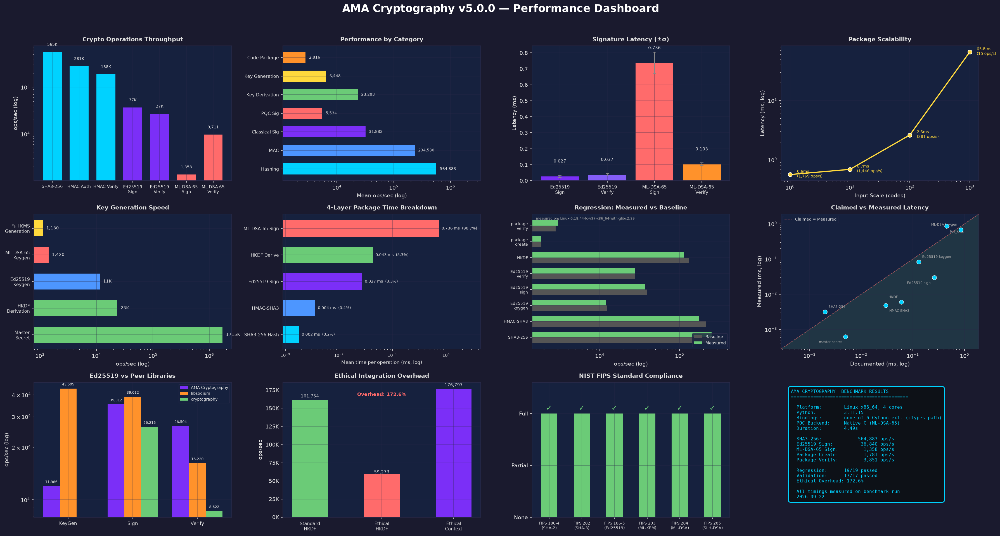
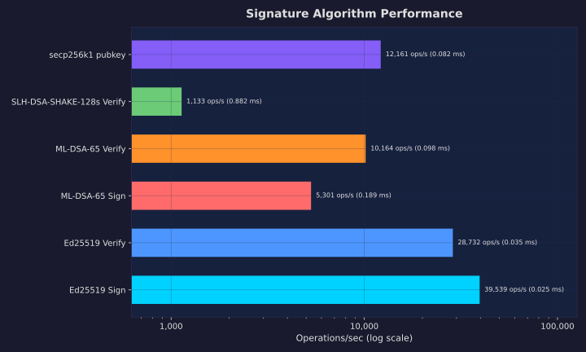
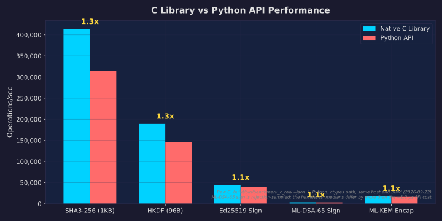
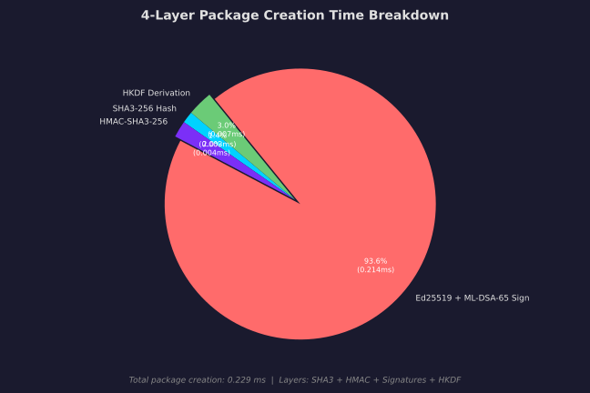
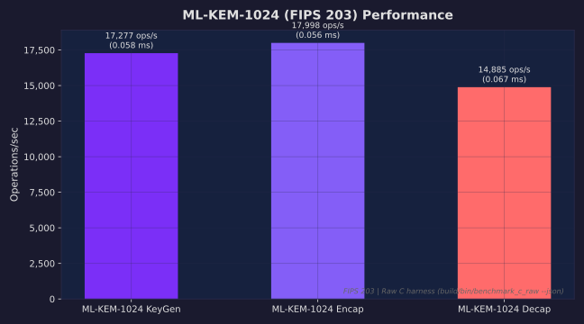
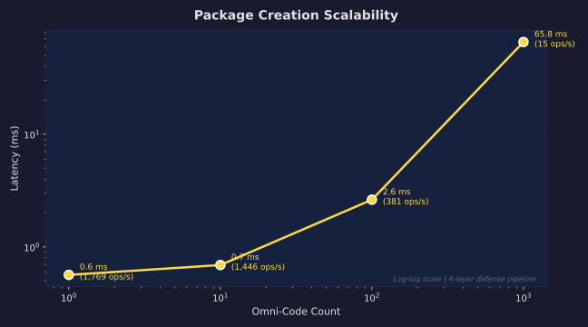
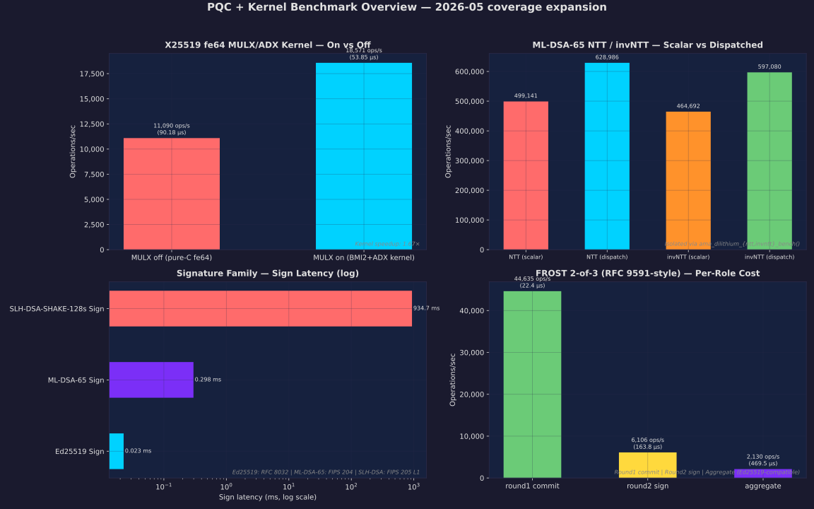
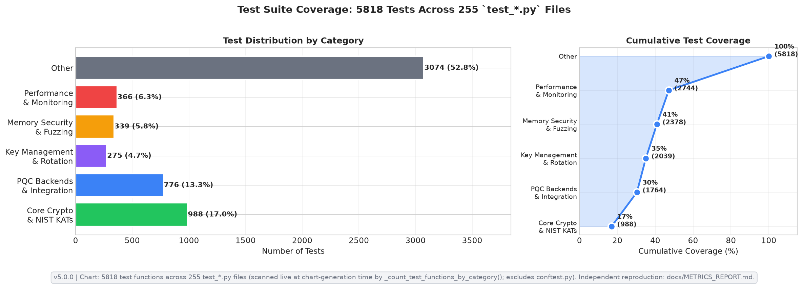
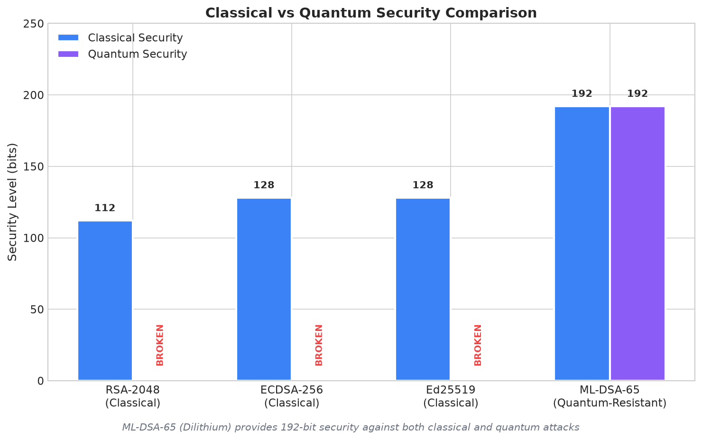

<div align="center">


</div>

[](LICENSE)
[](https://www.python.org)
[](https://en.wikipedia.org/wiki/C11_(C_standard_revision))
[](https://cython.org)
[](CRYPTOGRAPHY.md)
[](docs/compliance/ACVP_SELF_ATTESTATION.md)
[](MONITORING.md)
[](ARCHITECTURE.md)

```
              +==============================================================================+
              |                            AMA CRYPTOGRAPHY ♱                                |
              |               Post-Quantum and Classical Cryptographic Library               |
              |                                                                              |
              |   C Layer (Native)     |   Cython Layer         |   Python API               |
              |   ─────────────────    |   ─────────────────    |   ─────────────────        |
              |   ML-KEM, ML-DSA       |   FFI bindings:        |   Algorithm-agnostic API   |
              |   SLH-DSA, LMS/HSS     |   SHA3, HMAC, HKDF,    |   Hybrid signed packages   |
              |   Ed25519, FROST       |   Ed25519, ML-DSA      |   Key management           |
              |   X25519, P-curves     |                        |   Adaptive posture         |
              |   secp256k1            |   3R math engine       |   3R monitoring            |
              |   AES-GCM, ChaCha20    |                        |   HD key derivation        |
              |   Ascon, SHA-2, SHA-3  |                        |                            |
              |   HMAC, HKDF, PBKDF2   |                        |                            |
              |   Argon2id             |                        |                            |
              |                                                                              |
              +==============================================================================+
```

**Copyright 2025-2026 Steel Security Advisors LLC**\
**Author/Inventor:** Andrew E. A.\
**Contact:** steel.sa.llc@gmail.com\
**License:** Apache License 2.0\
**AI Co-Architects:** Eris ✠ | Eden ♱ | Devin ⚛︎ | Claude ⊛\
**Version:** 5.0.0

---

## Executive Summary

AMA Cryptography is a cryptographic library: a native C core that implements post-quantum and classical primitives from their published standards, and a Python API over it. Every primitive is implemented in this repository; there is no third-party cryptographic code, and one file is adapted under the MIT licence (see [License](#license)).

- **Post-quantum:** ML-KEM-512/768/1024 (FIPS 203), ML-DSA-44/65/87 (FIPS 204), SLH-DSA-SHA2-256f and SLH-DSA-SHAKE-128s (FIPS 205), LMS/HSS verification (SP 800-208)
- **Classical public key:** Ed25519 (RFC 8032), FROST-Ed25519 threshold signing (RFC 9591-style), X25519 (RFC 7748), ECDSA and ECDH on P-256/384/521 (FIPS 186-5, SP 800-56A), secp256k1 (SEC 2)
- **Symmetric, hashing and KDFs:** AES-256-GCM, ChaCha20-Poly1305, Ascon-AEAD128, SHA-2, SHA-3/SHAKE, HMAC, HKDF, PBKDF2, Argon2id

The Python layer adds a hybrid Ed25519 + ML-DSA-65 signed-package format, key management and storage, an adaptive posture controller, and the 3R runtime monitor. The Cython layer has two parts: five FFI bindings (`sha3_binding`, `hmac_binding`, `hkdf_binding`, `ed25519_binding`, `dilithium_binding`) that call the C entry points without ctypes marshalling, and `math_engine`, which accelerates only the 3R monitor's math. No speed-up ratio is published for `math_engine`, because none has been measured in this tree. 3R overhead is not part of the CI regression gate; measure it with `python benchmarks/validation_suite.py`. Cryptographic throughput, with host and method, is in [Performance Metrics](#performance-metrics).

The security analysis is self-assessed. The library has **not** been externally audited, and it is **not** CAVP- or CMVP-validated; CI checks conformance against NIST ACVP vectors as a self-attestation ([NIST Algorithm Compliance](#nist-algorithm-compliance)).

> **Design.** Built exclusively from standardized primitives (NIST FIPS and SP, IETF RFC, SECG SEC 2) — no custom ciphers, hash functions or signature schemes. The composition protocol — how the primitives combine into the signed package, double-helix key evolution and the adaptive posture system — is an original design by Steel Security Advisors LLC, and has no formal proof ([docs/DESIGN_NOTES.md](docs/DESIGN_NOTES.md)).
>
> **Consumers.** AMA Cryptography is a standalone library that any Python project can use. It is the cryptographic library of <a href="https://github.com/Steel-SecAdv-LLC/Mercury-Agent">Mercury Agent</a>.

> **Before production use.** This is a self-assessed implementation under active development. We recommend:
> - an HSM validated to FIPS 140-3, Level 3 or higher, for master secrets
> - independent review by qualified cryptographers
> - constant-time verification on your target hardware
> - restrictive permissions and encrypted volumes for key files and signed packages
>
> **Status:** Self-assessed | Not externally audited

---

## Table of Contents

<details>
<summary><strong>Click to expand navigation</strong></summary>

- [Executive Summary](#executive-summary)
- [Key Capabilities](#key-capabilities)
- [Performance Metrics](#performance-metrics)
- [Quick Start](#quick-start)
- [Testing and Quality Assurance](#testing-and-quality-assurance)
- [NIST Algorithm Compliance](#nist-algorithm-compliance)
- [Documentation](#documentation)
- [Cross-Platform Support](#cross-platform-support)
- [Build System](#build-system)
- [3R Monitoring and Mathematical Engine](#3r-monitoring-and-mathematical-engine)
- [Contributing](#contributing)
- [Ethical Binding and Omni-Codes](#ethical-binding-and-omni-codes)
- [License](#license)
- [Contact and Support](#contact-and-support)
- [Acknowledgments](#acknowledgments)
- [Legal Disclaimer & Attribution](#steel-security-advisors-llc--legal-disclaimer--attribution)

</details>

---

## Key Capabilities

<details>
<summary><strong>Scope</strong></summary>

- **Primitives:** every algorithm in the [Implementation Status Matrix](#implementation-status-matrix), implemented in C from its standard, with a Python API.
- **Hybrid signed packages:** content hashing, HMAC, and paired Ed25519 + ML-DSA-65 signatures, so a forgery requires breaking both signature schemes.
- **Hybrid KEM combiner:** classical and post-quantum shared secrets combined through HKDF (INVARIANT-19).
- **Key management:** HD key derivation, rotation lifecycle, and encrypted storage at rest under an Argon2id-derived key.
- **Runtime monitoring:** the 3R monitor surfaces statistical anomalies for review. It is advisory and does not detect or prevent attacks.

The post-quantum algorithms protect against an adversary with a cryptographically relevant quantum computer, including one that records traffic now to decrypt later. When such a machine will exist is not known.

</details>

<details>
<summary><strong>Unique Differentiators</strong></summary>

### Multi-Layer Cryptographic Protection Architecture

**Defense-in-depth security** with multiple independent cryptographic layers:

**Core Cryptographic Operations** (the defense layers an attacker must defeat):

| Layer | Protection | Security Level |
|-------|------------|----------------|
| 1. SHA3-256 | Content integrity | 128-bit collision resistance |
| 2. HMAC-SHA3-256 | Keyed message authentication | Authenticated integrity |
| 3. Ed25519 | Classical digital signature | ~128-bit classical; none against a quantum adversary |
| 4. ML-DSA-65 | Quantum-resistant digital signature | NIST PQC security category 3 (FIPS 204) |

**Supporting Cryptographic Infrastructure:**

| Component | Purpose |
|-----------|---------|
| 5. HKDF-SHA3-256 | Key derivation ensuring cryptographic key independence |
| 6. RFC 3161 Timestamping | Timestamp tokens, verified for §2.4.2 message-imprint binding only — not third-party attestation (optional) |

Canonical encoding serves as the input normalization step, ensuring deterministic serialization before cryptographic operations.

**Why defense-in-depth matters:** A forgery must defeat both signatures, so the package stays unforgeable while either Ed25519 (classically) or ML-DSA-65 holds. SHA3-256 is shared by every layer, so its collision resistance bounds all of them. See [CRYPTOGRAPHY.md](CRYPTOGRAPHY.md) for detailed analysis.


*Package authenticity is protected by four independent cryptographic operations — content hashing, keyed authentication, classical signature, and quantum-resistant signature — supported by independent key derivation and an optional RFC 3161 timestamp token (message-imprint binding only; the TSA signature and certificate chain are not verified).*

### 3R Runtime Security Monitoring

A runtime monitoring framework providing cryptographic operation analysis:

- **Resonance Engine**: FFT-based anomaly detection with frequency-domain analysis (monitors for statistical anomalies, not a timing attack prevention system)
- **Recursion Engine**: Multi-scale hierarchical pattern analysis for anomaly detection
- **Refactoring Engine**: Code complexity metrics for security review

Two advisory detectors, enabled by default (`detect_volume_spikes=True`, `detect_note_artifacts=True` in `AmaCryptographyMonitor`), extend the Resonance and Recursion components to agentic misuse:

- **Volume-spike detector** (`VolumeSpikeDetector`): statistical detection of anomalous KEM/signature bursts, scored in the Anscombe variance-stabilising transform so a quiet baseline cannot manufacture false spikes; an optional key fingerprint separates ephemeral-key churn from a hot loop over one key.
- **Note-like artifact detector** (`NoteArtifactDetector`): surfaces signed payloads shaped like instructions addressed to a later instance ("notes for future versions"). Calibrated against the repository's own text as a hard-negative corpus.

- **Performance overhead**: Not tracked in the CI regression suite; measure locally with `python benchmarks/validation_suite.py` (3R monitoring section)

> **Note:** The 3R system is a runtime anomaly monitoring framework. It surfaces statistical anomalies for security review but does not guarantee detection or prevention of timing attacks or other side-channel vulnerabilities. The agentic-abuse detectors are advisory heuristics: they flag payloads and bursts for human review and never block a cryptographic operation.
>
> **Measured detection efficacy (`benchmarks/r3_efficacy.tsv`, produced by `benchmarks/r3_efficacy_eval.py`).** On 4,000 real ML-DSA-65 sign timings from one process (median 0.124 ms, MAD 0.003 ms; measured 2026-09-24 on a 4-vCPU KVM guest, pinned to one core), with anomalies injected and a trailing-window z-score (|z| > 3 over 100 samples) as the trivial baseline: isolated slow operations at 10x the median were flagged by `ResonanceTimingMonitor` 82% of the time (baseline: 100%) at a false-positive rate of 0.4% (baseline: 0.6%); at 1.5x, 55% (baseline: 69%). Runs of 20 slow operations went the other way: at 2x, 80% (baseline: 48%). A step is scored against the same detector run over the unshifted trace, so only alarms the shift caused count: a persistent slowdown of +10% was detected by 3R after 15 samples and by the baseline not at all; at +5%, by 3R after 15 samples and by the baseline not at all. The excess alarm rate after a shift is small for both detectors (at most half a percentage point), and at +100% 3R's rate fell below the clean run's. An earlier revision of this note reported the baseline detecting every step after 47 samples; that delay was an ordinary false alarm, which the unpaired metric counted as a detection. These figures depend on the noise of the trace they were taken from; re-run the script on your host before relying on them. Read the timing monitor as a regime-change detector, not a per-operation one: for isolated outliers a z-score does better, and nothing here is evidence of timing-attack detection.

### Multi-Language Architecture

Three-layer architecture balancing security and usability:

- **C Layer**: every primitive in the [Implementation Status Matrix](#implementation-status-matrix); no third-party cryptographic dependency
- **Cython Layer**: five FFI bindings to the C primitives, plus the 3R `math_engine` (no speed-up ratio published; see [Cython modules](#cython-modules-srccython-7-files))
- **Python API**: the primary interface; `crypto_api` is algorithm-agnostic

### Advanced Features

- Hierarchical Deterministic (HD) key derivation
- Key rotation lifecycle (`KeyRotationManager`: rotation period, initiate and complete)
- Algorithm-agnostic API (`AmaCryptography(algorithm=AlgorithmType.…)`)
- Secure encrypted key storage at rest
- AES-256-GCM authenticated encryption (NIST SP 800-38D)
- Adaptive cryptographic posture controller (escalates algorithm strength on monitor signals; fail-closed on an algorithm it cannot rank)
- Hybrid KEM combiner (classical + PQC key encapsulation)
- Agent-instance key/signature binding (INVARIANT-30): long-lived persistence material and successor-authorizing signatures cannot be *derived* without a human-held operator key — the key is an input to the HKDF and to the signature context, not only to the policy gate beside them, so an agent with in-process access cannot reproduce the bytes by calling the primitive directly. Domain separation and policy over existing SHA3-256/HMAC-SHA3-256/HKDF, no new algorithms

### Quantum-Resistant Algorithms

NIST-standardized post-quantum algorithms:

- ML-DSA-44 / -65 / -87 (NIST FIPS 204; Dilithium lineage)
- ML-KEM-512 / -768 / -1024 (NIST FIPS 203; Kyber lineage)
- SLH-DSA-SHA2-256f and SLH-DSA-SHAKE-128s (NIST FIPS 205; SPHINCS+ lineage)
- LMS / HSS verification (NIST SP 800-208)
- Hybrid classical+PQC modes with binding combiner

</details>

<a id="implementation-status-matrix"></a>

<details>
<summary><strong>Implementation Status Matrix</strong></summary>

| Algorithm / Family | C API | Python API | Notes |
|---|---|---|---|
| SHA-256, SHA-512 | Full | Full | FIPS 180-4; SHA-NI compression (`ama_sha256_ni.c`, built on every x86 target) selected at runtime when CPUID reports SHA-NI; ARMv8 SHA2 instructions on AArch64 |
| SHA3-256 / -512, SHAKE-128 / -256 | Full | Full | FIPS 202; AVX-512 4-way Keccak available opt-in via `-DAMA_ENABLE_AVX512=ON` |
| HMAC-SHA-256 / -384 / -512, HMAC-SHA3-256 | Full | Full | RFC 2104, FIPS 198-1 |
| HKDF (any supported hash) | Full | Full | RFC 5869 |
| PBKDF2-HMAC-SHA-256 / -512 | Full | Full | SP 800-132 / RFC 8018 (`ama_pbkdf2.c`) |
| AES-256-GCM | Full | Full | SP 800-38D; constant-time bitsliced S-box default; VAES + VPCLMULQDQ YMM kernel selected at runtime when CPUID reports both |
| ChaCha20-Poly1305 | Full | Full | RFC 8439; AVX2 8-way + NEON kernels |
| Ascon-AEAD128 & Ascon-Hash256 | Full | Full | SP 800-232 |
| Argon2id | Full | Full | RFC 9106; `out_len ≤ AMA_ARGON2ID_MAX_TAG_LEN` (1024). Legacy verify-only path (`ama_argon2id_legacy*`) for one-shot migration of hashes from AMA ≤ 2.1.5 |
| Ed25519 | Full | Full | RFC 8032; INVARIANT-26 canonical-S enforced. One in-house backend on every platform (`src/c/ama_ed25519.c` + `src/c/internal/ama_ed25519_ge.h`): radix-2⁵¹ fe51 arithmetic, static signed-5-bit comb base-point tables, Bernstein–Yang safegcd inversion, half-size-scalar verification; x86-64 GCC/Clang builds also instantiate the same group code over the radix-2⁶⁴ MULX+ADX kernel, byte-identical and selectable via `ama_ed25519_set_mulx_override(1)` (not the default — slower at the group level) |
| X25519 | Full | Full | RFC 7748; field arithmetic dispatched fe64 (radix-2⁶⁴ on x86-64 GCC/Clang, promoted to a MULX+ADX asm kernel when CPUID reports BMI2 ∧ ADX) → fe51 (radix-2⁵¹, non-x86-64 64-bit) → gf16 (radix-2¹⁶, 32-bit and MSVC). u-coordinates canonicalised (INVARIANT-27); low-order outputs rejected (INVARIANT-21); batch API `ama_x25519_scalarmult_batch` available; opt-in AVX2 4-way ladder |
| NIST P-256 / P-384 / P-521 | Full | Full | FIPS 186-5 ECDSA + SP 800-56A ECDH; TLS/X.509/JOSE/COSE/WebAuthn interop. P-256 4-limb Montgomery MULX+ADCX/ADOX kernel; P-384/P-521 use the generic multi-limb CIOS path constant-folded to their limb counts. Strict minimal-DER with `r`,`s` in `[1, n-1]` unconditional; RFC 6979 `s` emitted verbatim and either representative accepted by default, low-`s` opt-in via `AMA_NISTP_ECDSA_SIGN_LOW_S` / `AMA_NISTP_ECDSA_REQUIRE_LOW_S` (INVARIANT-34); canonical field-element pubkey coordinates (INVARIANT-29). See [docs/NIST_PRIME_CURVES.md](docs/NIST_PRIME_CURVES.md) |
| secp256k1 | Full | Full | RFC 6979 deterministic ECDSA; fixed-base comb over the compile-time generator (4-block, 16 entries) — pubkey derivation and signing scalar multiplications use the comb; caller-supplied bases keep the constant-time Montgomery ladder |
| ML-KEM-512 / -768 / -1024 | Full (native) | Full | FIPS 203; Fujisaki–Okamoto transform, IND-CCA2; NTT q=3329 |
| ML-DSA-44 / -65 / -87 | Full (native) | Full | FIPS 204; NTT q=8380417; constant-time NTT/arithmetic; signing's rejection-sampling loop has intentional timing variation by design (leaks no private-key material) |
| SLH-DSA-SHA2-256f | Full (native) | Full | FIPS 205; WOTS+ / FORS / hypertree d=17 |
| SLH-DSA-SHAKE-128s | Full (native) | Full | FIPS 205 |
| LMS / HSS verify | Full | Full | SP 800-208; verification and parameter reads (`ama_lms_verify`, `ama_hss_verify`, `ama_lms_signature_length`, `ama_hss_pubkey_levels`) — signing is not exposed at the Python layer |
| FROST-Ed25519 (RFC 9591-style) | Full | Full | Trusted-dealer keygen, two-round commit / sign, aggregate. Protocol structure per RFC 9591; hash derivations are library-internal (no ciphersuite contextString), so partial signatures interoperate only between AMA participants — the aggregated signature verifies as standard RFC 8032 Ed25519 anywhere. Aggregation verifies every share (INVARIANT-49) |
| Hybrid Ed25519 + ML-DSA-65 | N/A | Full | See `ama_cryptography.hybrid_combiner` (INVARIANT-19) |
| Key formats — PKCS#8 / SPKI / PEM / JWK / COSE_Key | N/A | Full | 12 algorithms: Ed25519, X25519, P-256/-384/-521, secp256k1, ML-DSA-44/-65/-87, ML-KEM-512/-768/-1024. See [docs/KEY_FORMATS.md](docs/KEY_FORMATS.md) |

> All PQC operations run through the native C library. No external PQC dependency (liboqs, pqcrypto) is present or required. Build with `cmake -B build -DAMA_USE_NATIVE_PQC=ON && cmake --build build`.

### C library inventory (v5.0.0)

Top-level `src/c/*.c` — 28 translation units:

`ama_aes_bitsliced.c`, `ama_aes_gcm.c`, `ama_agent_binding.c`, `ama_argon2.c`, `ama_ascon.c`, `ama_chacha20poly1305.c`, `ama_consttime.c`, `ama_core.c`, `ama_cpuid.c`, `ama_dilithium.c`, `ama_ed25519.c`, `ama_frost.c`, `ama_hkdf.c`, `ama_hmac_sha256.c`, `ama_hmac_sha384.c`, `ama_kyber.c`, `ama_lms.c`, `ama_nistp.c`, `ama_pbkdf2.c`, `ama_platform_rand.c`, `ama_secp256k1.c`, `ama_secure_memory.c`, `ama_sha256.c`, `ama_sha256_ni.c`, `ama_sha3.c`, `ama_sha512.c`, `ama_slhdsa.c`, `ama_x25519.c`.

Public headers under `include/` — 4: `ama_cryptography.h` (top-level API), `ama_cpuid.h`, `ama_dispatch.h`, `ama_uint128.h`.

Additional C sources:

- `src/c/dispatch/ama_dispatch.c` — runtime CPU-feature detection and function-pointer dispatch. On x86 the SHA-3 slot promotes to the AVX-512 kernel when `AMA_ENABLE_AVX512=ON` at build time and `ama_cpuid_has_avx512_keccak()` (AVX-512F + AVX-512VL + XCR0 5+6+7) holds at runtime; every other x86 slot ceiling is AVX2. On AArch64 the order is SVE2 → NEON → generic (for the three slots wired to SVE2; see below). Best-of-5 SHA-3 auto-tune with a 10 % revert threshold. Overrides: `AMA_DISPATCH_NO_AUTOTUNE=1`, `AMA_DISPATCH_VERBOSE=1`.
- `src/c/x86/` (3 files) — `ama_keccak_f1600_bmi.c` (Keccak-f[1600] BMI1/BMI2 kernel where `ANDN` collapses chi's `(~b) & c`); `ama_nistp_mont_mulx.c` (P-256 4-limb MULX+ADCX/ADOX Montgomery multiply); `ama_ed25519_fe64_mulx.c` (the radix-2^64 MULX+ADX instantiation of the Ed25519 group arithmetic, selectable through `ama_ed25519_set_mulx_override(1)`).
- `src/c/internal/` — 1 `.c`: `ama_x25519_fe64_mulx.c` (fe64 multiply / square / reduce with `MULX` + `ADCX` + `ADOX` dual-carry chains); 17 `.h`: `ama_ct_barrier.h` (compiler barrier that keeps constant-time selects from being branch-optimized), `ama_ct_declassify.h` (explicit declassification points for the secret-taint gate, no-ops outside AMA_TESTING_MODE), `ama_ed25519_backend.h` (hidden prototypes of the MULX instantiation), `ama_ed25519_canonical.h` (the RFC 8032 §5.1.7 `S < L` check, INVARIANT-26), `ama_ed25519_ge.h` (the Ed25519 group-arithmetic template both field instantiations compile), `ama_ed25519_halfsize.h` (half-size-scalar decomposition for verify), `ama_ed25519_tables.h` (generated static base-point tables), `ama_fe25519_safegcd.h` (Bernstein–Yang constant-time inversion), `ama_fe64_mulx_kernel.h` (the fused MULX/ADX multiply and square, shared by X25519 and Ed25519), `ama_keccak_round.h` (macro-based round header shared by scalar / BMI paths), `ama_once.h` (platform once-primitive for INVARIANT-15), `ama_sha2.h` (SHA-512 header-only), `ama_sha3_x4.h` (4-way Keccak interface), `ama_stack_wipe.h` (depth-parameterised stack wipe used by the Ed25519 signing chain), `ama_testing_exports.h` (visibility macro that exposes internals to the C test suite only), `ama_wide_mul.h` (64×64→128 multiply on every toolchain), `ama_x25519_fe64_mulx.h` (the prototypes for the `.c` above).

### SIMD translation units — 26 (20 carry kernels, 6 are documented placeholders)

**AVX2 (`src/c/avx2/`, 10 files):** SHA3 4-way Keccak-f[1600], ML-KEM (NTT / Barrett / batch CBD2), ML-DSA (NTT q=8380417 / batch SHAKE rejection), AES-256-GCM pipelined AES-NI + PCLMULQDQ GHASH with H^1..H^8 power-table folding and deferred one-iteration GHASH pipeline, VAES + VPCLMULQDQ YMM AES-256-GCM (`ama_aes_gcm_vaes_avx2.c` — gated by `ama_cpuid_has_vaes_aesgcm()`), ChaCha20-Poly1305 8-way, Argon2 4-way BlaMka, X25519 4-way ladder (`ama_x25519_avx2.c` — opt-in via `AMA_DISPATCH_USE_X25519_AVX2=1`; intentionally not the default on MULX/ADX hosts, retained for CI matrix coverage and a future AVX-512-IFMA port), and the Ed25519 comb's constant-time 256-bit table fold (`ama_ed25519_select_avx2.c` — dispatched on `ama_has_avx2()`). `ama_sphincs_avx2.c` is a documented placeholder with no kernel; SLH-DSA on x86-64 gains from the Keccak dispatch slot and SHA-NI only.

**AVX-512 (`src/c/avx512/`, 1 file, opt-in via `-DAMA_ENABLE_AVX512=ON`):** EVEX-encoded YMM-width 4-way Keccak permutation (`ama_sha3_x4_avx512.c` — `vprolq` for the 64-bit rotate, `vpternlogq` for the theta `0x96` and chi `0xD2` collapses). No ZMM register touched. XCR0 5+6+7-gated so an EVEX YMM op cannot `#UD` on a host whose hypervisor advertises CPUID without the ZMM save area. See [docs/AVX512_KECCAK_ADR.md](docs/AVX512_KECCAK_ADR.md).

**NEON (`src/c/neon/`, 7 files):** `<arm_neon.h>` intrinsics and the ARMv8 Crypto Extensions — ML-KEM (`ama_kyber_neon.c`), ML-DSA (`ama_dilithium_neon.c`), SHA3 (`ama_sha3_neon.c`), AES-GCM (`ama_aes_gcm_neon.c`), ChaCha20-Poly1305 (`ama_chacha20poly1305_neon.c`), Argon2 (`ama_argon2_neon.c`), and SHA-256 compression through the ARMv8 SHA2 instructions for SLH-DSA (`ama_sphincs_neon.c`). There is no Ed25519 NEON kernel (`ama_ed25519_neon.c` does not exist): AArch64 runs the portable radix-2^51 Ed25519 backend (`src/c/internal/ama_ed25519_ge.h` over `fe51`). `tools/check_public_api_docs.py` pins this file set against the tree.

**SVE2 (`src/c/sve2/`, 8 files): three wired via dispatch**, their externs in `src/c/dispatch/ama_dispatch.c`. Two are genuine scalable-vector kernels — ML-KEM forward/inverse NTT + add/sub/reduce (`ama_kyber_sve2.c`; the `kyber_pointwise` dispatch slot is NULL on every tier and no SVE2 basemul kernel exists) and ML-DSA NTT trio (`ama_dilithium_sve2.c`): VL-agnostic `svwhilelt`-predicated load/store/add/sub, with the modular (Montgomery/Barrett) reductions done scalar — each file's header states the split. The third, SHA3/Keccak (`ama_sha3_sve2.c`), is wired and auto-tuned but its `ama_keccak_f1600_sve2` is a **scalar** permutation, not a vector one: a correctly strip-mined VL-agnostic theta measured slower than scalar at every vector length (a 5-element column-parity reduction cannot fill a vector), so the SVE intrinsics were removed and the file documents it. The remaining five (`ama_aes_gcm_sve2.c`, `ama_chacha20poly1305_sve2.c`, `ama_argon2_sve2.c`, `ama_sphincs_sve2.c`, `ama_ed25519_sve2.c`) are documented placeholders — their per-file headers state the specific reason each cannot be wired today (dispatch-signature mismatch, algorithmic non-conformance to RFC 9106 BlaMka, absent dispatch surface, no production batched caller) and the preconditions a future kernel must meet. Until those hold, AES-GCM, ChaCha20-Poly1305 and Argon2 dispatch to their NEON kernels on SVE2 hosts; SLH-DSA has no dispatch slot and uses the SHA-3 and SHA-256 paths; Ed25519 runs the portable fe51 backend on every AArch64 host.

### Cython modules (`src/cython/`, 7 files)

- `hmac_binding.pyx`, `sha3_binding.pyx`, `hkdf_binding.pyx`, `ed25519_binding.pyx`, `dilithium_binding.pyx` — thin FFI bindings that call the native C entry points with no per-call ctypes overhead. `ctypes` fallback is used when the extension is not built.
- `math_engine.pyx` — the 3R monitoring math kernels (Lyapunov exponent, NTT-shaped rotation matrix-vector products, helix evolution). No speed-up ratio over the pure-Python NumPy baseline is published: none has been measured in this tree ([`wiki/Performance-Benchmarks.md`](wiki/Performance-Benchmarks.md) says how to measure it). **The acceleration does not apply to the C-implemented cryptographic primitives.**
- `helix_engine_complete.pyx` — a complete-engine reference implementation of all 18+ variants. It is **not** compiled by the default build (`setup.py` builds `math_engine.pyx` and the FFI bindings above, not this file); `math_engine.pyx` is the acceleration that actually ships.

### Python package (`ama_cryptography/`, 28 modules + `__init__` + `__main__`)

`crypto_api` (algorithm-agnostic top-level API + `AlgorithmType`), `pqc_backends` (native C bindings for every primitive), `key_formats` (PKCS#8 / SPKI / PEM / JWK / COSE_Key across 12 algorithms), `key_management`, `hybrid_combiner`, `adaptive_posture`, `agent_binding`, `session`, `secure_channel`, `secure_memory`, `integrity`, `equations`, `double_helix_engine`, `monitor`, `monitoring`, `ascon`, `rfc3161_timestamp`, `legacy_compat`, `exceptions`, `_self_test`, `_asn1`, `_artefact_source`, `_build_sign`, `_finalizer_health`, `_module_state`, `_numeric`, `_owner_only` (owner-only file and directory access: `chmod` on POSIX, a protected owner-only DACL on Windows), `_package_transcript` (the canonical transcript a package signature covers, INVARIANT-52), `__main__`. The build also writes `_integrity_signature.py`, the per-build signed integrity artefact; it is not tracked.

</details>

---

## Performance Metrics

<details>
<summary><strong>5.0.0 throughput: CI-runner medians and canonical-host tables</strong></summary>

> **Reading the numbers below.** All ops/sec figures in the collapsible tables below are from the **canonical bench host** — an Emerald Rapids VM (KVM guest, 4 vCPU) with AVX-512F/VL/BW/DQ/VBMI + VAES + VPCLMULQDQ — measured 2026-09-24 on the 5.0.0 tree with `python benchmarks/benchmark_runner.py` and `build/bin/benchmark_c_raw --json`: five interleaved runs pinned to one core, medians, min–max stated. They describe **that host**, not a runner you are likely to have; reproduce them on equivalent silicon. The host, method and every per-run figure are in [docs/BENCHMARK_HISTORY.md](docs/BENCHMARK_HISTORY.md).
>
> **What the rows include.** The canonical rows measure the 5.0.0 code paths, including the work 5.0.0 added: the FIPS 140-3 pairwise-consistency test every Python keypair runs (INVARIANT-41), the per-signature derivation of `A = [a]B` on the 64-byte Ed25519 key (INVARIANT-51; the expanded-key row is the once-at-load form), the small-order rejection in Ed25519 verification (INVARIANT-48), the package transcript and KEM commitment (INVARIANT-52), and the `check_crypto_permitted()` guard on each gated native entry point (INVARIANT-39). The April 2026 figures these replace measured the 4.x code; they are kept, with the reason each row moved, in [docs/BENCHMARK_HISTORY.md](docs/BENCHMARK_HISTORY.md).
>
> **Virtualised, and said so.** The canonical host is a VM, as the host of the figures it replaces was. Whether bare-metal silicon of the same class would move these rows is not measured; the result most likely to differ is the dispatcher's demotion of the AVX-512 four-way Keccak to the scalar BMI1/BMI2 path, which this host reproduced in 5 of 5 process starts.
>
> **Where the current, per-runner numbers live.** `benchmarks/baseline.json` and `benchmarks/arm-baseline.json` carry **measured medians** on their named CI runners with a single derived tolerance each — they are regression *floors*, and since 5.0.0 they are no longer pre-discounted guesses (`x86` uses the slow-class median of a measurably two-class `ubuntu-latest` fleet with a uniform 45% tolerance; `aarch64`, a homogeneous fleet with spreads ≤3%, uses 15% — 25% for the two rejection-averaged composites). `benchmark-report.md` is a regression-run report: it records the exact commit, host, command, repeat count and aggregation of one run of the suite, and is not where the published figures below come from. A floor and a canonical-host figure are different numbers on purpose; neither is an estimate of the other.

### 5.0.0 on the canonical CI runners — four-run medians (2026-09-20/21)

These are the only 5.0.0 throughput measurements this repository publishes, and they are on the CI runner classes the regression floors are defined against, not on the canonical bench host. Each figure is the median of four `benchmark-regression` jobs (`python benchmarks/benchmark_runner.py` under `taskset -c 0`, Python API through `pqc_backends` with the six Cython bindings built and imported, exactly as `ci.yml` installs them) at the branch heads `ebc80b9`, `1bf806b`, `da8901d` and `1e79cd1`, none of which changes a measured path; workflow runs 35545407750, 35548705329, 35608144468 and 35611329428 (x86_64 jobs 106170292775, 106179299451, 106360245063 and 106370902549; aarch64 jobs 106170292802, 106179299071, 106360244481 and 106370902832), 2026-09-20 to 2026-09-21. Medians of an even count are the mean of the middle two, rounded half up, computed by script from the job logs. The `ubuntu-latest` x86_64 fleet is two-class: run 35548705329 landed on the fast class on every row, 20–45% above the other three, so the x86_64 min–max spans are wide and the medians are slow-class medians; `ubuntu-24.04-arm` is homogeneous (spreads of 1.5% or less on every row except `dilithium_sign`, a rejection-sampled composite). These runs supersede the 2026-09-07 medians (heads `f2ac1d8`, `4a45408`, `755cd22`, `447cdf0`; runs 34070019745, 34082980156, 34084425292, 34084821515), which predate the 2026-09 audit remediation; `docs/BENCHMARK_HISTORY.md` keeps both sets.

| Benchmark | `ubuntu-latest` x86_64 — ops/sec, median (min–max) | `ubuntu-24.04-arm` aarch64 — ops/sec, median (min–max) |
|---|---|---|
| `ama_sha3_256_hash` — AMA native C SHA3-256 hashing of 1KB data (FIPS 202, ctypes) | 363,574 (362,192–484,921) | 436,428 (433,513–436,658) |
| `hmac_sha3_256` — HMAC-SHA3-256 authentication (native C via ctypes) | 248,598 (247,946–331,652) | 303,818 (303,360–304,312) |
| `ed25519_keygen` — Ed25519 key pair generation through the Python API: CSPRNG seed draw + native keygen + the FIPS 140-3 pairwise-consistency sign/verify run on every key (native keygen alone is about a sixth of the timed operation; not comparable with the 4.x native-keygen-only row) | 12,368 (12,343–16,618) | 12,282 (12,269–12,315) |
| `ed25519_sign` — Ed25519 signature generation (native C, 64-byte `seed \|\| A` key; re-derives A per call) | 38,811 (38,655–50,286) | 32,846 (32,839–32,852) |
| `ed25519_verify` — Ed25519 signature verification (native C) | 27,934 (27,759–38,799) | 31,066 (30,719–31,111) |
| `hkdf_derive` — HKDF-SHA3-256 key derivation (3 keys) | 166,677 (166,598–220,752) | 209,168 (208,684–209,407) |
| `full_package_create` — Complete crypto package creation (with PQC) | 1,856 (1,836–2,479) | 2,135 (2,110–2,177) |
| `full_package_verify` — Complete crypto package verification (with PQC) | 2,807 (2,793–4,244) | 3,516 (3,482–3,556) |
| `secp256k1_ecdsa_sign` — secp256k1 ECDSA signing (native C, RFC 6979 deterministic nonce) | 9,199 (9,179–11,869) | 10,912 (10,897–10,927) |
| `secp256k1_ecdsa_verify` — secp256k1 ECDSA verification (native C, Shamir's-trick joint multiply, low-s + canonical-pubkey policy) | 3,723 (3,717–4,874) | 4,524 (4,517–4,532) |
| `dilithium_keygen` — ML-DSA-65 (Dilithium) key pair generation (native C) | 1,530 (1,497–1,907) | 1,670 (1,664–1,682) |
| `dilithium_sign` — ML-DSA-65 (Dilithium) signature generation (native C) | 3,135 (3,106–3,905) | 3,604 (3,456–3,944) |
| `dilithium_verify` — ML-DSA-65 (Dilithium) signature verification (native C) | 10,381 (10,367–13,208) | 11,675 (11,664–11,683) |
| `kyber_keygen` — ML-KEM-1024 (Kyber) key pair generation (native C) | 3,264 (3,238–4,360) | 3,857 (3,842–3,861) |
| `kyber_encapsulate` — ML-KEM-1024 (Kyber) encapsulation (native C) | 15,978 (15,894–21,394) | 21,970 (21,586–21,999) |
| `aes_256_gcm_encrypt` — AES-256-GCM encryption of 1KB data (native C) | 232,699 (230,869–315,191) | 234,335 (233,826–235,180) |
| `chacha20poly1305_encrypt` — ChaCha20-Poly1305 encryption of 1KB data (native C) | 235,094 (231,429–306,089) | 195,992 (195,505–197,531) |
| `x25519_scalarmult` — X25519 single-shot scalar-mult (native C, default dispatch) | 18,984 (18,894–24,705) | 25,400 (25,394–25,410) |
| `x25519_scalarmult_batch4` — X25519 batch-4 scalar-mult (native C, default dispatch) — batches/sec, not per-op rate | 4,551 (4,540–5,906) | 6,066 (6,053–6,075) |

> **`ed25519_sign`, `ed25519_keygen`, `ed25519_verify` and the package rows moved for documented reasons, not regressions.** [INVARIANT-51](INVARIANTS.md#invariant-51--an-ed25519-signer-derives-its-own-public-half) makes `ama_ed25519_sign` derive `A = [a]B` and refuse a key whose stored public half disagrees — a second fixed-base scalar multiplication on every signature, with no opt-out — and `keypair()` pays it again inside its FIPS 140-3 pairwise-consistency sign. The package rows additionally rebuild and check the INVARIANT-52 canonical transcript and reject small-order Ed25519 points before verifying (2026-09 audit A-2 and A-3), and `ed25519_verify` carries the INVARIANT-48 small-order public-key and R rejection. The 2026-09-07 medians (Ed25519 70,496 / 58,762 sign, 15,370 / 14,678 keygen, 30,542 / 31,270 verify) predate all of that. The x86_64 `ed25519_sign` floor was first set by a host-independent derivation (70,496 / 1.8469 = 38,170) and is now the runner's own four-run median; the derivation sat 1.7% under the measurement. The aarch64 floors set from one run on 2026-09-16 are reproduced by these four runs to within 0.1% (keygen), 0.02% (sign) and 2.2% (package verify).

*The x86_64 `ed25519_keygen`, `ed25519_sign`, `ed25519_verify`, `full_package_create` and `full_package_verify` medians and the aarch64 `full_package_create` median are the `baseline_value` floors in `benchmarks/baseline.json` and `benchmarks/arm-baseline.json` as of 2026-09-22; the aarch64 `ed25519_keygen`, `ed25519_sign` and `full_package_verify` floors are the 2026-09-16 single-run values these four runs confirm; the other rows keep their earlier calibration floors, which all four runs passed on both runner classes. Tolerances: 45% on x86_64, 15% on aarch64 (25% for the two rejection-averaged composites).*

<details>
<summary><strong>Cryptographic Operation Benchmarks (canonical host)</strong></summary>



*Dashboard generated by `tools/generate_dashboards.py` from a `benchmarks/benchmark_suite.py` run on 2026-09-22 (timestamp in `assets/visuals_manifest.json`). It is not the canonical-host measurement below.*

<!-- canonical-bench: begin -->
<!-- Every measurement between these markers is pinned by
     benchmarks/canonical-host.json and enforced by
     tools/check_canonical_benchmarks.py. Changing a number here
     without changing the record -- or adding one with no host
     provenance -- fails the gate. Re-measurement needs the named
     host; drift detection does not. -->
### ML-DSA-65 (Post-Quantum Digital Signatures — FIPS 204)

| Operation | Throughput (Python API via ctypes) | Latency | Notes |
|-----------|-----------|---------|-------|
| **KeyGen** | 1,617 ops/sec | ~618µs | Native C keygen plus the FIPS 140-3 pairwise-consistency sign/verify every Python keypair runs (INVARIANT-41); not comparable with the keygen-only figure it replaces |
| **Sign** | 3,171 ops/sec | ~315µs | Rejection sampling — intentional, by-design timing variation (leaks no key); NTT/arithmetic constant-time, NTT q=8380417 |
| **Verify** | 10,817 ops/sec | ~92µs | Verified against NIST ACVP test vectors (self-attested) |

*Source: canonical bench host (see the host note below), measured 2026-09-24; median of five interleaved runs, min–max KeyGen 1,578–1,699, Sign 3,028–3,244, Verify 10,630–11,443 ops/sec. Raw C on the same host and runs, `build/bin/benchmark_c_raw --json`, no ctypes and no pairwise test: ~9,358 KeyGen, ~11,532 Verify ops/sec (medians); Sign ~3,360 ops/sec, re-measured on the same host the same day in five further rounds (3,199–3,880) after the raw-C Sign row moved from one fixed (key, message) pair to a 256-message pool, which the one-pair median of those runs did not measure. The checked-in `benchmarks/benchmark-results.json` carries a measured run on the host its own provenance names plus the slow-runner CI regression floors in `baseline_value` — neither column is these canonical numbers; see [docs/BENCHMARK_HISTORY.md](docs/BENCHMARK_HISTORY.md) for the per-run record and the 4.x figures these replace.*

### ML-KEM-1024 (Post-Quantum Key Encapsulation — FIPS 203)

| Operation | Throughput (Python API via ctypes) | Notes |
|-----------|-----------|-------|
| **KeyGen** | 3,602 ops/sec | Native C keygen plus the pairwise-consistency encapsulate/decapsulate (INVARIANT-41); no OpenSSL dependency |
| **Encapsulate** | 17,984 ops/sec | Fujisaki–Okamoto transform, IND-CCA2 |

*Source: canonical bench host, measured 2026-09-24; median of five runs, min–max KeyGen 3,402–3,891, Encapsulate 16,715–18,398 ops/sec. Raw C on the same host: ~16,734 KeyGen, ~19,016 Encaps, ~16,117 Decaps ops/sec (medians). The checked-in `benchmarks/benchmark-results.json` carries a measured run on the host its own provenance names plus the slow-runner CI regression floors in `baseline_value` — neither column is these canonical numbers.*

### Full Multi-Layer Package Performance

Complete security package with all defense layers (Python API via ctypes):

| Operation | Throughput | Latency |
|-----------|-----------|----------|
| Package Create (all layers) | 1,955 ops/sec | ~511µs |
| Package Verify (all layers) | 3,336 ops/sec | ~300µs |

*Source: canonical bench host, measured 2026-09-24; median of five runs, min–max Create 1,900–2,050, Verify 3,128–3,455 ops/sec. The package now carries more than the one the replaced figures timed: the INVARIANT-52 canonical transcript, the signed KEM shared-secret commitment and the small-order point checks.*

**All Layers:** SHA3-256, HMAC-SHA3-256, Ed25519, ML-DSA-65 (core), HKDF, RFC 3161 (supporting)

### Core Cryptographic Primitives (Python API via ctypes)

| Operation | Throughput | Source |
|-----------|-----------|--------|
| SHA3-256 (1KB) | 412,231 ops/sec | canonical bench, 2026-09-24 |
| HMAC-SHA3-256 (1KB) | 276,791 ops/sec | canonical bench, 2026-09-24 |
| HKDF-SHA3-256 (3-key derive) | 184,618 ops/sec | canonical bench, 2026-09-24 |
| Ed25519 KeyGen (with the pairwise-consistency test) | 13,361 ops/sec | canonical bench, 2026-09-24 |
| Ed25519 Sign (64-byte `seed \|\| A` key, re-derives A) | 41,300 ops/sec | canonical bench, 2026-09-24 |
| Ed25519 Sign (expanded key, `Ed25519SigningKey`) | 65,411 ops/sec | canonical bench, 2026-09-24 |
| Ed25519 Verify | 30,299 ops/sec | canonical bench, 2026-09-24 |
| AES-256-GCM Encrypt (1KB) | 299,214 ops/sec | canonical bench, 2026-09-24 |
| ChaCha20-Poly1305 Encrypt (1KB) | 288,960 ops/sec | canonical bench, 2026-09-24 |
| X25519 Scalar-mult (fe64 + MULX+ADX kernel) | 20,329 ops/sec | canonical bench, 2026-09-24 |

**Performance Note:** The 64-byte Ed25519 secret key is RFC 8032's `seed || A` layout, not a cache: `ama_ed25519_sign` re-hashes the seed and re-derives `A = [a]B` on every call and refuses a stored half that disagrees (INVARIANT-51). A caller signing repeatedly under one key pays that derivation once by loading the key into the 128-byte expanded form (`ama_ed25519_expand_secret_key` / `Ed25519SigningKey`), which signs without repeating it — the two Ed25519 Sign rows above are the two paths on the same host. X25519 uses the radix-2^64 (`fe64.h`) field arithmetic on x86-64 GCC/Clang (default) with the radix-2^51 (`fe51.h`) layout retained as a fallback for non-x86-64 64-bit GCC/Clang and the portable radix-2^16 path retained for MSVC and 32-bit targets. On hosts where CPUID reports both BMI2 (`EBX[8]`) and ADX (`EBX[19]`), the dispatcher promotes the ladder's multiply / square *and* the Fermat inversion to the in-house MULX+ADCX/ADOX kernel in `src/c/internal/ama_x25519_fe64_mulx.c` — gated by `ama_cpuid_has_x25519_mulx()` and pinned byte-identical to the pure-C fe64 reference across 4096 random vectors by `tests/c/test_x25519_fe64_mulx_equiv.c`. The kernel is hand-written GCC inline assembly: `fe64_mul512_mulx` issues explicit `ADCX` (CF chain) and `ADOX` (OF chain) so the lo-column and hi-column accumulations propagate in parallel, and `fe64_sq512_mulx` is a dedicated squaring kernel that exploits off-diagonal symmetry (10 multiplications vs 16 for the full schoolbook). The fe51 and fe64 ladders are pinned byte-identical over 1024 random vectors by `tests/c/test_x25519_field_equiv.c`. On the canonical host the MULX+ADX kernel takes the Python-via-ctypes harness from ~11,412 ops/sec with the kernel pinned off to ~20,213 ops/sec pinned on (~77 %); the raw-C harness `build/bin/benchmark_c_raw` measures ~12,465 → ~20,709 ops/sec (~66 %) in the same runs, the gap between the harnesses being per-call FFI overhead, not field arithmetic. The dispatcher selects this kernel wherever BMI2 and ADX are reported. See [benchmarks/](benchmarks/) for the harnesses.

*Canonical bench host: Intel Xeon (family 6, model 207 — Emerald Rapids) @ 2.10 GHz, 4 vCPU, a KVM guest (the note these figures replace called its canonical host a VM as well), with AVX-512F/VL/BW/DQ/VBMI/IFMA + VAES + VPCLMULQDQ + SHA-NI + BMI2/ADX; Linux 6.18, gcc 13.3.0 Release (`-DAMA_USE_NATIVE_PQC=ON`), Python 3.11.15, the native library and all six Cython bindings built by `python setup.py build_ext --inplace` at `974cb019`. Every run pinned to one core (`taskset -c 0`); five rounds, each round running `python benchmarks/benchmark_runner.py`, then `build/bin/benchmark_c_raw --json`, then the X25519 override pair, so the harnesses interleave across host phases; the published figure is the median of the five. On this host the dispatcher's auto-tune demoted the AVX-512 four-way Keccak to the scalar BMI1/BMI2 path in 5 of 5 process starts (four-way 1.25–1.46× slower), so the SHA3 and ML-KEM rows measure that path. Per-run figures, and the April 2026 figures these replace, are in [docs/BENCHMARK_HISTORY.md](docs/BENCHMARK_HISTORY.md).*


<!-- canonical-bench: end -->

The secp256k1 fixed-base comb (pubkey derivation and signing) and its constant-time check are recorded in [docs/BENCHMARK_HISTORY.md](docs/BENCHMARK_HISTORY.md) §2026-07-29; those figures predate 5.0.0 and are not re-measured on the canonical host.

### Benchmark Charts

| Chart | Description |
|-------|-------------|
|  | Signature algorithm throughput and latency (includes SLH-DSA Verify + secp256k1) |
|  | Native C vs Python performance comparison |
|  | Per-layer timing breakdown of the 4-layer defense |
|  | ML-KEM-1024 key encapsulation benchmarks |
|  | Package creation scalability across data sizes |
|  | 2×2 collage of the 2026-05 coverage expansion: X25519 MULX/ADX kernel on-vs-off, ML-DSA-65 NTT/invNTT scalar-vs-dispatched, signature-family sign latency (log), and FROST 2-of-3 per-role cost |

*Charts generated by `python benchmarks/generate_charts.py`. Without a local benchmark run they render from constants anchored to 2026-09-22 measurements on a 4-vCPU Xeon @ 2.80 GHz container (AVX-512F/BW/DQ/VL; no VBMI, VAES or VPCLMULQDQ), GCC 13.3.0 Release, tree `1e79cd1`, ctypes path with no Cython bindings built; the generator's header records the source of each table. The X25519 MULX on/off panel is redrawn from `benchmarks/benchmark_c_raw_results.json` when a raw-C run has written it. They are not the canonical-host figures above.*

</details>

<details>
<summary><strong>Cython Optimization (3R math engine)</strong></summary>

**Cython optimization for the 3R math engine** (Lyapunov, NTT, helix computations — does not affect C-implemented cryptographic primitives). The speed-up is host-specific and this repository publishes no ratio for it. The per-kernel table and the range this section carried until 5.0.0 had no measurement behind them in any benchmark, results file or history entry, and were removed rather than restated. `python benchmarks/performance_suite.py` measures the Lyapunov and matrix-vector kernels against their NumPy baselines where you run it; nothing in the tree compares the NTT or helix evolution against a Python implementation.

</details>

<details>
<summary><strong>Scalability Analysis</strong></summary>

Scalability across input sizes is not yet tracked in the CI regression suite. Measure locally:

```bash
python benchmarks/benchmark_suite.py   # scalability sweep over 1, 10, 100 and 1,000 copies of the Omni-Code payload
```

</details>

<details>
<summary><strong>Ethical Integration Overhead</strong></summary>

Ethical integration overhead is not tracked in the CI regression suite. The legacy package API (`legacy_compat.derive_keys`) binds the 4 Omni-Code Ethical Pillars into the HKDF context. End-to-end package creation overhead depends on host, build flags, and workload; measure locally before quoting a percentage:

```bash
python benchmarks/benchmark_suite.py   # includes ethical overhead breakdown
```

</details>

</details>

---

## Quick Start

<details>
<summary><strong>Installation</strong></summary>

### Distribution Channels

AMA Cryptography is distributed from **its own repository first**. No package
index is a required part of the supply chain: the library itself has zero
runtime cryptographic dependencies (INVARIANT-1), so a package index is a
delivery convenience, never an architectural dependency. Every channel below
installs byte-identical source.

| Channel | Status | Needs a C toolchain? |
|---|---|---|
| Source install from a git tag | Available once `v5.0.0` is tagged; `v5.0.0` is not tagged yet (latest tag: v4.0.0) | Yes |
| Prebuilt wheel from a GitHub Release | From the first release built by `release.yml` onward | No |
| PyPI (`pip install ama-cryptography`) | **Not published yet** — see channel 3 before using | No |
| Self-hosted PEP 503 index | Supported pattern, opt-in | No |

---

#### 1. Source install from a git tag — no index involved

The primary channel, and the one to use if you want zero third-party
intermediaries. Pin to a **tag**, never a branch, so the install is
reproducible:

```bash
# Replace the tag with the release you want; any published tag works.
# Tags: https://github.com/Steel-SecAdv-LLC/AMA-Cryptography/tags
pip install "git+https://github.com/Steel-SecAdv-LLC/AMA-Cryptography.git@v5.0.0"
```

This clones at the tag and builds the native C library and Cython extensions
locally, so it needs a build toolchain (see *Platform-Specific Notes* below):
a C11 compiler, `cmake >= 4.4.3`, `Cython >= 3.3.0`, and `numpy >= 1.24.0`.

To verify the tag is the one you expect before installing:

```bash
git ls-remote --tags https://github.com/Steel-SecAdv-LLC/AMA-Cryptography.git v5.0.0
```

Confirm the install landed and the native backends are live:

```bash
python -c "
from ama_cryptography import pqc_backends as p
pk, sk = p.native_ed25519_keypair()
sig = p.native_ed25519_sign(b'smoke test', sk)
assert p.native_ed25519_verify(sig, b'smoke test', pk)
kp = p.generate_kyber_keypair(); e = p.kyber_encapsulate(kp.public_key)
assert p.kyber_decapsulate(e.ciphertext, kp.secret_key) == e.shared_secret
print('native Ed25519 + ML-KEM-1024 OK;',
      'Kyber:', p.KYBER_AVAILABLE, 'Dilithium:', p.DILITHIUM_AVAILABLE,
      'SPHINCS+:', p.SPHINCS_AVAILABLE)
"
```

#### 2. Prebuilt wheel from a GitHub Release — no index, no toolchain

`release.yml` builds wheels with `cibuildwheel` for CPython 3.10–3.14 across
Linux x86-64, Linux aarch64, macOS x86-64, macOS arm64 and Windows AMD64, and
attaches them to the GitHub Release together with the sdist, sigstore bundles
and SLSA v1 provenance.

> **Availability:** releases published *before* this pipeline first ran carry
> no binary assets — for those tags, use channel 1. Check the release page for
> a given tag before relying on this channel:
> <https://github.com/Steel-SecAdv-LLC/AMA-Cryptography/releases>

```bash
# Pick the wheel matching your platform + Python from the release page, then:
pip install "https://github.com/Steel-SecAdv-LLC/AMA-Cryptography/releases/download/<TAG>/<WHEEL_FILENAME>"
```

Verify before installing — the artifacts are signed precisely so you do not
have to trust the transport:

```bash
# Keyless sigstore signature (identity is the release workflow itself)
pip install sigstore
sigstore verify identity \
  --cert-identity "https://github.com/Steel-SecAdv-LLC/AMA-Cryptography/.github/workflows/release.yml@refs/tags/<TAG>" \
  --cert-oidc-issuer "https://token.actions.githubusercontent.com" \
  <WHEEL_FILENAME>

# SLSA v1 build provenance
go install github.com/slsa-framework/slsa-verifier/v2/cli/slsa-verifier@latest   # or download a release binary
slsa-verifier verify-artifact <WHEEL_FILENAME> \
  --provenance-path ama-cryptography.intoto.jsonl \
  --source-uri github.com/Steel-SecAdv-LLC/AMA-Cryptography
```

Both of those attest to the *build*: Sigstore proves which workflow produced the
artifact, SLSA proves which commit it was produced from. Neither says a human
authorized the release. That is what the signed tag is for, and it is the only
link in the chain a compromised CI account cannot forge:

```bash
# The maintainer's signature over the release tag — offline, no GitHub account.
git clone https://github.com/Steel-SecAdv-LLC/AMA-Cryptography
cd AMA-Cryptography
git -c gpg.ssh.allowedSignersFile=.github/allowed_signers verify-tag <TAG>
# -> Good "git" signature for steel.sa.llc@gmail.com with ED25519 key SHA256:1MSk...
```

Requires git 2.34+ (SSH signature verification). The trust store is
[`.github/allowed_signers`](.github/allowed_signers), holding one Ed25519 key,
scoped to git signatures:

    SHA256:1MSkOHmeGP16tdSg705wY6rwFm+odfU3cUo0UwlfAP4

A trust store is only as good as your reason to believe it, and a key published
in the same repository whose tags it signs is not, by itself, a root of trust:
whoever could rewrite the tag could rewrite this file. Nobody should tell you
otherwise. What makes it worth something is that it is not the only copy, and
the others do not come from here:

- **GitHub attests to it independently.** The key is registered on the
  maintainer's account as a signing key, which is what makes signed tags render
  **Verified** on github.com. That verdict is GitHub's, not this repository's,
  and it is visible on the release page without cloning anything.
- **It has history.** The same key signed v4.0.0. An attacker substituting a key
  has to explain the discontinuity across releases, not just forge one tag.
- **A swap is visible.** The fingerprint lives in this file's commit history, so
  changing it produces a diff rather than a silent substitution.

Check the **Verified** badge on the release page against the fingerprint above.
If they agree, two independent parties are telling you the same thing.

The chain, end to end: the **signed tag** says the maintainer authorized this
commit; **SLSA provenance** says the wheel was built from that commit;
**Sigstore** says the release workflow is what built it; and the package's own
runtime integrity artefact (`python -m ama_cryptography.integrity --verify`)
says the copy you installed has not been altered since.

#### 3. PyPI — planned, not yet published

> [!WARNING]
> **`pip install ama-cryptography` does not install this library today.** The
> project is not published on PyPI, and the name `ama-cryptography` is
> **unregistered** — `https://pypi.org/pypi/ama-cryptography/json` returns 404.
>
> Because the name is unclaimed, anyone may register it. **A package appearing
> on PyPI under that name is not published by Steel Security Advisors LLC and
> must not be trusted as this library.** Do not add `ama-cryptography` to a
> `requirements.txt`, `pyproject.toml`, or lockfile that resolves against
> PyPI until this section says the channel is live and you have verified the
> uploader. Use channel 1 or channel 2 once a 5.0.0 tag and release exist; both
> are independently signature-checkable.

PyPI is intended as a *mirror of convenience*, never the source of truth.
Nothing in this library requires an index: it has zero runtime cryptographic
dependencies (INVARIANT-1), so channels 1 and 2 remain the supported path
whether or not PyPI is ever used.

Publishing is wired but deliberately opt-in. `release.yml` contains a
`publish-pypi` job using PyPI Trusted Publishing, gated on the repository
variable `AMA_PUBLISH_TO_PYPI`; with the variable unset the job is skipped and
the skip is stated in the release notes rather than passing silently. Turning
the channel on is an operator action, in this order:

1. **Register `ama-cryptography` on PyPI under the organization account** —
   this closes the name-squatting exposure above and is worth doing even if
   publishing stays off indefinitely.
2. Configure a Trusted Publisher for `Steel-SecAdv-LLC/AMA-Cryptography`
   against `release.yml`, and create the `pypi` GitHub environment.
3. Set the repository variable `AMA_PUBLISH_TO_PYPI` to `true`
   (*Settings → Secrets and variables → Actions → Variables*).
4. Update this section and the Distribution Channels table in the same commit
   that lands the first published tag.

Until step 4 lands, treat this channel as unavailable.

#### 4. Self-hosted index (PEP 503) — full independence

If you prefer to serve artifacts from infrastructure you control, any static
web host that can serve a PEP 503 "simple" directory tree works. Publish the
wheels under `/simple/ama-cryptography/` and point pip at it:

```bash
# Use as an additional source (PyPI still available for other packages)
pip install --extra-index-url https://<your-host>/simple/ ama-cryptography

# Or as the ONLY source — no third-party index consulted at all
pip install --index-url https://<your-host>/simple/ ama-cryptography
```

Two requirements are easy to get wrong and worth stating: the host must serve
real directory listings (an SPA/website builder that rewrites unknown paths to
`index.html` will not work), and it must be HTTPS with a valid certificate or
pip will refuse it. Pin hashes with `--require-hashes` in a requirements file
for a fully locked, index-independent install.

---

### Downstream Consumers (hard runtime dependency)

Mercury Agent imports this library on its runtime path and does not start
without it. For a dependency of that class, declare it with an
exact, verifiable pin rather than a floating range.

**Pin by tag, no index required** (PEP 508 direct reference — valid in
`requirements.txt` and in a `pyproject.toml` `dependencies` list):

```
ama-cryptography @ git+https://github.com/Steel-SecAdv-LLC/AMA-Cryptography.git@v5.0.0
```

**Pin by wheel + hash**, once a release carries built artifacts — the
strongest form, because pip refuses anything whose hash does not match:

```
# requirements.txt  (install with: pip install --require-hashes -r requirements.txt)
ama-cryptography @ https://github.com/Steel-SecAdv-LLC/AMA-Cryptography/releases/download/v5.0.0/<WHEEL_FILENAME> \
    --hash=sha256:<DIGEST>
```

> **One constraint worth knowing before choosing.** A distribution whose
> metadata contains a direct URL reference **cannot be uploaded to PyPI** —
> PyPI rejects `Requires-Dist` entries carrying direct references. So the
> choice is a stack-wide one, not a per-project one:
>
> - If a consumer such as Mercury Agent is itself distributed from GitHub, the
>   `git+https` pin above is fully supported and no index is involved anywhere.
> - If a consumer is to be installable from PyPI, then `ama-cryptography`
>   must also resolve from PyPI (or from an index configured via
>   `--extra-index-url`), because a direct reference would block their upload.

**Fail closed at import.** Because the dependency is load-bearing, verify the
native backend is actually present at start-up instead of discovering it at
first use:

<!-- example: python-run -->
```python
from ama_cryptography import pqc_backends as p

if not (p.KYBER_AVAILABLE and p.DILITHIUM_AVAILABLE and p.SPHINCS_AVAILABLE):
    raise SystemExit(
        "FATAL: AMA Cryptography native backend unavailable — refusing to start. "
        "Rebuild with: cmake -B build -DAMA_USE_NATIVE_PQC=ON && cmake --build build"
    )
```

This mirrors the library's own INVARIANT-7 posture: with no native
constant-time backend, refuse to operate rather than fall back.

---

### Standard Installation

```bash
# Clone repository
git clone https://github.com/Steel-SecAdv-LLC/AMA-Cryptography.git
cd AMA-Cryptography

# Install in editable mode with dev dependencies.  This build also writes the
# signed integrity artefact ama_cryptography/_integrity_signature.py for THIS
# build; it is git-ignored, and a fresh clone refuses to import until built.
pip install -e ".[dev]"

# Build native PQC C library (ML-DSA-65, ML-KEM-1024, SLH-DSA)
cmake -B build -DAMA_USE_NATIVE_PQC=ON -DCMAKE_BUILD_TYPE=Release
cmake --build build

# Build everything (C library + Python extensions)
make all

# Run tests (includes NIST KAT validation)
make test

# Install system-wide
sudo make install
```

> All PQC algorithms are implemented natively in C — no external PQC libraries required.

### Platform-Specific Notes

**Linux (Ubuntu/Debian)**:
```bash
# Install build dependencies
sudo apt-get install build-essential cmake python3-dev

# Build and install
make all && sudo make install
```

**macOS**:
```bash
# Install dependencies via Homebrew
brew install cmake

# Build and install
make all && sudo make install
```

**Windows (MSVC)**:
```powershell
# Install Visual Studio Build Tools
# Install CMake and Python from official websites

# Build
cmake -S . -B build -DAMA_USE_NATIVE_PQC=ON
cmake --build build --config Release
pip install .
```

### External Dependencies

**RFC 3161 Timestamps (Optional)**:
RFC 3161 timestamping supports three operating modes via the `tsa_mode` parameter:

| Mode | Description | Network Required |
|------|-------------|-----------------|
| `"online"` | Contact a real TSA server (default) | Yes |
| `"mock"` | HMAC-keyed mock tokens, honoured only inside a testing context | No |
| `"disabled"` | Skip timestamping, return empty token | No |

RFC 3161 is implemented in-tree on AMA's own DER codec and requires no third-party package. The `rfc3161ng` dependency was removed under INVARIANT-1; `RFC3161_AVAILABLE` is unconditionally `True`.

> **What a verified token does and does not establish.** AMA verifies the RFC 3161 §2.4.2 *message-imprint binding* — that a token refers to this data — plus the `PKIStatusInfo` verdict and the TSA's nonce echo. It does **not** verify the TSA's CMS `SignerInfo` signature and does **not** validate the TSA certificate chain, so a token that binds your data is not evidence that a trusted authority issued it, and `TSTInfo.genTime` is unauthenticated. The binding check is meaningful only when the token's origin is established by a separate control. See [INVARIANT-37](INVARIANTS.md#invariant-37--a-verification-api-must-not-claim-a-check-it-does-not-perform).

<!-- example: python-run -->
```python
from ama_cryptography.rfc3161_timestamp import (
    allow_mock_tsa,
    describe_token_verification,
    get_timestamp,
    verify_timestamp_binding,
)

# Mock mode for testing (no network required). Mock tokens carry their own
# HMAC key, so both creating and honouring one is gated to a testing context.
with allow_mock_tsa():
    result = get_timestamp(b"document data", tsa_mode="mock")
    assert verify_timestamp_binding(b"document data", result)

# Disabled mode (skip timestamping)
result = get_timestamp(b"document data", tsa_mode="disabled")
```

For a record of what a check did *not* establish — for an audit log or a
compliance profile — use `describe_token_verification`, whose result cannot be
collapsed into a single truthy value:

<!-- example: pseudocode: needs the DER TimeStampToken a live TSA returns, and a mock token is not DER; tests/test_rfc3161_api_honesty.py pins the fields shown -->
```python
# `token` is the DER TimeStampToken an online TSA returned — for example
# get_timestamp(b"document data").token.  Mock-mode tokens are HMAC-keyed
# test fixtures, not DER, and this call rejects them.
record = describe_token_verification(b"document data", token)
record.binding_verified          # True
sorted(record.not_verified)      # ['gen_time', 'tsa_certificate_chain', 'tsa_signature']
```

The online timestamp feature contacts an external TSA (Time Stamping Authority) server; the default is FreeTSA (https://freetsa.org/tsr). AMA verifies only the message-imprint binding, so whichever TSA you use, its identity must be established by a separate control.

</details>

<details>
<summary><strong>Basic Usage</strong></summary>

### Simple Example

<!-- example: python-run -->
```python
from ama_cryptography.crypto_api import AmaCryptography, AlgorithmType

# Create crypto instance
crypto = AmaCryptography(algorithm=AlgorithmType.HYBRID_SIG)

# Generate keys
keypair = crypto.generate_keypair()

# Sign message
signature = crypto.sign(b"Hello, World!", keypair.secret_key)

# Verify signature
valid = crypto.verify(b"Hello, World!", signature.signature, keypair.public_key)
print(f"Signature valid: {valid}")  # True
```

### Advanced Example with 3R Monitoring

<!-- example: python-run -->
```python
from ama_cryptography.crypto_api import AmaCryptography, AlgorithmType
from ama_cryptography_monitor import AmaCryptographyMonitor

# Enable 3R security monitoring
monitor = AmaCryptographyMonitor(enabled=True)

# Create crypto instance
crypto = AmaCryptography(algorithm=AlgorithmType.ML_DSA_65)

# Generate and use keys with monitoring
keypair = crypto.generate_keypair()
signature = crypto.sign(b"Sensitive data", keypair.secret_key)

# Get security report
report = monitor.get_security_report()
print(f"Security status: {report['status']}")
print(f"Anomalies detected: {report['total_alerts']}")
```

> **C API Note:** Full native C implementations are available for SHA3-256, HKDF, Ed25519, ML-DSA-65, ML-KEM-1024, and SLH-DSA parameter sets — no external PQC dependencies required. Build with `-DAMA_USE_NATIVE_PQC=ON` (default). See `include/ama_cryptography.h` for the complete interface specification and `docs/compliance/CSRC_ALIGN_REPORT.md` for the current self-attested vector scope.

</details>

<details>
<summary><strong>Docker Quick Start</strong></summary>

### Ubuntu Image (Production)

```bash
# Build the Ubuntu-based image
docker build -t ama-cryptography -f docker/Dockerfile .

# Run: imports the package (POST runs at import) and prints the version
docker run --rm ama-cryptography

# Interactive shell
docker run -it ama-cryptography /bin/bash
```

### Alpine Image (Minimal)

```bash
# Build the Alpine image
docker build -t ama-cryptography:alpine -f docker/Dockerfile.alpine .

# Run
docker run --rm ama-cryptography:alpine
```

### Docker Compose

The compose file is `docker/docker-compose.yml`; its `context: ..` and
`../data` paths resolve relative to that directory, so pass it with `-f` from
the repository root (or `cd docker` first).

```bash
# Start all services
docker compose -f docker/docker-compose.yml up -d

# View logs
docker compose -f docker/docker-compose.yml logs -f ama-cryptography
```

The runtime images carry the installed wheel and `examples/`, not the test
suite; run the tests from a source checkout.

</details>

---
## Testing and Quality Assurance

> **Note:** Running the full test suite requires dev dependencies. Install with: `pip install -e ".[dev]"` or `pip install -r requirements-dev.txt`

<details>
<summary><strong>Test Suite</strong></summary>

### Running Tests

```bash
# C library tests (includes NIST KAT vectors)
make test-c

# Python tests
make test-python

# All tests
make test

# Performance benchmarks
make benchmark

# PQC sanity check (after the package is installed)
python tools/sanity_check.py
```

### Test Coverage

The test suite includes:
- Unit tests for all cryptographic primitives (Python and C)
- Integration tests for package creation and verification
- Edge case testing for error handling
- Performance regression floors per CI runner class (x86_64 45%; aarch64 15%, 25% for the two rejection-averaged composites)
- NIST ACVP vector validation (1,215 vectors across 12 algorithm functions — 815 AFT + 400 SHA-3 MCT; see [CSRC_ALIGN_REPORT.md](docs/compliance/CSRC_ALIGN_REPORT.md)). The 1,215 is the byte-aligned, in-scope subset of the pinned ACVP-Server files, not the whole of them: the harness skips 5,789 further vectors (4,667 filtered inside AFT groups — non-byte-aligned inputs, parameter sets the library does not ship — and 1,122 non-AFT LDT/VOT/MCT groups), each skip class named and counted in [ACVP_SELF_ATTESTATION.md](docs/compliance/ACVP_SELF_ATTESTATION.md)
- Fuzz harnesses for 17 C targets (`fuzz/`): AES-GCM, agent-binding, Argon2, Ascon, ChaCha20-Poly1305, consttime, Dilithium, Ed25519, FROST, HKDF, HSS/LMS, Kyber, NIST P-curves, secp256k1, SHA3, SPHINCS+, X25519. (`fuzz_rng.c` is a shared PRNG helper linked into `fuzz_frost`, not a harness of its own — 18 `fuzz_*.c` sources, 17 libFuzzer entry points.) The agent-binding harness asserts security properties (fail-closed policy, no derivation for a refused binding, tampered tags rejected), not merely absence of crashes.
- Empirical constant-time verification via [dudect](docs/constant-time-testing.md) (Welch's t-test on execution times)
- Continuous fuzzing on GitHub-hosted runners: [ClusterFuzzLite](.github/workflows/clusterfuzzlite.yml) runs nightly batch campaigns under ASan, UBSan and MSan with a persisted corpus, weekly pruning and coverage reports; the per-PR libFuzzer lane persists and merges its corpus between runs; and the [OSS-Fuzz](docs/oss-fuzz-onboarding.md) submission files are prepared (built and checked by OSS-Fuzz's own driver on every push) but the project is not yet onboarded to OSS-Fuzz



*6,560 test functions across 270 Python test files plus 94 C test suites (96 translation units) covering core crypto and NIST KATs (including the AVX-512 4-way Keccak KAT, CSPRNG-failure scrubbing (`tests/c/test_csprng_failure_residue.c`), ML-DSA hint encoding (`tests/c/test_ml_dsa_hint_encoding.c`), input guards (`tests/c/test_input_guards.c`), fe51-vs-fe64 X25519 byte-equivalence, MULX+ADX equivalence, VAES AES-GCM equivalence, FROST threshold signing, Ed25519 Shamir verify and base-point comb equivalence, and Dilithium / Kyber sampling-equivalence pinning), PQC backends, key management, adaptive posture, hybrid combiner, memory security, fuzz harnesses, and performance/monitoring. See [docs/METRICS_REPORT.md](docs/METRICS_REPORT.md) for the authoritative count and reproduction command (`grep -rE "^\s*def test_" tests/ --include='*.py' | wc -l`).*

</details>

<details>
<summary><strong>Continuous Integration</strong></summary>

Pull-request workflows are fail-closed, and every job is reachable from its workflow's gate (INVARIANT-2, INVARIANT-31).

### CI Matrix

- **C library:** gcc-13 and clang-18 on `ubuntu-latest`; gcc-12 and Apple clang on `macos-latest`; AArch64 under QEMU, including SVE2
- **Python package:** CPython 3.10–3.14 on `ubuntu-latest`, `ubuntu-24.04-arm`, `macos-latest`, `macos-15-intel` and `windows-latest`
- **Code quality:** ruff, black, and `mypy --strict` over every tracked `.py` file (scope enforced by `tools/check_type_check_scope.py`)

### CI Workflows

| Workflow | File | Purpose |
|----------|------|---------|
| CI - Testing and Code Quality | `ci.yml` | Python test matrix, code quality, docs build, security checks (including Semgrep), benchmark regression, constant-time checks, AVX-512 lane, C-consumer build |
| CI - Build and Test | `ci-build-test.yml` | C library across compilers and platforms, Python package matrix, instruction-count regression, Docker images |
| Static Analysis (C) | `static-analysis.yml` | cppcheck, clang-analyzer, CodeQL, `-Werror` on x86-64 and AArch64, ASan, MSan, TSan, Valgrind memcheck, clang-tidy, reproducible build |
| Fuzzing (libFuzzer) | `fuzzing.yml` | C fuzz harnesses (17 targets), Python parser fuzzing, dictionary-validity gate, OSS-Fuzz build |
| ClusterFuzzLite | `clusterfuzzlite.yml` | Nightly batch fuzzing, corpus pruning and coverage |
| dudect Constant-Time | `dudect.yml` | Welch's t-test lanes and callgrind instruction-count invariance |
| ACVP Vector Validation | `acvp_validation.yml` | 1,215 / 1,215 gate; pushes to `main`/`develop`/`feature/**`/`fix/**` and `v*` tags, PRs to `main`/`develop`, + weekly |
| Vendored Corpus Provenance | `corpus-provenance.yml` | Wycheproof + NIST digest manifest gate |
| ARM (QEMU) Cross-Test | `arm-qemu.yml` | AArch64 test lanes under QEMU (with and without Crypto Extensions, SVE2, UBSan) |
| Baseline Change Guard | `baseline-guard.yml` | Enforces baseline-justification on any `benchmarks/baseline.json` edit |
| Integrity anchor check | `integrity-anchor-check.yml` | Checks that the release signing seed and trust-anchor public key are a matching Ed25519 pair |
| Security | `security.yml` | pip-audit, bandit, CycloneDX SBOM, TruffleHog secret scanning |
| Auto Docs | `auto-docs.yml` | Auto-generate documentation via PR |
| Wiki Sync | `wiki-sync.yml` | Auto-sync `wiki/` to GitHub Wiki |
| Release | `release.yml` | `cibuildwheel` matrix, sigstore, SLSA v1 provenance, GitHub Release, gated PyPI publish |

</details>

<details>
<summary><strong>Security Analysis</strong></summary>

| Area | Mechanism |
|-------|------------|
| Signed packages | SHA3-256, HMAC-SHA3-256, Ed25519 and ML-DSA-65 over one canonical transcript (INVARIANT-52) |
| Quantum resistance | ML-KEM (FIPS 203), ML-DSA (FIPS 204), SLH-DSA (FIPS 205) |
| Side channels | Constant-time secret-dependent code (INVARIANT-12), checked by dudect, callgrind instruction counts and Valgrind taint |
| Memory | Secret zeroization on every exit path (INVARIANT-6); sanitizer and Valgrind lanes |
| Encodings | Canonical-encoding and small-order checks on Ed25519, X25519 and ECDSA (INVARIANT-21, -26 to -29, -34, -38, -48) |
| 3R Monitoring | Advisory runtime anomaly monitoring; overhead must be measured per environment |

See [SECURITY.md](SECURITY.md) for the security policy, the POST and integrity controls, and the implementation assurance table.

<details>
<summary>Classic vs Quantum Security Comparison</summary>



*RSA, ECDSA and Ed25519 would be broken by a cryptographically relevant quantum computer (Shor's algorithm). ML-DSA-65 targets NIST PQC security category 3.*

</details>

</details>

<details>
<summary><strong>Constant-Time Verification</strong></summary>

The constant-time utility functions in `src/c/ama_consttime.c` are verified using a dudect-style timing analysis harness:

```bash
# Build and run the constant-time verification harness (10^5 measurements;
# `make test-full` runs the 10^6 the threshold below is calibrated for)
cd tools/constant_time && make test
```

The harness tests all 5 constant-time functions using Welch's t-test:

| Function | Purpose | Test Classes |
|----------|---------|--------------|
| `ama_consttime_memcmp` | Byte comparison | Identical vs different buffers |
| `ama_consttime_swap` | Conditional swap | condition=0 vs condition=1 |
| `ama_secure_memzero` | Secure zeroing | All-zeros vs all-ones input |
| `ama_consttime_lookup` | Table lookup | First-half vs second-half index |
| `ama_consttime_copy` | Conditional copy | condition=0 vs condition=1 |

A t-value under the calibrated threshold after 10^6 measurements indicates no detectable timing leakage (~10⁻⁵ false-positive probability under the null). The threshold is **5.0, not the 4.5 usually quoted for dudect**: the harnesses report the maximum over 21 percentile-cropped rungs rather than a single Welch t, and the null distribution of that maximum is wider — measured over 6,000,000 null replicates, `P(|t| >= 4.5)` is 7.2e-5 against the 1e-5 the confidence level asserts, while `P(|t| >= 5.0)` is 6.5e-6. See [CONSTANT_TIME_VERIFICATION.md](CONSTANT_TIME_VERIFICATION.md) for methodology details.

**Note:** This is statistical timing analysis, not formal verification. Results are environment-sensitive (CPU frequency scaling, interrupts). Run multiple times on target hardware to confirm.

</details>

<details>
<summary><strong>NIST KAT Validation</strong></summary>

Native PQC implementations are checked against the repository's NIST-vector harness. The current self-attested ACVP scope is documented in `docs/compliance/CSRC_ALIGN_REPORT.md`; it is not a CAVP certificate or NIST endorsement.

```bash
# Run NIST KAT tests (C library)
cd build && ctest --output-on-failure

# Run NIST KAT tests (Python)
pytest tests/test_nist_kat.py tests/test_pqc_kat.py -v
```

### FIPS-Format KAT Vectors (Native C — Self-Attested Coverage)

`ml_kem_1024.kat` is regenerated from the pq-crystals reference generator (see `tests/kat/README.md`); `ml_dsa_65.kat` and the ACVP harness use NIST ACVP-Server vectors:

| Algorithm | Standard | KAT File | Test Coverage | Status |
|-----------|----------|----------|---------------|--------|
| ML-KEM-1024 | FIPS 203 | `tests/kat/fips203/ml_kem_1024.kat` plus ACVP harness | KeyGen, Encaps, Decaps | See `docs/compliance/CSRC_ALIGN_REPORT.md` |
| ML-DSA-65 | FIPS 204 | `tests/kat/fips204/ml_dsa_65.kat` plus ACVP harness | KeyGen, Sign, Verify | See `docs/compliance/CSRC_ALIGN_REPORT.md` |

### Pre-FIPS Round-3 KATs (historical; parsed and size-checked only, not a conformance gate)

| Algorithm | KAT File | Test Coverage |
|-----------|----------|---------------|
| ML-DSA-44 (Dilithium2) | `tests/kat/ml_dsa/dilithium2.rsp` | Parse and sizes; round-3 signatures asserted *not* to verify under FIPS 204 |
| ML-DSA-65 (Dilithium3) | `tests/kat/ml_dsa/dilithium3.rsp` | Parse and sizes; round-3 signatures asserted *not* to verify under FIPS 204 |
| ML-DSA-87 (Dilithium5) | `tests/kat/ml_dsa/dilithium5.rsp` | Parse and sizes; round-3 signatures asserted *not* to verify under FIPS 204 |
| ML-KEM-512 (Kyber512) | `tests/kat/ml_kem/kyber512.rsp` | Parse and sizes |
| ML-KEM-768 (Kyber768) | `tests/kat/ml_kem/kyber768.rsp` | Parse and sizes |
| ML-KEM-1024 (Kyber1024) | `tests/kat/ml_kem/kyber1024.rsp` | Parse and sizes |

### Key Implementation Details

- **FIPS 203 (ML-KEM-1024):** Full Fujisaki-Okamoto transform with IND-CCA2 security, NTT-based polynomial multiplication (q=3329), implicit rejection for ciphertext validation
- **FIPS 204 (ML-DSA-65):** Constant-time NTT/arithmetic (q=8380417); signing's rejection-sampling loop has intentional timing variation by design (leaks no private-key material); deterministic (hedged-off) signing
- **FIPS 205 (SLH-DSA-SHA2-256f, SLH-DSA-SHAKE-128s):** WOTS+ one-time signatures, FORS few-time signatures, hypertree (d=17) construction
- **SHA3/SHAKE:** Incremental XOF (SHAKE128/SHAKE256) with proper multi-block squeeze for FIPS 203/204 compliance

The FIPS 203/204 `.kat` files and the ACVP harness check that the native implementations produce bit-exact outputs for known inputs. The round-3 `.rsp` files are kept for historical comparison only.

### Design Alignment with FIPS 140-3 Level 1 Requirements (Pending Future CMVP Validation)

The module implements technical controls aligned with FIPS 140-3 Security Level 1 requirements:

- **Power-On Self-Tests (POST):** KATs for SHA3-256, HMAC-SHA3-256, AES-256-GCM, ML-KEM-1024, ML-DSA-65, SLH-DSA-SHA2-256f, SLH-DSA-SHAKE-128s and Ed25519 run at import; the CI budget is 2,000 ms (median of five runs), and `module_attestation()["stage_durations_ms"]` reports each stage's time. This is a **subset** of the approved primitives, not full per-algorithm coverage — see `CSRC_ALIGN_REPORT.md` §4.1 for the algorithms POST does and does not cover
- **Module Integrity Verification:** an Ed25519-signed integrity artefact covering the package sources, the native library and the six binding extensions, verified at import; the executed bytecode is then checked against the signed source (INVARIANT-40)
- **Error State Machine:** OPERATIONAL / ERROR / SELF_TEST; a failed POST raises at import (INVARIANT-39), every cryptographic entry point refuses to run in ERROR, and `last_failure()` names the failing stage
- **Repeated-output CSPRNG check:** Detects consecutive identical outputs from the OS CSPRNG (defence-in-depth; not the SP 800-90B health tests FIPS 140-3 specifies — see `CSRC_STANDARDS.md` §3.1(e))
- **Pairwise Consistency Tests:** every asymmetric key generation runs a sign-verify or encaps-decaps test before the key is returned (INVARIANT-41)

> **Important:** This library implements algorithms specified in FIPS 203, FIPS 204, and FIPS 205. This implementation has **NOT** been submitted for CMVP validation and is **NOT** FIPS 140-3 certified. The controls above represent design alignment with FIPS 140-3 Level 1 technical requirements as a step toward future CMVP validation. See `CSRC_STANDARDS.md` for details.
>
> **Scope:** These controls (POST, error-state output inhibition, pairwise consistency tests) are properties of the **`ama_cryptography` Python package**, which wraps every approved operation behind an error-state guard and runs POST at import. They are **not** properties of `libama_cryptography.so` linked directly: a C consumer of the shared object (via the pkg-config file or `Dockerfile.c-api`) gets the constant-time primitives but not POST, the error-state inhibition, or the PCT. See INVARIANT-41 in `INVARIANTS.md` for the boundary.

</details>

---

<a id="nist-algorithm-compliance"></a>

<details>
<summary><strong>NIST Algorithm Compliance</strong></summary>

AMA Cryptography is tested in CI against
[NIST ACVP](https://github.com/usnistgov/ACVP-Server) Algorithm Functional
Test (AFT) vectors plus the four SHA-3 family Monte Carlo Test (MCT)
groups and NIST reference vectors from the applicable FIPS/SP
publications (FIPS 180-4 §B.1 reference vectors for SHA-256, and SP
800-38D Appendix B test cases TC13–TC16 for AES-256-GCM, since those
two are not sourced from ACVP-Server). The current attestation is
**1,215 / 1,215 vectors passing** across 12 algorithm functions and
7 NIST standards.

- **Formal attestation:** [`docs/compliance/ACVP_SELF_ATTESTATION.md`](docs/compliance/ACVP_SELF_ATTESTATION.md)
- **Machine-readable:** [`docs/compliance/acvp_attestation.json`](docs/compliance/acvp_attestation.json)
- **Full evidence report:** [`docs/compliance/CSRC_ALIGN_REPORT.md`](docs/compliance/CSRC_ALIGN_REPORT.md)
- **CI gate:** [`.github/workflows/acvp_validation.yml`](.github/workflows/acvp_validation.yml) — runs on pushes to `main`, `develop`, `feature/**` and `fix/**`, on `v*` tags, on PRs to `main` and `develop`, and weekly; fails if any vector regresses.

### Coverage Summary

| Algorithm | NIST Standard | Vectors | Pass | Fail |
|---|---|---:|---:|---:|
| SHA-256 | FIPS 180-4 | 3 | 3 | 0 |
| HMAC-SHA-256 | FIPS 198-1 | 150 | 150 | 0 |
| SHA3-256 (AFT+MCT) | FIPS 202 | 251 | 251 | 0 |
| SHA3-512 (AFT+MCT) | FIPS 202 | 186 | 186 | 0 |
| SHAKE-128 (AFT+MCT) | FIPS 202 | 274 | 274 | 0 |
| SHAKE-256 (AFT+MCT) | FIPS 202 | 243 | 243 | 0 |
| AES-256-GCM | SP 800-38D | 4 | 4 | 0 |
| ML-KEM-1024 KeyGen | FIPS 203 | 25 | 25 | 0 |
| ML-KEM-1024 EncapDecap | FIPS 203 | 25 | 25 | 0 |
| ML-DSA-65 KeyGen | FIPS 204 | 25 | 25 | 0 |
| ML-DSA-65 SigVer | FIPS 204 | 15 | 15 | 0 |
| SLH-DSA-SHA2-256f SigVer | FIPS 205 | 14 | 14 | 0 |
| **TOTAL** | | **1,215** | **1,215** | **0** |

Each SHA-3 family row = AFT byte-aligned count + 100 MCT vectors (1 tcId
× 100 outer iterations per FIPS-202 MCT spec).

### Reproduction

```bash
cmake -B build -DAMA_USE_NATIVE_PQC=ON && cmake --build build
python3 nist_vectors/fetch_vectors.py   # verified against docs/compliance/acvp_vector_digests.json
python3 tools/acvp_vector_pin.py --check # re-verify the ten fetched projections, no network
python3 nist_vectors/run_vectors.py     # writes nist_vectors/results.json
```

Full reproduction instructions:
[`docs/compliance/ACVP_SELF_ATTESTATION.md §5`](docs/compliance/ACVP_SELF_ATTESTATION.md#5-reproduction-instructions).

### CAVP / FIPS Disclaimer

> **This is a NIST ACVP self-attestation — it is NOT a CAVP validation
> certificate, NOT a CMVP certificate, and NOT a claim of FIPS 140-3
> compliance.** No NIST program has reviewed this library and no independent
> laboratory has witnessed these results. Customers in regulated
> environments that require FIPS validation must obtain a formal CAVP/CMVP
> validation through an accredited CST laboratory. See
> [`docs/compliance/ACVP_SELF_ATTESTATION.md §7`](docs/compliance/ACVP_SELF_ATTESTATION.md#7-disclaimers).

</details>

---

## Documentation

<details>
<summary><strong>User Documentation</strong></summary>

| Document | Description |
|----------|-------------|
| [README.md](README.md) | Quick start and overview |
| [IMPLEMENTATION_GUIDE.md](IMPLEMENTATION_GUIDE.md) | Deployment and build guide |
| [ENHANCED_FEATURES.md](ENHANCED_FEATURES.md) | In-depth feature documentation |
| [MONITORING.md](MONITORING.md) | 3R security monitoring guide |
| [docs/KEY_FORMATS.md](docs/KEY_FORMATS.md) | PKCS#8 / SPKI / PEM / JWK / COSE_Key across 12 algorithms |
| [docs/NIST_PRIME_CURVES.md](docs/NIST_PRIME_CURVES.md) | P-256 / P-384 / P-521 usage and interop |

</details>

<details>
<summary><strong>Technical Documentation</strong></summary>

| Document | Description |
|----------|-------------|
| [ARCHITECTURE.md](ARCHITECTURE.md) | System architecture and design |
| [SECURITY.md](SECURITY.md) | Security policy, disclosure process and security controls |
| [THREAT_MODEL.md](THREAT_MODEL.md) | Threat model and risk assessment |
| [benchmarks/](benchmarks/) | Benchmark harnesses and regression floors |
| [docs/BENCHMARK_HISTORY.md](docs/BENCHMARK_HISTORY.md) | Every published figure, with host, method and per-run data |
| [CRYPTOGRAPHY.md](CRYPTOGRAPHY.md) | Cryptographic algorithm overview |
| [CSRC_ALIGN_REPORT.md](docs/compliance/CSRC_ALIGN_REPORT.md) | NIST ACVP vector validation evidence (1,215/1,215 pass — 815 AFT + 400 SHA-3 MCT) |
| [docs/compliance/ACVP_SELF_ATTESTATION.md](docs/compliance/ACVP_SELF_ATTESTATION.md) | **Customer-facing** NIST ACVP self-attestation (NOT CAVP, NOT CMVP, NOT FIPS 140-3) |
| [docs/compliance/acvp_attestation.json](docs/compliance/acvp_attestation.json) | Machine-readable attestation — structured fields for tooling |
| [CSRC_STANDARDS.md](CSRC_STANDARDS.md) | Governing standards registry |
| [CONSTANT_TIME_VERIFICATION.md](CONSTANT_TIME_VERIFICATION.md) | dudect-style timing analysis |
| [docs/DESIGN_NOTES.md](docs/DESIGN_NOTES.md) | Security arguments for original constructions |
| [docs/METRICS_REPORT.md](docs/METRICS_REPORT.md) | Verified project counts (LoC, tests, NIST vectors) with reproduction commands |

</details>

<details>
<summary><strong>Developer Documentation</strong></summary>

| Document | Description |
|----------|-------------|
| [CONTRIBUTING.md](CONTRIBUTING.md) | Contribution guidelines |
| [AGENTS.md](AGENTS.md) | Engineering directive: evidence standard, severity classes, verification procedure |
| [CRYPTO_REVIEW_CHECKLIST.md](CRYPTO_REVIEW_CHECKLIST.md) | Review checklist for cryptographic changes |
| [CHANGELOG.md](CHANGELOG.md) | Version history |
| [INVARIANTS.md](INVARIANTS.md) | Canonical architectural invariants (INVARIANT-1 through INVARIANT-53) and vendoring policy |
| [AMA_CRYPTOGRAPHY_ETHICAL_PILLARS.md](AMA_CRYPTOGRAPHY_ETHICAL_PILLARS.md) | Ethical pillar specification |

</details>

---

## Cross-Platform Support

| Platform | CI coverage |
|----------|-------------|
| Linux x86-64 | `ubuntu-latest` (gcc-13, clang-18); CPython 3.10–3.14 |
| Linux AArch64 | `ubuntu-24.04-arm` (CPython 3.10–3.14); QEMU lanes with and without Crypto Extensions, SVE2 and UBSan |
| macOS | `macos-latest` (Apple Silicon) and `macos-15-intel`; CPython 3.10–3.14 |
| Windows x64 | `windows-latest` (MSVC); CPython 3.10–3.14. MinGW x86-64 is cross-linked only, with native PQC off |
| Windows ARM64 (MSVC) | Configures; no CI lane |

---

## Build System

<details>
<summary><strong>CMake (C Library with Native PQC)</strong></summary>

The C library provides native implementations of all post-quantum algorithms (LMS/HSS: verification only). No external PQC dependency (liboqs, pqcrypto) is required.

**Prerequisites:**
```bash
# Install build dependencies (Ubuntu/Debian)
sudo apt-get install build-essential cmake

# macOS
brew install cmake
```

**Build with native PQC (default):**
```bash
mkdir build && cd build

# Configure with native PQC support (enabled by default)
cmake .. \
  -DCMAKE_BUILD_TYPE=Release \
  -DAMA_USE_NATIVE_PQC=ON \
  -DAMA_ENABLE_AVX2=ON \
  -DAMA_ENABLE_LTO=ON

# Build
cmake --build . -j$(nproc)

# Run NIST KAT validation
ctest --output-on-failure

# Install
sudo cmake --install .
```

**CMake Options**:
- `AMA_USE_NATIVE_PQC` - Enable native PQC implementations (default: ON)
- `AMA_AES_CONSTTIME` - Enable bitsliced AES S-box for cache-timing hardening (default: ON). Turning it off also requires `AMA_AES_TABLE_INSECURE=ON` (INVARIANT-20)
- `AMA_BUILD_SHARED` - Build shared library (default: ON)
- `AMA_BUILD_STATIC` - Build static library (default: ON)
- `AMA_BUILD_TESTS` - Build test suite including NIST KAT tests (default: ON)
- `AMA_BUILD_EXAMPLES` - Build C example programs (default: ON)
- `AMA_BUILD_FUZZ` - Build coverage-guided libFuzzer harnesses (default: OFF; 17 targets in `fuzz/`)
- `AMA_ENABLE_SIMD` - Master toggle for all SIMD paths (default: ON)
- `AMA_ENABLE_AVX2` - Enable AVX2 SIMD optimizations (x86-64; default: ON)
- `AMA_ENABLE_AVX512` - Enable in-house AVX-512 4-way Keccak permutation kernel (`src/c/avx512/ama_sha3_x4_avx512.c`, EVEX YMM-width, XCR0 5+6+7-gated; x86-64 only; default: **OFF**). With this off, the AVX2 4-way Keccak path remains the SHA-3 dispatch ceiling; with it on, the dispatcher promotes the SHA-3 slot to the AVX-512 kernel when `ama_cpuid_has_avx512_keccak()` holds at runtime.
- `AMA_ENABLE_NEON` - Enable ARM NEON SIMD optimizations (AArch64; default: ON)
- `AMA_ENABLE_SVE2` - Enable ARM SVE2 SIMD optimizations (AArch64, ARMv9; default: OFF)
- `AMA_ENABLE_SANITIZERS` - Enable AddressSanitizer / UBSan (default: OFF)
- `AMA_ENABLE_LTO` - Link-time optimization (default: ON)
- `AMA_ENABLE_NATIVE_ARCH` - Enable `-march=native` for host-optimized builds (default: OFF)
- `AMA_ENABLE_DUDECT` - Build dudect-style empirical constant-time verification tests (default: OFF)
- `AMA_ALLOW_UNVERIFIED_TOOLCHAIN` - Downgrade INVARIANT-8 toolchain pin (GCC ≥ 12, Clang ≥ 15, MSVC) from FATAL_ERROR to WARNING (default: OFF)
- `AMA_KYBER_BUILD_DIAGNOSTICS` - Compile the Kyber NTT/CPA debug block (test-only; default: OFF, enabled with the tests)
- `AMA_INTEGRITY_TRUST_ANCHOR_PUBKEY_HEX` - Ed25519 public key compiled in as the module-integrity trust anchor (release builds; default: empty)

`AMA_TESTING_MODE` is not a user option: it is defined only on the `ama_cryptography_test` library that the C tests link, which exposes the dispatch and CSPRNG test hooks.

> **Note:** ML-DSA-65, ML-KEM-1024, and SLH-DSA parameter sets are implemented natively in C with the self-attested NIST-vector scope documented in `docs/compliance/CSRC_ALIGN_REPORT.md`. No external PQC libraries are needed.

</details>

<details>
<summary><strong>Python Setup</strong></summary>

```bash
# Build with optimizations
python setup.py build_ext --inplace

# Development mode
pip install -e .

# Create distribution
python -m build
```

**Environment Variables**:
- `AMA_NO_CYTHON` - Disable Cython extensions
- `AMA_NO_C_EXTENSIONS` - Disable C extensions
- `AMA_DEBUG` - Build with debug symbols
- `AMA_COVERAGE` - Enable coverage instrumentation

</details>

<details>
<summary><strong>Makefile Targets</strong></summary>

```bash
make all          # Build everything
make c            # C library only
make python       # Python package only
make test         # Run all tests
make test-c       # C tests only
make test-python  # Python tests only
make benchmark    # Performance benchmarks
make docker       # Build the Ubuntu Docker image
make docs         # Generate documentation
make format       # Format code (black, ruff import sorting)
make lint         # Lint code (ruff, mypy)
make clean        # Clean build artifacts
make install      # Install system-wide
```

</details>

---

## 3R Monitoring and Mathematical Engine

<details>
<summary><strong>3R monitor and the double-helix engine</strong></summary>

The **3R Mechanism** (Resonance-Recursion-Refactoring) is an advisory runtime monitor:

- **Resonance:** FFT-based timing anomaly monitoring (statistical anomaly detection, not timing-attack detection)
- **Recursion:** multi-scale hierarchical pattern analysis
- **Refactoring:** code complexity metrics for security review

Its overhead is not tracked in CI; measure it with `python benchmarks/validation_suite.py`. See [MONITORING.md](MONITORING.md).

`ama_cryptography/equations.py` and `ama_cryptography/double_helix_engine.py` implement the mathematics behind 3R and the double-helix key evolution: helix curvature and torsion, a Lyapunov function with decay constant `LAMBDA_DECAY = 0.18`, golden-ratio convergence, and a quadratic-form threshold (`sigma_quadratic >= 0.96`). Their numerical self-checks are in `tests/test_equations.py`. They have no bearing on the security of the cryptographic primitives.

</details>

---

## Contributing

We welcome contributions! Please see [CONTRIBUTING.md](CONTRIBUTING.md) for guidelines.

<details>
<summary><strong>Development Setup</strong></summary>

```bash
# Clone repository
git clone https://github.com/Steel-SecAdv-LLC/AMA-Cryptography.git
cd AMA-Cryptography

# Install development dependencies
pip install -e ".[dev,all]"

# Setup pre-commit hooks
pre-commit install

# Format code
make format

# Lint code
make lint

# Run security audit
make security-audit
```

</details>

<details>
<summary><strong>Code Quality Standards</strong></summary>

| Language | Standards |
|----------|-----------|
| Python | PEP 8, type hints, docstrings |
| C | C11; clean under `-Wall -Wextra -Wpedantic -Wshadow -Wconversion -Wsign-conversion -Werror` on gcc and clang; Doxygen comments |
| Security | Constant-time operations, no undefined behavior |
| Testing | Python line coverage gated at ≥ 75% (`pyproject.toml`); C branch coverage measured by `tools/measure_branch_coverage.py`; new tests mutation-checked (AGENTS.md §6) |

</details>

---

## Ethical Binding and Omni-Codes

<details>
<summary><strong>Ethical vector and Omni-Code payload</strong></summary>

**Ethical vector.** `ETHICAL_VECTOR` (`ama_cryptography/equations.py`) holds four pillar weights of 3.0 each (Σw = 12.0, checked at import). The legacy package API (`legacy_compat.derive_keys` / `create_ethical_hkdf_context`) appends the first 16 bytes of the vector's SHA3-256 hash to the HKDF context, so keys derived under a different vector are unrelated. This is domain separation: it makes the policy explicit in the derivation, and it adds no cryptographic strength. `crypto_api` does not use it. Agent-instance bindings (INVARIANT-30) carry a separate ethical-profile hash into HKDF and the signature context.

| Pillar | Triad |
|--------|-------|
| **Omniscient** | Wisdom |
| **Omnipotent** | Agency |
| **Omnidirectional** | Geography |
| **Omnibenevolent** | Integrity |

The pillar definitions are in [AMA_CRYPTOGRAPHY_ETHICAL_PILLARS.md](AMA_CRYPTOGRAPHY_ETHICAL_PILLARS.md).


**Omni-Codes.** Seven memorial codes (`OMNI_CODES`), each with helix parameters (`HELIX_PARAMS`), are the example payload the package API, benchmarks and 3R engine use:

| Code | Symbol | Domain | Helical Parameters |
|------|--------|--------|-------------------|
| `👁20A07∞_XΔEΛX_ϵ19A89Ϙ` | 👁∞ | Omni-Directional System | r=20.0, p=0.7 |
| `Ϙ15A11ϵ_ΞΛMΔΞ_ϖ20A19Φ` | Ϙϵ | Omni-Percipient Future | r=15.0, p=1.1 |
| `Φ07A09ϖ_ΨΔAΛΨ_ϵ19A88Σ` | Φϖ | Omni-Indivisible Guardian | r=7.0, p=0.9 |
| `Σ19L12ϵ_ΞΛEΔΞ_ϖ19A92Ω` | Σϵ | Omni-Benevolent Stone | r=19.0, p=1.2 |
| `Ω20V11ϖ_ΨΔSΛΨ_ϵ20A15Θ` | Ωϖ | Omni-Scient Curiosity | r=20.0, p=1.1 |
| `Θ25M01ϵ_ΞΛLΔΞ_ϖ19A91Γ` | Θϵ | Omni-Universal Discipline | r=25.0, p=0.1 |
| `Γ19L11ϖ_XΔHΛX_∞19A84♰` | Γϖ | Omni-Potent Lifeforce | r=19.0, p=1.1 |

</details>

---

## License

Copyright 2025-2026 Steel Security Advisors LLC

Licensed under the Apache License, Version 2.0. See [LICENSE](LICENSE) file for details.

### Third-Party Dependencies

AMA Cryptography v5.0.0 has **zero core cryptographic dependencies** — all cryptographic primitives are implemented natively in C, and the Python layer's production hashing and key derivation run on those C kernels rather than stdlib `hashlib` (which is OpenSSL-backed in every libcrypto-linked CPython). The deliberate exceptions are the pre-execution trust bootstrap — the code that hashes the shared object and sources *before* the native library may be trusted — and two comparators whose output the library never emits (POST's hashlib cross-check of the SHA3-256 KAT, and `hybrid_combiner`'s test-only HKDF reference, which raises unless a test opts in). All of it is pinned file-by-file with exact reference counts by `tools/check_stdlib_hash_boundary.py` and fails CI if it grows.

**Algorithm implementations.** Every implementation is Apache-2.0 code written in this repository from the cited standards (the NIST and IETF publications are specifications, not code), with one exception:
- **Ed25519**: in-house (RFC 8032), not ref10. Its constant-time field inversion (`src/c/internal/ama_fe25519_safegcd.h`) is **adapted** from libsecp256k1's safegcd `modinv64` reference implementation, **MIT licence** — the notice is in [`NOTICE`](NOTICE) and must accompany redistributed binaries; the C-library SBOM records it as the `ama_ed25519` pedigree (`Apache-2.0 AND MIT`)

**Optional dependency groups:**
- `[math]`: numpy (≥ 1.24), Cython (≥ 3.3.0) — required only for the optional `math_engine` Cython extension
- `[monitoring]`: numpy (3R engine)
- `[legacy]`: cryptography — used only by interoperability-oracle tests (`@pytest.mark.requires_interop_oracle`) and comparative benchmarks, never as an answer key (INVARIANT-36) and never as a runtime fallback (INVARIANT-1)
- `[hsm]`: PyKCS11 ≥ 1.5.18 (HSM support)
- `[docs]`: sphinx, sphinx-rtd-theme ≥ 3.1.0 (documentation build)
- `[benchmark]`: pynacl, cryptography (peer libraries for `benchmarks/comparative_benchmark.py` only — not linked into the production library; INVARIANT-1 still holds)
- `[examples]`: flask (the example web service under `examples/`)
- `[dev]`: test, lint and type-check tooling; `[all]`: every extra above

### Dependency Graph

GitHub's dependency graph is enabled for this repository: `Insights > Dependency graph`. It provides visibility into all direct and transitive dependencies, security advisories, and Dependabot alerts for automated vulnerability detection.

---

## Contact and Support

| Type | Contact |
|------|---------|
| General Inquiries | steel.sa.llc@gmail.com |
| Security Issues | See [SECURITY.md](SECURITY.md) for responsible disclosure |
| GitHub Issues | [Issues Page](https://github.com/Steel-SecAdv-LLC/AMA-Cryptography/issues) |
| GitHub Repository | [AMA Cryptography](https://github.com/Steel-SecAdv-LLC/AMA-Cryptography) |

---

## Acknowledgments

**Author/Inventor**: Andrew E. A.

**AI Co-Architects:** Eris ✠ | Eden ♱ | Devin ⚛︎ | Claude ⊛

**Special Thanks**:
- NIST Post-Quantum Cryptography Standardization Project
- The open-source cryptography community
- All contributors and security researchers

---

## Steel Security Advisors LLC – Legal Disclaimer & Attribution

### Development Model

**Conceptual Architect:** Steel Security Advisors LLC and Andrew E. A. conceived, directed, validated, and supervised the development of AMA Cryptography.

**AI Co-Architects:** More than 99% of the codebase, documentation, mathematical frameworks, and technical implementation was constructed by AI systems: Eris ✠, Eden ♱, Devin ⚛︎, and Claude ⊛.

This project represents a human/AI collaborative construct—a new development paradigm where human vision, requirements, and critical evaluation guide AI-generated implementation.

### Professional Background Disclosure

The human architect does not hold formal credentials in cryptography. The AI contributors, while trained on cryptographic literature, are tools without professional accountability.

### Design Principles

- **Standards-based design:** Built on the standards in [CSRC_STANDARDS.md](CSRC_STANDARDS.md) — not custom cryptography
- **Quantified claims:** Every published figure names its host, command and record ([docs/BENCHMARK_HISTORY.md](docs/BENCHMARK_HISTORY.md), `benchmarks/canonical-host.json`)
- **Rigorous testing:** 6,560 test functions across 270 Python files plus 94 C test suites, anchored in [docs/METRICS_REPORT.md](docs/METRICS_REPORT.md); CI includes security scanning, NIST ACVP validation (1,215/1,215 — 815 AFT + 400 SHA-3 MCT), and benchmark-regression checks
- **Regression detection:** Benchmark floors measured on each CI runner class (x86_64 45% tolerance; aarch64 15–25%)
- **Transparent limitations:** Security analysis explicitly distinguishes self-assessed vs. audited claims
- **Defense-in-depth:** Security bounded by the weakest layer (~128-bit classical), not inflated aggregate claims
- **Proofs:** The primitives rely on their published security proofs; AMA's composition has no formal proof ([docs/DESIGN_NOTES.md](docs/DESIGN_NOTES.md))

### What Requires Caution

- **No Independent Audit:** All security analysis is self-assessed. Production deployment requires review by qualified cryptographers.
- **AI-Generated Code:** May contain subtle implementation errors that appear correct. Constant-time properties and side-channel resistance require independent verification.
- **New PQC Standards:** ML-DSA-65, ML-KEM-1024, and SLH-DSA are recent NIST standards with limited real-world deployment history.
- **Implementation vs. Specification:** Using correct algorithms doesn't guarantee correct implementation.

### Recommendation

Before production use:

- Commission independent security audit by qualified cryptographers
- Verify constant-time implementations (ctgrind, dudect)
- Deploy master secrets in an HSM validated to FIPS 140-3, Level 3 or higher
- Conduct penetration testing

### No Warranty

THIS SOFTWARE IS PROVIDED "AS IS" WITHOUT WARRANTY OF ANY KIND. THE AUTHORS AND CONTRIBUTORS DISCLAIM ALL LIABILITY FOR ANY DAMAGES RESULTING FROM ITS USE.

*This disclaimer does not replace formal legal advice; organizations should consult qualified counsel for regulatory and contractual obligations.*

---

<div align="center">

**AMA Cryptography** — post-quantum and classical cryptography, implemented in-tree

<div align="center">


</div>


</div>
