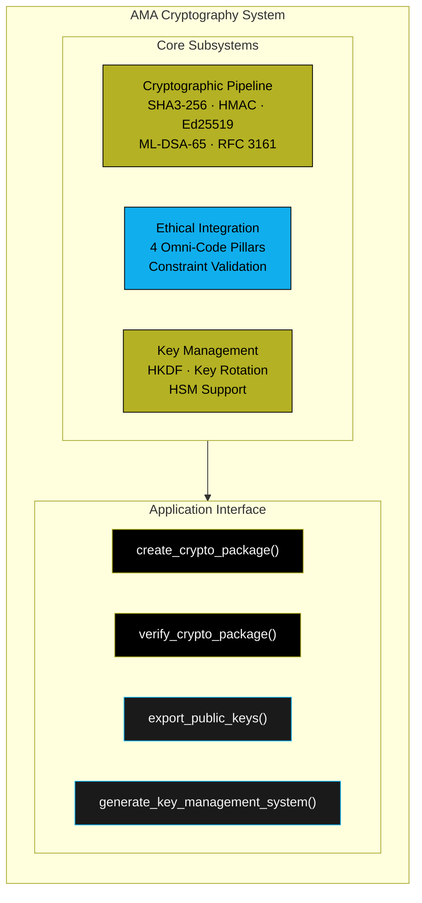
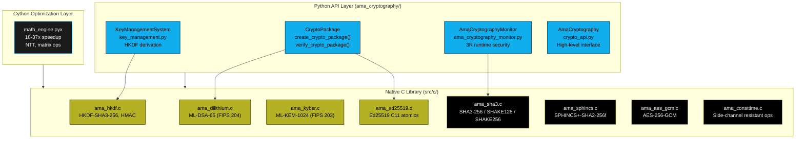
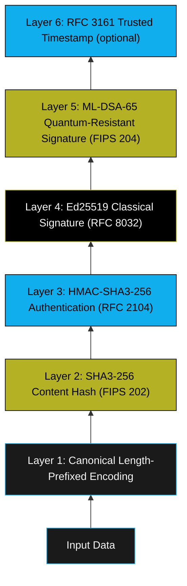
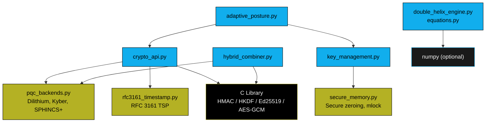
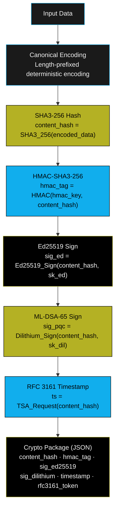
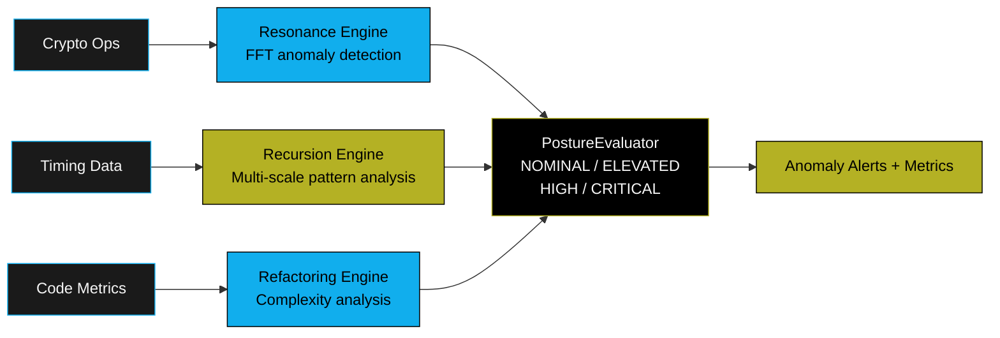
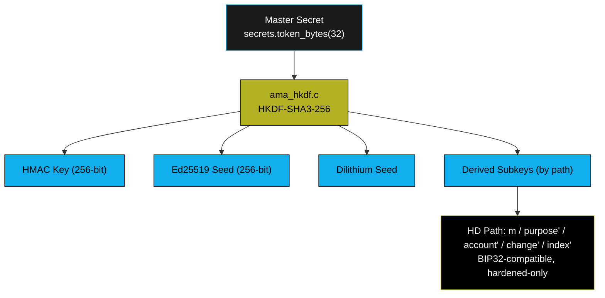

# Architecture

This page describes the system architecture of AMA Cryptography, including the 6-layer defense design, component interactions, data flow, and multi-language implementation.

---

## System Overview

AMA Cryptography is a **defense-in-depth** cryptographic protection system implementing six independent cryptographic layers. It serves as the cryptographic protection layer for [Mercury Agent](https://github.com/Steel-SecAdv-LLC/Mercury-Agent).

---

## Architectural Principles

### Security Through Mathematical Rigor
All security claims are backed by formal proofs or reduction arguments to well-studied cryptographic assumptions. No security-by-obscurity mechanisms are employed.

### Defense in Depth
Six independent cryptographic layers ensure that compromise of any single layer does not compromise overall system security. Each layer provides distinct security properties from different mathematical foundations.

### Quantum Readiness
Primary signature algorithms are selected for resistance to known quantum attacks. The system remains secure against adversaries with access to large-scale quantum computers for 50+ years.

### Ethical Integration
Ethical constraints are mathematically bound to cryptographic operations through the key derivation process, ensuring that ethical metadata cannot be separated from cryptographic proofs.

### Standards Compliance
Built exclusively from standardized cryptographic primitives (NIST FIPS, IETF RFC). No custom ciphers, hash functions, or signature schemes. The composition protocol is an original design by Steel Security Advisors LLC.

### Performance Efficiency
Cryptographic operations maintain throughput exceeding 1,000 operations per second with less than 2% overhead for monitoring integration.

---

## Multi-Language Architecture

**C Layer (`src/c/`):**
Implements all cryptographic primitives in C11 with zero external dependencies. NIST FIPS compliant implementations for ML-DSA-65, ML-KEM-1024, SPHINCS+-SHA2-256f, SHA3-256, HKDF, Ed25519, AES-256-GCM, and more.

**Cython Layer:**
Optional acceleration for mathematical operations (18–37x vs pure Python). Provides NumPy integration for the 3R monitoring engine.

**Python API (`ama_cryptography/`):**
High-level, algorithm-agnostic interface. Primary production API for integration.

---

## The 6-Layer Cryptographic Stack

Layers are applied sequentially during package creation:

### Layer-by-Layer Description

**Layer 1 — Canonical Encoding:**
Input data is encoded using a deterministic length-prefixed format. Prevents concatenation attacks and ensures identical inputs always produce identical encoded outputs.

**Layer 2 — SHA3-256 Content Hash:**
Produces a 256-bit digest serving as the binding commitment for all subsequent layers. 128-bit collision resistance (NIST FIPS 202, Keccak sponge construction).

**Layer 3 — HMAC-SHA3-256 Authentication:**
Provides symmetric authentication using a key derived via HKDF. Enables efficient verification when the HMAC key is available without requiring asymmetric operations.

**Layer 4 — Ed25519 Classical Signature:**
Compact 64-byte digital signature with 128-bit classical security. Ensures compatibility with existing verification infrastructure.

**Layer 5 — ML-DSA-65 Quantum-Resistant Signature:**
Lattice-based signature (≈3,309 bytes) resistant to all known quantum attacks. Provides 192-bit quantum security (NIST Level 3, FIPS 204).

**Layer 6 — RFC 3161 Trusted Timestamp:**
Optional third-party timestamp providing non-repudiation and cryptographic proof of existence at a specific time.

---

## Component Architecture

### Python Modules

| Module | Purpose |
|--------|---------|
| `crypto_api.py` | Algorithm-agnostic unified cryptographic interface |
| `pqc_backends.py` | Post-quantum cryptography backend detection and operations |
| `key_management.py` | Enterprise-grade key management (HD derivation, lifecycle) |
| `secure_memory.py` | Secure memory operations (zeroing, mlock, constant-time) |
| `hybrid_combiner.py` | Hybrid classical + PQC KEM binding construction |
| `adaptive_posture.py` | Runtime threat response with algorithm switching |
| `double_helix_engine.py` | Mathematical state evolution engine (3R monitoring) |
| `equations.py` | Mathematical frameworks (Lyapunov stability, golden ratio) |
| `rfc3161_timestamp.py` | RFC 3161 timestamp protocol implementation |
| `exceptions.py` | Centralized exception hierarchy |

### Module Dependency Graph

### C Library Components (`src/c/`)

| File | Algorithm | Standard |
|------|-----------|----------|
| `ama_sha3.c` | SHA3-256/512, SHAKE128/256 | NIST FIPS 202 |
| `ama_sha256.c` | SHA-256 | FIPS 180-4 |
| `ama_hkdf.c` | HKDF-SHA3-256 | RFC 5869 |
| `ama_ed25519.c` | Ed25519 sign/verify | RFC 8032 |
| `ama_aes_gcm.c` | AES-256-GCM | NIST SP 800-38D |
| `ama_aes_bitsliced.c` | Constant-time AES S-box | — |
| `ama_dilithium.c` | ML-DSA-65 (Dilithium) | NIST FIPS 204 |
| `ama_kyber.c` | ML-KEM-1024 (Kyber) | NIST FIPS 203 |
| `ama_sphincs.c` | SPHINCS+-SHA2-256f | NIST FIPS 205 |
| `ama_x25519.c` | X25519 key exchange | RFC 7748 |
| `ama_chacha20poly1305.c` | ChaCha20-Poly1305 AEAD | RFC 8439 |
| `ama_argon2.c` | Argon2id password hashing | RFC 9106 |
| `ama_secp256k1.c` | secp256k1 elliptic curve | SEC 2 |
| `ama_consttime.c` | Constant-time operations | — |
| `ama_core.c` | Context management, CSPRNG | — |
| `ama_platform_rand.c` | Platform-native CSPRNG | — |

---

## Data Flow: Package Creation

---

## 3R Runtime Security Monitoring

The 3R monitoring framework provides real-time visibility with less than 2% performance overhead:

> **Note:** The 3R system surfaces statistical anomalies for security review. It is not a guarantee of detection or prevention for timing attacks or side-channel vulnerabilities.

---

## Key Management Architecture

See [Key Management](Key-Management) for full details.

---

## Security Architecture Summary

| Property | Mechanism |
|----------|-----------|
| Confidentiality | AES-256-GCM, ChaCha20-Poly1305, Hybrid KEM |
| Integrity | SHA3-256 + HMAC-SHA3-256 |
| Authentication | Ed25519 + ML-DSA-65 |
| Non-repudiation | RFC 3161 trusted timestamps |
| Key Independence | HKDF domain-separated derivation |
| Quantum Resistance | ML-DSA-65 (FIPS 204), ML-KEM-1024 (FIPS 203) |
| Side-Channel | Constant-time comparisons, optional bitsliced AES |
| Memory Safety | SecureBuffer, `secure_memzero()`, libsodium `mlock` |

---

## Standards Compliance

| Standard | Algorithm | Implementation |
|----------|-----------|----------------|
| NIST FIPS 202 | SHA3-256/512, SHAKE | `ama_sha3.c` |
| NIST FIPS 203 | ML-KEM-1024 (Kyber) | `ama_kyber.c` |
| NIST FIPS 204 | ML-DSA-65 (Dilithium) | `ama_dilithium.c` |
| NIST FIPS 205 | SLH-DSA (SPHINCS+) | `ama_sphincs.c` |
| NIST SP 800-38D | AES-256-GCM | `ama_aes_gcm.c` |
| RFC 2104 | HMAC | `ama_hkdf.c` |
| RFC 5869 | HKDF | `ama_hkdf.c` |
| RFC 7748 | X25519 | `ama_x25519.c` |
| RFC 8032 | Ed25519 | `ama_ed25519.c` |
| RFC 8439 | ChaCha20-Poly1305 | `ama_chacha20poly1305.c` |
| RFC 9106 | Argon2id | `ama_argon2.c` |
| RFC 3161 | Trusted Timestamps | `rfc3161_timestamp.py` |

---

*See [Cryptography Algorithms](Cryptography-Algorithms) for algorithm details, or [Security Model](Security-Model) for the threat model.*
