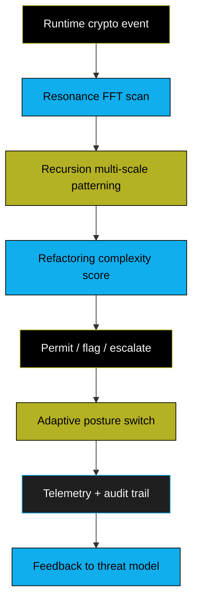

<div align="center" style="background: linear-gradient(120deg, #000000 0%, #111111 32%, #11AEED 62%, #B4B124 100%); color: #f6f6f6; padding: 26px; border: 2px solid #000000; border-radius: 14px;">

# AMA Cryptography Wiki

**Post-Quantum Security System — built for people, data, and networks**

<div style="display:flex; gap:10px; justify-content:center; flex-wrap:wrap; margin-top:10px;">
  <span style="background:#B4B124; color:#000; padding:6px 10px; border:1px solid #000;">Gold • Assurance & governance</span>
  <span style="background:#11AEED; color:#000; padding:6px 10px; border:1px solid #000;">Blue • Cryptography & transport</span>
  <span style="background:#1c1c1c; color:#f6f6f6; padding:6px 10px; border:1px solid #B4B124;">Black/Gray • Execution & observability</span>
</div>

</div>

---

## How to use this wiki (fast lane)

- **Ship quickly:** Use the blue tracks for code: [Installation](Installation) → [Quick Start](Quick-Start) → [API Reference](API-Reference).  
- **Assure correctness:** Follow the gold tracks for governance: [Security Model](Security-Model) → [Key Management](Key-Management) → [Adaptive Posture](Adaptive-Posture).  
- **Operate safely:** Follow the black/gray tracks for runtime: [Secure Memory](Secure-Memory) → [Hybrid Cryptography](Hybrid-Cryptography) → [Performance Benchmarks](Performance-Benchmarks).  
- **Need a map?** Start with the system flow below; every node links to deeper pages.

---

## System Blueprint — cryptographic package lifecycle

```mermaid
flowchart LR
    raw[Input: data / firmware / tx]:::gray --> prep[Canonicalize + length-prefix]:::gray
    prep --> sha3[SHA3-256 digest]:::gold
    sha3 --> hmac[HMAC-SHA3-256 auth]:::blue
    hmac --> ed[Ed25519 signature]:::black
    ed --> pqc[ML-DSA-65 signature]:::gold
    pqc --> ts[RFC 3161 timestamp]:::blue
    ts --> pkg[Cryptographic package]:::black
    pkg --> verify[Verify: HKDF keys + integrity + signatures]:::blue
    verify --> monitor[3R observability loop]:::gold
    monitor --> action[Adaptive posture (lockdown / rotate / switch algos)]:::black

classDef gold fill:#B4B124,stroke:#000000,color:#000000;
classDef blue fill:#11AEED,stroke:#000000,color:#000000;
classDef black fill:#000000,stroke:#B4B124,color:#f6f6f6;
classDef gray fill:#1a1a1a,stroke:#11AEED,color:#f6f6f6;
```

**Why it matters:** Each stage is independently checkable. An attacker must subvert the gold (assurance), blue (crypto), and black/gray (execution) layers in sequence — a defense-in-depth chain instead of a single gate.

---

## Runtime Safety Loop — observability without guessing



---

## Navigation by intent (choose one)

- **Build & integrate (blue):**
  - [Installation](Installation) — requirements, toolchains, wheels
  - [Quick Start](Quick-Start) — minimal create/verify package in 5 minutes
  - [API Reference](API-Reference) + [C API](C-API-Reference) — production calls, return codes
- **Assurance & lifecycle (gold):**
  - [Security Model](Security-Model) — threat coverage, residual risks, disclosure path
  - [Key Management](Key-Management) — hardened HD derivation, rotation, custody
  - [Adaptive Posture](Adaptive-Posture) — runtime policy toggles and allowed fallbacks
- **Operations & performance (black/gray):**
  - [Secure Memory](Secure-Memory) — zeroization, constant-time expectations
  - [Hybrid Cryptography](Hybrid-Cryptography) — binding combiners and KEM flow
  - [Performance Benchmarks](Performance-Benchmarks) — throughput, latency, scaling curves

---

## Build-with confidence checklist

1. **Decide the trust surface (gold):** choose HSM/HKDF parameters; align with [Security Model](Security-Model).  
2. **Assemble the pipeline (blue):** wire the API call sequence from [Quick Start](Quick-Start) or [API-Reference](API-Reference).  
3. **Harden execution (black/gray):** enable zeroization + monitoring from [Secure-Memory](Secure-Memory) and [Adaptive-Posture](Adaptive-Posture).  
4. **Measure and watch:** run the 3R loop and record telemetry per [Performance-Benchmarks](Performance-Benchmarks).  

---

## Status snapshot

| Property | Value |
|----------|-------|
| Version | 2.0 |
| Algorithms | ML-DSA-65, Kyber-1024, SPHINCS+, Ed25519, AES-256-GCM, Argon2id |
| Platforms | Linux, macOS, Windows |
| Python | 3.8 – 3.13 |
| Audit | Community-tested · Not externally audited |
| License | Apache 2.0 |

> **Production guardrails:** Use a FIPS 140-2 Level 3+ HSM for master secrets, enforce constant-time verification, and perform independent cryptographic review before deployment. See [Security-Model](Security-Model) for requirements.

---

**Contact:** steel.sa.llc@gmail.com — [Report a vulnerability](Security-Model#reporting-vulnerabilities) — [Contribute](Contributing)  
*Built by Steel Security Advisors LLC. Last updated: 2026-03-11.*
